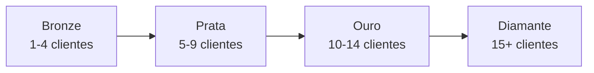
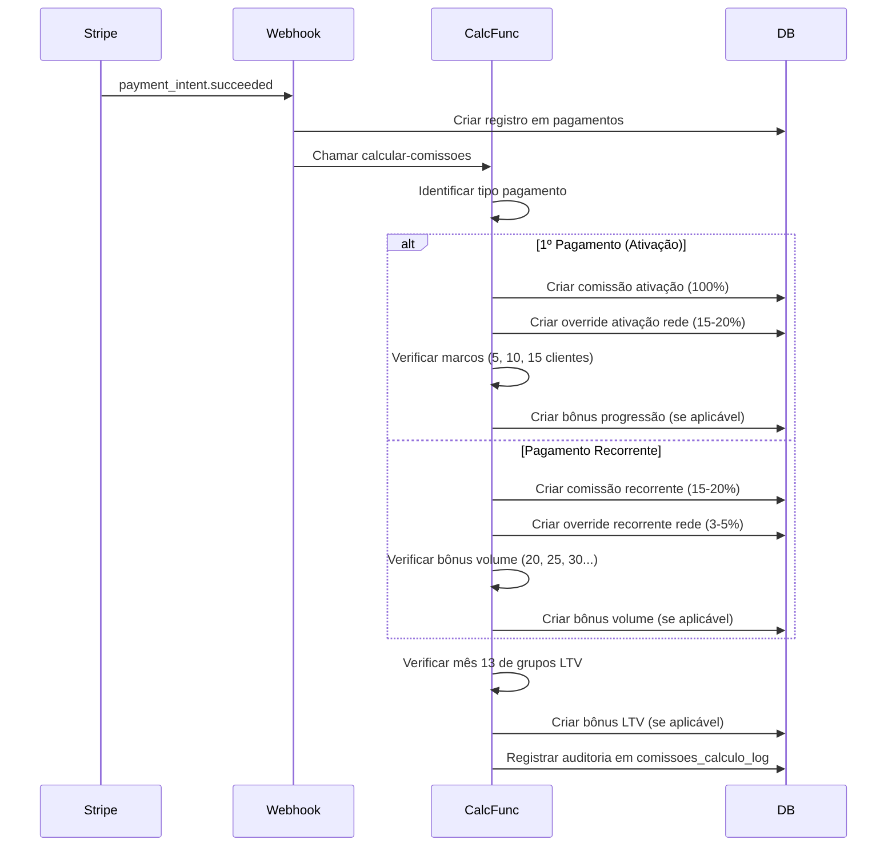

# ANÁLISE COMPLETA DO PRD - LOVABLE-CELITE

**Data:** Janeiro 2026  
**Fonte:** `docs/PRD_LOVABLE_CELITE.md` e `docs/17 bonificacoes_Regras do programa`

---

## 1. OBJETIVO DO APLICATIVO

**Lovable-Celite** é um portal web de transparência que automatiza o cálculo de bonificações para o Programa Contadores de Elite.

### Problema que Resolve
- **ANTES:** Cálculo manual em planilhas (40-60h/mês), erros frequentes, impossível escalar
- **DEPOIS:** Webhook Stripe → cálculo automático em < 2 segundos, precisão 100%, escalável para 1000+ contadores

### 3 Pilares Técnicos
1. **Cálculo Automático:** Edge Functions calculam todas as bonificações automaticamente
2. **Transparência Total:** Contador vê todas as bonificações, histórico completo
3. **Auditoria Completa:** Rastreabilidade 100% de cada cálculo

---

## 2. AS 17 BONIFICAÇÕES (DETALHADAS)

### PARTE 1: Ganhos Sobre Clientes Diretos (5 bonificações)

#### Bonificação #1: Bônus de 1ª Mensalidade (100%)
- **Tipo:** Único (one-time)
- **Quando:** Imediatamente após 1º pagamento do cliente
- **Quanto:** 100% do valor pago
- **Base de cálculo:** Valor efetivamente pago (após incentivos)
- **Exemplos:**
  - Cliente paga R$ 130 → Contador recebe R$ 130
  - Cliente paga anual R$ 1.560 → Contador recebe R$ 1.560 no mês 1

**Regra Especial:** Se houver cashback/desconto, bônus é sobre valor líquido pago.

**Campo DB necessário:** `pagamentos.tipo = 'ativacao'`

---

#### Bonificações #2-5: Comissões Recorrentes por Nível
**Tipo:** Recorrente mensal vitalício

| Nível | Clientes Diretos | % Comissão | Status |
|-------|------------------|------------|--------|
| Bronze | 1-4 | 15% | Padrão |
| Prata | 5-9 | 17,5% | +2.5% |
| Ouro | 10-14 | 20% | +5% |
| Diamante | 15+ | 20% | Teto |

**Quando:** A partir do 2º mês do cliente (mês 1 = bônus ativação)

**Retroatividade:** Ao subir de nível, nova % se aplica a TODA carteira (antigos + novos)

**Exemplo:**
- Contador Bronze com 3 clientes: 3 × R$ 130 × 15% = R$ 58,50/mês
- Sobe para Prata (5 clientes): 5 × R$ 130 × 17,5% = R$ 113,75/mês

**Campo DB necessário:** 
- `contadores.nivel` (bronze, prata, ouro, diamante)
- `comissoes.tipo = 'recorrente'`
- `comissoes.percentual` (15, 17.5, 20)

---

### PARTE 2: Ganhos Sobre Rede (6 bonificações)

#### Bonificação #6: Override 1º Pagamento Rede (15-20%)
- **Tipo:** Único (one-time)
- **Quando:** Quando contador indicado por você traz cliente novo
- **Quanto:** Mesma % da sua comissão recorrente (15% se Bronze, 17,5% se Prata, 20% se Ouro/Diamante)
- **Base:** 1º pagamento do cliente da rede

**Exemplo:**
- Você é Prata (17,5%)
- Seu indicado (downline) traz cliente que paga R$ 130
- Você recebe: R$ 130 × 17,5% = R$ 22,75

**Campo DB necessário:**
- `contadores.sponsor_id` (quem é o upline)
- `clientes.indicado_por_id` (quem indicou o cliente)

---

#### Bonificações #7-10: Override Recorrente por Nível
**Tipo:** Recorrente mensal vitalício sobre TODA rede

| Nível | % Override Rede | Status |
|-------|-----------------|--------|
| Bronze | 3% | Padrão |
| Prata | 4% | +1% |
| Ouro | 5% | +2% |
| Diamante | 5% | Teto |

**Quando:** Mensal, sobre mensalidades de todos os clientes da rede

**Exemplo:**
- Você tem 2 contadores indicados
- Contador A tem 5 clientes (5 × R$ 130 = R$ 650)
- Contador B tem 3 clientes (3 × R$ 130 = R$ 390)
- Total carteira rede: R$ 1.040
- Você é Prata: R$ 1.040 × 4% = R$ 41,60/mês

**Campo DB necessário:**
- `comissoes.tipo = 'override'`
- Query recursiva para calcular carteira total da rede

---

#### Bonificação #11: Bônus Indicação Contador (R$ 50)
- **Tipo:** Único (one-time)
- **Quando:** Quando contador indicado por você se ativa (traz 1º cliente)
- **Quanto:** R$ 50 fixo
- **Condição:** Contador downline deve trazer pelo menos 1 cliente

**Campo DB necessário:**
- `bonus_historico.tipo_bonus = 'indicacao_contador'`
- Trigger quando contador indicado ativa primeiro cliente

---

### PARTE 3: Bônus de Desempenho (6 bonificações)

#### Bonificações #12-15: Bônus de Progressão
**Tipo:** Únicos (one-time) NÃO cumulativos

| Marco | Clientes | Valor | Frequência |
|-------|----------|-------|------------|
| Prata | 5 | R$ 100 | 1x na vida |
| Ouro | 10 | R$ 100 | 1x na vida |
| Diamante | 15 | R$ 100 | 1x na vida |
| Volume | 20, 25, 30... | R$ 100 | Recorrente após Diamante |

**NÃO CUMULATIVOS:** Recebe apenas 1 bônus por marco (não soma Prata + Ouro + Diamante)

**Bônus Volume:** Só se torna recorrente APÓS atingir Diamante (15+)

**Campo DB necessário:**
- `bonus_historico.tipo_bonus` = 'progressao_prata', 'progressao_ouro', 'progressao_diamante', 'volume'
- `bonus_historico.marco_atingido` (5, 10, 15, 20, 25...)

---

#### Bonificações #16-18: Bônus LTV (Lifetime Value)
**Tipo:** Único (one-time) por grupo, anual

**Conceito:** Bonificação pela retenção de grupo de clientes captados NO MESMO MÊS.

| Faixa | Clientes Retidos | % Bônus no Mês 13 |
|-------|------------------|-------------------|
| Faixa 1 | 5-9 | 15% |
| Faixa 2 | 10-14 | 30% |
| Faixa 3 | 15+ | 50% |

**Como Funciona:**
1. Contador capta 8 clientes em Jan/2025
2. Passam 12 meses (Jan/2026 = mês 13)
3. 7 clientes continuam ativos
4. Bônus: 7 clientes × R$ 130 × 15% = R$ 136,50 (pago no mês 13)

**CRÍTICO:** Precisa rastrear "grupo captado no mesmo mês"

**Campo DB necessário:**
- `clientes.mes_captacao` (DATE - mês que foi captado)
- `bonus_ltv_grupos` (NOVA TABELA)
  - `contador_id`
  - `mes_captacao`
  - `cliente_ids[]` (array de UUIDs)
  - `quantidade_clientes`
  - `mes_13_completado`
  - `clientes_retidos`
  - `faixa_ltv` (faixa_1, faixa_2, faixa_3)
  - `percentual_bonus` (15, 30, 50)
  - `valor_bonus`

---

#### Bonificação #19: Bônus Diamante Leads (1 lead/mês)
- **Tipo:** Recorrente mensal
- **Quando:** Enquanto mantiver Diamante (15+ clientes)
- **Quanto:** 1 lead qualificado entregue pela empresa
- **Prazo:** Até dia 15 de cada mês

**Definição de Lead Qualificado:**
- CNPJ ativo
- Fit para planos Top Class
- Intenção de contratar em ≤ 30 dias
- Contato verificável

**Campo DB necessário:**
- `leads_diamante` (NOVA TABELA)
  - `contador_id`
  - `mes_referencia`
  - `lead_info` (JSONB)
  - `entregue_em`
  - `status` (entregue, substituicao_solicitada, convertido)

---

## 3. NÍVEIS DE CONTADOR

### Progressão de Níveis



### Benefícios por Nível

| Nível | Clientes | Comissão Direta | Override Rede | Bônus Progressão | Leads |
|-------|----------|-----------------|---------------|------------------|-------|
| Bronze | 1-4 | 15% | 3% | - | Não |
| Prata | 5-9 | 17,5% | 4% | R$ 100 (1x) | Não |
| Ouro | 10-14 | 20% | 5% | R$ 100 (1x) | Não |
| Diamante | 15+ | 20% | 5% | R$ 100 (1x) + Volume | 1 lead/mês |

---

## 4. VITALICIEDADE E TIERS

### Sistema de Performance Anual

#### TIER 1: Performance Mínima (Comissão Integral)
Para manter 15-20%, cumprir UMA das opções:

**OPÇÃO A - Foco Comercial:**
- 4+ indicações diretas por ano

**OPÇÃO B - Foco Qualidade + Comunidade:**
- 2-3 indicações/ano E
- Retenção ≥ 85% E
- Participação ≥ 70% em treinamentos/eventos

#### Escala de Penalidades (Anos Consecutivos de Inatividade)

| Ano | Comissão | Ação |
|-----|----------|------|
| 0 | 15-20% | Performance mínima mantida |
| 1 | 7% | Alertas proativos + janela reativação |
| 2 | 3% | Última chance + planos reativação |
| 3 | 0% | Perde 100%, carteira liberada |

**IMPORTANTE:** Prazo é consecutivo. Se reativar, contador zera.

#### Porto Seguro (Proteção para Carteiras Robustas)

**Nível 1 - Porto Seguro Elite:**
- Requisitos: 30+ clientes, retenção ≥ 90%, 2+ anos, 8 indicações/12 meses
- Benefício: 1 pausa de 12 meses a cada 2 anos, comissão mantém 8%

**Nível 2 - Porto Seguro Semi-Elite:**
- Requisitos: 20-29 clientes, retenção ≥ 85%, 2+ anos, 6 indicações/12 meses
- Benefício: 1 pausa emergencial de 6 meses (1x na carreira), comissão mantém 4%

### Janela de Reativação

**Plano 90 Dias:**
- Meta: +4 clientes em 90 dias
- Resultado: Recupera 100% imediatamente

**Plano 180 Dias:**
- Meta: +6 clientes em 180 dias
- Resultado: 50% nos primeiros 6 meses, 100% após

**Campo DB necessário:**
- `contador_performance_anual` (tabela)
  - `contador_id`
  - `ano`
  - `indicacoes_diretas`
  - `retencao_percentual`
  - `participacao_eventos_percentual`
  - `tier_status` (tier_1, penalidade_ano_1, penalidade_ano_2, penalidade_ano_3)
  - `comissao_percentual_aplicado` (100, 7, 3, 0)
  - `porto_seguro_ativo`
  - `porto_seguro_tipo` (elite, semi_elite, null)

---

## 5. ENTIDADES DO DOMÍNIO

### Entidades Principais

1. **Usuário** (auth.users + profiles)
2. **Contador** (contador que vende)
3. **Cliente** (empresa que contrata)
4. **Pagamento** (mensalidade paga)
5. **Comissão** (bonificação calculada)
6. **Bonus** (marcos atingidos)
7. **Rede MLM** (sponsor/downline)
8. **Performance Anual** (vitaliciedade)
9. **Grupo LTV** (conjunto de clientes captados no mesmo mês)
10. **Solicitação de Saque**

### Relacionamentos Críticos

```
USUÁRIO 1:1 CONTADOR
CONTADOR 1:N CLIENTE (gerencia)
CONTADOR 1:1 CONTADOR (sponsor_id - upline)
CLIENTE N:1 CONTADOR (indicado_por_id)
CLIENTE 1:N PAGAMENTO
PAGAMENTO 1:N COMISSÃO
CONTADOR 1:N COMISSÃO
CONTADOR 1:N BONUS
CONTADOR 1:N PERFORMANCE_ANUAL
CONTADOR 1:N GRUPO_LTV
```

---

## 6. FLUXO DE CÁLCULO DE COMISSÕES

### Quando Cliente Paga (Webhook Stripe)



### Cálculo Mensal (CRON Job)

```
DIA 1 DO MÊS:
1. Verificar grupos LTV que completaram 12 meses
2. Calcular retenção de cada grupo
3. Determinar faixa LTV (5-9, 10-14, 15+)
4. Gerar comissão LTV (15%, 30%, 50%)

DIA 15 DO MÊS:
1. Verificar contadores Diamante
2. Gerar leads qualificados
3. Registrar entrega

DIA 25 DO MÊS:
1. Processar saques (comissões aprovadas)
2. Agrupar por contador
3. Verificar mínimo R$ 100
4. Criar Stripe Transfer
```

---

## 7. REGRAS DE ACUMULAÇÃO

### ✅ ACUMULAM (somam no mesmo mês)
- Comissões Diretas + Overrides de Rede → TODAS somam
- Bônus LTV → Aplica-se apenas faixa mais alta do grupo
- Bônus de Progressão → Conforme elegibilidade

### ❌ NÃO ACUMULAM
- Bônus Progressão Prata/Ouro/Diamante → Apenas 1 por marco
- Bônus Volume → Só recorrente após Diamante (20+)

### Exemplo Real de Acumulação

**Contador Prata (7 clientes diretos) em Março/2026:**

1. Comissão Direta: 7 × R$ 130 × 17,5% = R$ 159,25
2. Override Rede: Carteira rede R$ 520 × 4% = R$ 20,80
3. Bônus LTV: Grupo de 6 clientes completou 12 meses → 6 × R$ 130 × 15% = R$ 117,00
4. **TOTAL: R$ 297,05**

---

## 8. CAMPOS CRÍTICOS PARA CÁLCULO

### Em `contadores`
- `nivel` → Determina % comissão
- `sponsor_id` → Para override de rede
- `clientes_ativos` → Para marcos de progressão
- `status` → Para tier/penalidades

### Em `clientes`
- `contador_id` → Quem gerencia
- `indicado_por_id` → Quem indicou (para override)
- `mes_captacao` → CRÍTICO para bônus LTV
- `data_ativacao` → Para calcular mês 13
- `status` → Para retenção LTV

### Em `pagamentos`
- `tipo` → ativacao vs recorrente
- `valor_liquido` → Após taxas Stripe
- `competencia` → Mês referência
- `cliente_id` → De qual cliente

### Em `comissoes`
- `tipo` → Qual bonificação (ativacao, recorrente, override, bonus_*)
- `valor` → Quanto será pago
- `percentual` → Se aplicável
- `competencia` → Mês referência
- `status` → calculada, aprovada, paga
- `nivel_contador_na_epoca` → Nível quando foi calculado (auditoria)

---

## 9. CONCLUSÕES DA ANÁLISE

### Tabelas Essenciais Identificadas

1. ✅ **Já Existem:**
   - auth.users, profiles, user_roles
   - contadores, clientes
   - pagamentos, comissoes
   - bonus_historico
   - solicitacoes_saque
   - audit_logs, webhook_logs

2. ❌ **FALTAM:**
   - `bonus_ltv_grupos` → CRÍTICO para rastrear grupos LTV
   - `leads_diamante` → Para bônus de leads
   - `contador_performance_anual` → Verificar se existe completa

3. ⚠️ **PRECISAM AJUSTES:**
   - `clientes.mes_captacao` → Campo DEVE existir
   - `clientes.indicado_por_id` → Separar gerente vs indicador
   - `contadores.stripe_account_id` → Para Stripe Connect
   - ENUM `tipo_comissao` → Valores específicos para cada bonificação

### Próximos Passos

1. Criar arquitetura ideal completa (FASE 2)
2. Comparar com banco atual (FASE 3)
3. Gerar migrations necessárias (FASE 4)
4. Documentar tudo (FASE 5)


