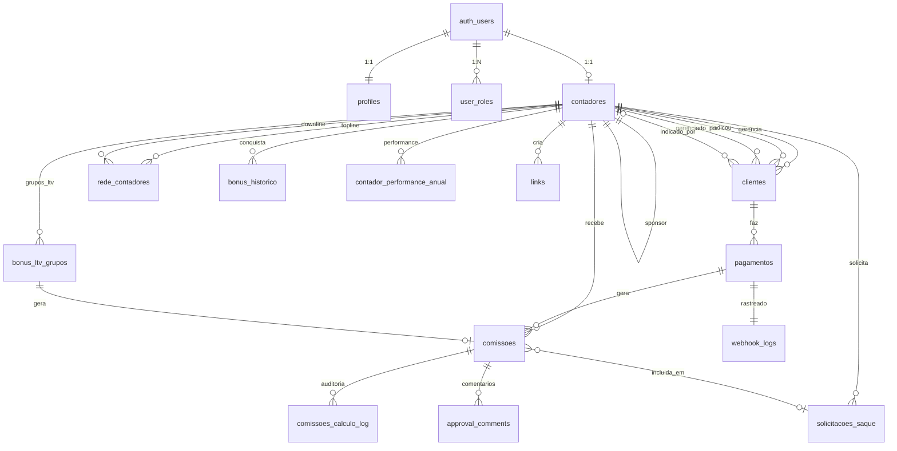

# ARQUITETURA IDEAL DO BANCO DE DADOS

**Data:** Janeiro 2026  
**Baseado em:** `docs/ANALISE_PRD_COMPLETA.md`  
**Status:** ✅ Arquitetura Completa

---

## 1. VISÃO GERAL

Esta arquitetura foi projetada de cima para baixo (top-down), baseada nas necessidades do PRD e nas 17 bonificações do Programa Contadores de Elite.

### Princípios de Design

1. **Auditoria 100%:** Todo cálculo de comissão é rastreável
2. **Performance:** Índices em todas as queries críticas
3. **Escalabilidade:** Suporta 1000+ contadores e 10000+ clientes
4. **Transparência:** Contador vê histórico completo
5. **Integridade:** Foreign keys e constraints garantem consistência

---

## 2. DIAGRAMA ER COMPLETO



---

## 3. TABELAS POR DOMÍNIO

### DOMÍNIO 1: Autenticação e Usuários

#### 3.1.1 auth.users (Supabase Nativo)
Gerenciado pelo Supabase Auth.

#### 3.1.2 profiles
```sql
CREATE TABLE profiles (
  id UUID PRIMARY KEY REFERENCES auth.users(id) ON DELETE CASCADE,
  nome TEXT NOT NULL,
  email TEXT UNIQUE NOT NULL,
  telefone TEXT,
  cpf TEXT UNIQUE,
  data_nascimento DATE,
  foto_url TEXT,
  aceite_termos BOOLEAN DEFAULT false,
  aceite_notificacoes BOOLEAN DEFAULT false,
  fcm_token TEXT, -- Firebase Cloud Messaging para notificações push
  created_at TIMESTAMPTZ DEFAULT now(),
  updated_at TIMESTAMPTZ DEFAULT now()
);

-- Índices
CREATE INDEX idx_profiles_email ON profiles(email);
CREATE INDEX idx_profiles_cpf ON profiles(cpf);

-- Trigger para atualizar updated_at
CREATE TRIGGER update_profiles_updated_at BEFORE UPDATE ON profiles
  FOR EACH ROW EXECUTE FUNCTION update_updated_at_column();

-- RLS
ALTER TABLE profiles ENABLE ROW LEVEL SECURITY;

CREATE POLICY "Usuários veem seu próprio perfil"
  ON profiles FOR SELECT
  USING (auth.uid() = id);

CREATE POLICY "Usuários atualizam seu próprio perfil"
  ON profiles FOR UPDATE
  USING (auth.uid() = id);
```

**Campos Críticos:**
- `id`: UUID do auth.users
- `nome`: Nome completo do usuário
- `email`: Email (único)
- `cpf`: CPF (único, validado)

---

#### 3.1.3 user_roles
```sql
CREATE TABLE user_roles (
  id UUID PRIMARY KEY DEFAULT gen_random_uuid(),
  user_id UUID REFERENCES auth.users(id) ON DELETE CASCADE NOT NULL,
  role app_role NOT NULL,
  granted_by UUID REFERENCES auth.users(id),
  granted_at TIMESTAMPTZ DEFAULT now(),
  UNIQUE(user_id, role)
);

-- Índices
CREATE INDEX idx_user_roles_user_id ON user_roles(user_id);
CREATE INDEX idx_user_roles_role ON user_roles(role);

-- RLS
ALTER TABLE user_roles ENABLE ROW LEVEL SECURITY;

CREATE POLICY "Admins veem todos os roles"
  ON user_roles FOR SELECT
  USING (
    EXISTS (
      SELECT 1 FROM user_roles ur
      WHERE ur.user_id = auth.uid() AND ur.role = 'admin'
    )
  );

CREATE POLICY "Usuários veem seus próprios roles"
  ON user_roles FOR SELECT
  USING (user_id = auth.uid());
```

**ENUM:**
```sql
CREATE TYPE app_role AS ENUM ('admin', 'contador', 'suporte');
```

---

### DOMÍNIO 2: Contadores e Rede MLM

#### 3.2.1 contadores
```sql
CREATE TABLE contadores (
  id UUID PRIMARY KEY DEFAULT gen_random_uuid(),
  user_id UUID UNIQUE REFERENCES auth.users(id) ON DELETE CASCADE NOT NULL,
  sponsor_id UUID REFERENCES contadores(id) ON DELETE SET NULL,
  
  -- Estado atual
  nivel nivel_contador DEFAULT 'bronze',
  status status_contador DEFAULT 'ativo',
  clientes_ativos INTEGER DEFAULT 0 CHECK (clientes_ativos >= 0),
  xp INTEGER DEFAULT 0 CHECK (xp >= 0),
  
  -- Dados profissionais
  crc TEXT, -- Conselho Regional de Contabilidade
  chave_pix TEXT,
  
  -- Rastreamento
  link_rastreavel TEXT UNIQUE,
  primeiro_acesso BOOLEAN DEFAULT true,
  data_ingresso DATE DEFAULT CURRENT_DATE,
  ultima_ativacao DATE,
  
  -- Stripe Connect (para receber pagamentos diretos)
  stripe_account_id TEXT UNIQUE,
  stripe_account_status TEXT CHECK (stripe_account_status IN ('pending', 'verified', 'rejected')),
  stripe_onboarding_completed BOOLEAN DEFAULT false,
  
  created_at TIMESTAMPTZ DEFAULT now(),
  updated_at TIMESTAMPTZ DEFAULT now()
);

-- Índices críticos
CREATE INDEX idx_contadores_user_id ON contadores(user_id);
CREATE INDEX idx_contadores_sponsor_id ON contadores(sponsor_id);
CREATE INDEX idx_contadores_nivel ON contadores(nivel);
CREATE INDEX idx_contadores_status ON contadores(status);
CREATE INDEX idx_contadores_stripe_account_id ON contadores(stripe_account_id);
CREATE INDEX idx_contadores_clientes_ativos ON contadores(clientes_ativos);

-- Trigger
CREATE TRIGGER update_contadores_updated_at BEFORE UPDATE ON contadores
  FOR EACH ROW EXECUTE FUNCTION update_updated_at_column();

-- RLS
ALTER TABLE contadores ENABLE ROW LEVEL SECURITY;

CREATE POLICY "Contador vê seu próprio registro"
  ON contadores FOR SELECT
  USING (user_id = auth.uid());

CREATE POLICY "Contador atualiza seu próprio registro"
  ON contadores FOR UPDATE
  USING (user_id = auth.uid());

CREATE POLICY "Admins veem todos os contadores"
  ON contadores FOR ALL
  USING (
    EXISTS (
      SELECT 1 FROM user_roles
      WHERE user_id = auth.uid() AND role = 'admin'
    )
  );
```

**ENUMs:**
```sql
CREATE TYPE nivel_contador AS ENUM ('bronze', 'prata', 'ouro', 'diamante');

CREATE TYPE status_contador AS ENUM (
  'ativo',
  'inativo',
  'tier_1',
  'tier_2',
  'tier_3',
  'porto_seguro_elite',
  'porto_seguro_semi_elite'
);
```

**Campos Críticos:**
- `sponsor_id`: Quem indicou este contador (upline/topline)
- `nivel`: Bronze, Prata, Ouro, Diamante → determina % comissão
- `clientes_ativos`: Usado para determinar nível e marcos
- `stripe_account_id`: Para Stripe Connect (pagamentos diretos)

---

#### 3.2.2 rede_contadores
```sql
CREATE TABLE rede_contadores (
  id UUID PRIMARY KEY DEFAULT gen_random_uuid(),
  sponsor_id UUID REFERENCES contadores(id) ON DELETE CASCADE NOT NULL,
  child_id UUID REFERENCES contadores(id) ON DELETE CASCADE NOT NULL,
  nivel_rede INTEGER DEFAULT 1 CHECK (nivel_rede BETWEEN 1 AND 5),
  ativo BOOLEAN DEFAULT true,
  created_at TIMESTAMPTZ DEFAULT now(),
  UNIQUE(sponsor_id, child_id),
  CHECK (sponsor_id != child_id)
);

-- Índices
CREATE INDEX idx_rede_contadores_sponsor ON rede_contadores(sponsor_id);
CREATE INDEX idx_rede_contadores_child ON rede_contadores(child_id);
CREATE INDEX idx_rede_contadores_ativo ON rede_contadores(ativo);

-- RLS
ALTER TABLE rede_contadores ENABLE ROW LEVEL SECURITY;

CREATE POLICY "Contador vê sua rede"
  ON rede_contadores FOR SELECT
  USING (
    sponsor_id IN (SELECT id FROM contadores WHERE user_id = auth.uid())
    OR child_id IN (SELECT id FROM contadores WHERE user_id = auth.uid())
  );
```

**Observação:** Esta tabela pode ser redundante dado que `contadores.sponsor_id` já mapeia a relação. No entanto, é útil para:
- Histórico de mudanças de rede
- Cálculo rápido de profundidade
- Queries recursivas de rede

---

#### 3.2.3 contador_performance_anual
```sql
CREATE TABLE contador_performance_anual (
  id UUID PRIMARY KEY DEFAULT gen_random_uuid(),
  contador_id UUID REFERENCES contadores(id) ON DELETE CASCADE NOT NULL,
  ano INTEGER NOT NULL CHECK (ano >= 2025 AND ano <= 2100),
  
  -- Métricas de performance
  indicacoes_diretas INTEGER DEFAULT 0 CHECK (indicacoes_diretas >= 0),
  retencao_percentual NUMERIC(5,2) CHECK (retencao_percentual >= 0 AND retencao_percentual <= 100),
  participacao_eventos_percentual NUMERIC(5,2) CHECK (participacao_eventos_percentual >= 0 AND participacao_eventos_percentual <= 100),
  
  -- Status de tier
  tier_status TEXT DEFAULT 'tier_1' CHECK (tier_status IN (
    'tier_1',
    'penalidade_ano_1',
    'penalidade_ano_2',
    'penalidade_ano_3',
    'zerado'
  )),
  comissao_percentual_aplicado NUMERIC(5,2) DEFAULT 100.00 CHECK (comissao_percentual_aplicado IN (0, 3, 7, 100)),
  
  -- Porto seguro
  porto_seguro_ativo BOOLEAN DEFAULT false,
  porto_seguro_tipo TEXT CHECK (porto_seguro_tipo IN ('elite', 'semi_elite', NULL)),
  porto_seguro_usado_em DATE,
  
  -- Janela de reativação
  reativacao_plano TEXT CHECK (reativacao_plano IN ('plano_90', 'plano_180', NULL)),
  reativacao_inicio DATE,
  reativacao_meta_clientes INTEGER,
  reativacao_progresso INTEGER DEFAULT 0,
  
  observacoes TEXT,
  created_at TIMESTAMPTZ DEFAULT now(),
  updated_at TIMESTAMPTZ DEFAULT now(),
  
  UNIQUE(contador_id, ano)
);

-- Índices
CREATE INDEX idx_performance_contador_ano ON contador_performance_anual(contador_id, ano);
CREATE INDEX idx_performance_tier_status ON contador_performance_anual(tier_status);

-- RLS
ALTER TABLE contador_performance_anual ENABLE ROW LEVEL SECURITY;

CREATE POLICY "Contador vê sua performance"
  ON contador_performance_anual FOR SELECT
  USING (contador_id IN (SELECT id FROM contadores WHERE user_id = auth.uid()));
```

**Campos Críticos:**
- `tier_status`: Define se contador está em penalidade
- `comissao_percentual_aplicado`: 100%, 7%, 3%, ou 0%
- `porto_seguro_ativo`: Proteção para carteiras robustas

---

### DOMÍNIO 3: Clientes e Pagamentos

#### 3.3.1 clientes
```sql
CREATE TABLE clientes (
  id UUID PRIMARY KEY DEFAULT gen_random_uuid(),
  contador_id UUID REFERENCES contadores(id) ON DELETE RESTRICT NOT NULL,
  indicado_por_id UUID REFERENCES contadores(id) ON DELETE SET NULL,
  
  -- Dados empresa
  nome_empresa TEXT NOT NULL,
  cnpj TEXT UNIQUE NOT NULL CHECK (length(cnpj) = 14),
  contato_nome TEXT,
  contato_email TEXT,
  contato_telefone TEXT,
  
  -- Plano e valores
  plano tipo_plano NOT NULL,
  valor_mensal NUMERIC(10,2) NOT NULL CHECK (valor_mensal > 0),
  
  -- Status do cliente
  status status_cliente DEFAULT 'lead',
  data_ativacao DATE,
  data_cancelamento DATE,
  mes_captacao DATE NOT NULL, -- CRÍTICO para bônus LTV
  
  -- Integração Stripe
  stripe_customer_id TEXT UNIQUE,
  stripe_subscription_id TEXT,
  
  created_at TIMESTAMPTZ DEFAULT now(),
  updated_at TIMESTAMPTZ DEFAULT now(),
  
  -- Constraints de datas
  CHECK (data_cancelamento IS NULL OR data_cancelamento >= data_ativacao)
);

-- Índices críticos
CREATE INDEX idx_clientes_contador_id ON clientes(contador_id);
CREATE INDEX idx_clientes_indicado_por ON clientes(indicado_por_id);
CREATE INDEX idx_clientes_status ON clientes(status);
CREATE INDEX idx_clientes_data_ativacao ON clientes(data_ativacao);
CREATE INDEX idx_clientes_mes_captacao ON clientes(mes_captacao); -- CRÍTICO para LTV
CREATE INDEX idx_clientes_stripe_customer ON clientes(stripe_customer_id);
CREATE INDEX idx_clientes_cnpj ON clientes(cnpj);

-- Trigger
CREATE TRIGGER update_clientes_updated_at BEFORE UPDATE ON clientes
  FOR EACH ROW EXECUTE FUNCTION update_updated_at_column();

-- RLS
ALTER TABLE clientes ENABLE ROW LEVEL SECURITY;

CREATE POLICY "Contador vê seus clientes"
  ON clientes FOR SELECT
  USING (contador_id IN (SELECT id FROM contadores WHERE user_id = auth.uid()));

CREATE POLICY "Admins veem todos os clientes"
  ON clientes FOR ALL
  USING (
    EXISTS (
      SELECT 1 FROM user_roles
      WHERE user_id = auth.uid() AND role = 'admin'
    )
  );
```

**ENUMs:**
```sql
CREATE TYPE tipo_plano AS ENUM ('basico', 'profissional', 'premium', 'enterprise');

CREATE TYPE status_cliente AS ENUM ('lead', 'ativo', 'cancelado', 'inadimplente');
```

**Campos Críticos:**
- `contador_id`: Quem GERENCIA o cliente
- `indicado_por_id`: Quem INDICOU o cliente (pode ser diferente, para override)
- `mes_captacao`: Mês que foi captado (CRÍTICO para bônus LTV)
- `data_ativacao`: Quando fez 1º pagamento (para calcular mês 13 de LTV)

---

#### 3.3.2 pagamentos
```sql
CREATE TABLE pagamentos (
  id UUID PRIMARY KEY DEFAULT gen_random_uuid(),
  cliente_id UUID REFERENCES clientes(id) ON DELETE RESTRICT NOT NULL,
  
  -- Tipo e valores
  tipo tipo_pagamento NOT NULL,
  valor_bruto NUMERIC(10,2) NOT NULL CHECK (valor_bruto > 0),
  valor_liquido NUMERIC(10,2) NOT NULL CHECK (valor_liquido > 0),
  taxa_stripe NUMERIC(10,2) GENERATED ALWAYS AS (valor_bruto - valor_liquido) STORED,
  
  -- Tracking temporal
  competencia DATE NOT NULL,
  status status_pagamento DEFAULT 'pendente',
  pago_em TIMESTAMPTZ,
  
  -- Integração Stripe
  stripe_payment_id TEXT UNIQUE,
  stripe_invoice_id TEXT,
  stripe_subscription_id TEXT,
  
  -- Auditoria
  webhook_log_id UUID,
  processado BOOLEAN DEFAULT false,
  processado_em TIMESTAMPTZ,
  
  created_at TIMESTAMPTZ DEFAULT now(),
  
  -- Constraints
  CHECK (valor_liquido <= valor_bruto)
);

-- Índices críticos
CREATE INDEX idx_pagamentos_cliente_id ON pagamentos(cliente_id);
CREATE INDEX idx_pagamentos_competencia ON pagamentos(competencia);
CREATE INDEX idx_pagamentos_status ON pagamentos(status);
CREATE INDEX idx_pagamentos_tipo ON pagamentos(tipo);
CREATE INDEX idx_pagamentos_stripe_payment ON pagamentos(stripe_payment_id);
CREATE INDEX idx_pagamentos_processado ON pagamentos(processado);
CREATE INDEX idx_pagamentos_pago_em ON pagamentos(pago_em);

-- RLS
ALTER TABLE pagamentos ENABLE ROW LEVEL SECURITY;

CREATE POLICY "Contador vê pagamentos de seus clientes"
  ON pagamentos FOR SELECT
  USING (
    cliente_id IN (
      SELECT id FROM clientes WHERE contador_id IN (
        SELECT id FROM contadores WHERE user_id = auth.uid()
      )
    )
  );
```

**ENUMs:**
```sql
CREATE TYPE tipo_pagamento AS ENUM ('ativacao', 'recorrente');

CREATE TYPE status_pagamento AS ENUM ('pendente', 'pago', 'cancelado', 'estornado');
```

**Campos Críticos:**
- `tipo`: 'ativacao' (1º pagamento) ou 'recorrente' (mensalidade)
- `valor_liquido`: Após taxa Stripe (3.79%) → base para comissão
- `competencia`: Mês referência do pagamento

---

### DOMÍNIO 4: Comissões e Bonificações

#### 3.4.1 comissoes (TABELA CENTRAL)
```sql
CREATE TABLE comissoes (
  id UUID PRIMARY KEY DEFAULT gen_random_uuid(),
  
  -- Relacionamentos
  contador_id UUID REFERENCES contadores(id) ON DELETE RESTRICT NOT NULL,
  cliente_id UUID REFERENCES clientes(id) ON DELETE SET NULL,
  pagamento_id UUID REFERENCES pagamentos(id) ON DELETE SET NULL,
  
  -- Tipo de comissão (17 bonificações)
  tipo tipo_comissao NOT NULL,
  
  -- Valores
  valor NUMERIC(10,2) NOT NULL CHECK (valor >= 0),
  percentual NUMERIC(5,2) CHECK (percentual >= 0 AND percentual <= 100),
  base_calculo NUMERIC(10,2), -- Valor sobre o qual foi calculado
  
  -- Tracking temporal
  competencia DATE NOT NULL,
  mes_calculo DATE NOT NULL DEFAULT CURRENT_DATE,
  
  -- Status e aprovação
  status status_comissao DEFAULT 'calculada',
  aprovada_por UUID REFERENCES auth.users(id),
  aprovada_em TIMESTAMPTZ,
  pago_em TIMESTAMPTZ,
  
  -- Metadados (para auditoria)
  nivel_contador_na_epoca nivel_contador,
  observacao TEXT,
  metadata JSONB, -- Dados adicionais flexíveis
  
  created_at TIMESTAMPTZ DEFAULT now(),
  updated_at TIMESTAMPTZ DEFAULT now(),
  
  -- Constraints
  CHECK (pago_em IS NULL OR pago_em >= aprovada_em),
  CHECK (aprovada_em IS NULL OR aprovada_em >= created_at)
);

-- Índices CRÍTICOS (performance)
CREATE INDEX idx_comissoes_contador_id ON comissoes(contador_id);
CREATE INDEX idx_comissoes_cliente_id ON comissoes(cliente_id);
CREATE INDEX idx_comissoes_pagamento_id ON comissoes(pagamento_id);
CREATE INDEX idx_comissoes_tipo ON comissoes(tipo);
CREATE INDEX idx_comissoes_status ON comissoes(status);
CREATE INDEX idx_comissoes_competencia ON comissoes(competencia);
CREATE INDEX idx_comissoes_mes_calculo ON comissoes(mes_calculo);
CREATE INDEX idx_comissoes_pago_em ON comissoes(pago_em);

-- Índice composto para query comum
CREATE INDEX idx_comissoes_contador_competencia ON comissoes(contador_id, competencia);
CREATE INDEX idx_comissoes_contador_status ON comissoes(contador_id, status);

-- Trigger
CREATE TRIGGER update_comissoes_updated_at BEFORE UPDATE ON comissoes
  FOR EACH ROW EXECUTE FUNCTION update_updated_at_column();

-- RLS
ALTER TABLE comissoes ENABLE ROW LEVEL SECURITY;

CREATE POLICY "Contador vê suas comissões"
  ON comissoes FOR SELECT
  USING (contador_id IN (SELECT id FROM contadores WHERE user_id = auth.uid()));

CREATE POLICY "Admins veem e gerenciam todas as comissões"
  ON comissoes FOR ALL
  USING (
    EXISTS (
      SELECT 1 FROM user_roles
      WHERE user_id = auth.uid() AND role = 'admin'
    )
  );
```

**ENUM (EXPANDIDO para cobrir 17 bonificações):**
```sql
CREATE TYPE tipo_comissao AS ENUM (
  -- Comissões Diretas
  'ativacao',
  'recorrente_bronze',
  'recorrente_prata',
  'recorrente_ouro',
  'recorrente_diamante',
  
  -- Override Rede
  'override_ativacao',
  'override_bronze',
  'override_prata',
  'override_ouro',
  'override_diamante',
  
  -- Bônus de Progressão
  'bonus_progressao_prata',
  'bonus_progressao_ouro',
  'bonus_progressao_diamante',
  'bonus_volume',
  
  -- Bônus LTV
  'bonus_ltv_faixa_1',
  'bonus_ltv_faixa_2',
  'bonus_ltv_faixa_3',
  
  -- Outros Bônus
  'bonus_indicacao_contador',
  'bonus_diamante_leads'
);

CREATE TYPE status_comissao AS ENUM ('calculada', 'aprovada', 'paga', 'cancelada');
```

**Campos Críticos:**
- `tipo`: Qual das 17 bonificações
- `valor`: Quanto o contador receberá
- `percentual`: Se aplicável (15%, 17.5%, 20%, etc)
- `status`: calculada → aprovada → paga
- `nivel_contador_na_epoca`: Nível quando comissão foi gerada (auditoria)

---

#### 3.4.2 comissoes_calculo_log
```sql
CREATE TABLE comissoes_calculo_log (
  id UUID PRIMARY KEY DEFAULT gen_random_uuid(),
  comissao_id UUID REFERENCES comissoes(id) ON DELETE CASCADE,
  
  -- Detalhes do cálculo
  regra_aplicada TEXT NOT NULL,
  valores_intermediarios JSONB,
  resultado_final NUMERIC(10,2),
  
  -- Tracking
  calculado_em TIMESTAMPTZ DEFAULT now(),
  calculado_por UUID REFERENCES auth.users(id),
  observacoes TEXT,
  
  -- Metadata da função/trigger que executou
  funcao_executora TEXT,
  versao_calculo TEXT
);

-- Índices
CREATE INDEX idx_calculo_log_comissao ON comissoes_calculo_log(comissao_id);
CREATE INDEX idx_calculo_log_calculado_em ON comissoes_calculo_log(calculado_em);

-- RLS
ALTER TABLE comissoes_calculo_log ENABLE ROW LEVEL SECURITY;

CREATE POLICY "Admins veem logs de cálculo"
  ON comissoes_calculo_log FOR SELECT
  USING (
    EXISTS (
      SELECT 1 FROM user_roles
      WHERE user_id = auth.uid() AND role = 'admin'
    )
  );
```

**Objetivo:** Auditoria 100% de cada cálculo de comissão.

---

#### 3.4.3 bonus_historico
```sql
CREATE TABLE bonus_historico (
  id UUID PRIMARY KEY DEFAULT gen_random_uuid(),
  contador_id UUID REFERENCES contadores(id) ON DELETE CASCADE NOT NULL,
  comissao_id UUID REFERENCES comissoes(id) ON DELETE SET NULL,
  
  -- Tipo de bônus
  tipo_bonus TEXT NOT NULL CHECK (tipo_bonus IN (
    'progressao_prata',
    'progressao_ouro',
    'progressao_diamante',
    'volume',
    'indicacao_contador',
    'diamante_leads'
  )),
  marco_atingido INTEGER CHECK (marco_atingido > 0),
  
  -- Valor e status
  valor NUMERIC(10,2) NOT NULL CHECK (valor >= 0),
  status TEXT DEFAULT 'pendente' CHECK (status IN ('pendente', 'pago', 'cancelado')),
  
  -- Tracking temporal
  conquistado_em TIMESTAMPTZ DEFAULT now(),
  pago_em TIMESTAMPTZ,
  competencia DATE NOT NULL,
  
  observacao TEXT,
  
  -- Constraint: pago_em só pode existir se status = 'pago'
  CHECK (status != 'pago' OR pago_em IS NOT NULL)
);

-- Índices
CREATE INDEX idx_bonus_historico_contador ON bonus_historico(contador_id);
CREATE INDEX idx_bonus_historico_tipo ON bonus_historico(tipo_bonus);
CREATE INDEX idx_bonus_historico_competencia ON bonus_historico(competencia);
CREATE INDEX idx_bonus_historico_status ON bonus_historico(status);

-- RLS
ALTER TABLE bonus_historico ENABLE ROW LEVEL SECURITY;

CREATE POLICY "Contador vê seu histórico de bônus"
  ON bonus_historico FOR SELECT
  USING (contador_id IN (SELECT id FROM contadores WHERE user_id = auth.uid()));
```

**Objetivo:** Rastrear bônus únicos (progressão, volume, indicação, etc).

---

#### 3.4.4 bonus_ltv_grupos (NOVA TABELA - CRÍTICA)
```sql
CREATE TABLE bonus_ltv_grupos (
  id UUID PRIMARY KEY DEFAULT gen_random_uuid(),
  contador_id UUID REFERENCES contadores(id) ON DELETE CASCADE NOT NULL,
  
  -- Identificação do grupo
  mes_captacao DATE NOT NULL,
  
  -- Clientes do grupo
  cliente_ids UUID[] NOT NULL,
  quantidade_clientes INTEGER NOT NULL CHECK (quantidade_clientes > 0),
  
  -- Tracking de retenção
  mes_13_completado BOOLEAN DEFAULT false,
  data_mes_13 DATE,
  clientes_retidos INTEGER CHECK (clientes_retidos >= 0 AND clientes_retidos <= quantidade_clientes),
  taxa_retencao NUMERIC(5,2) GENERATED ALWAYS AS (
    CASE 
      WHEN quantidade_clientes > 0 THEN (clientes_retidos::NUMERIC / quantidade_clientes * 100)
      ELSE 0
    END
  ) STORED,
  
  -- Bônus gerado
  faixa_ltv TEXT CHECK (faixa_ltv IN ('faixa_1', 'faixa_2', 'faixa_3', NULL)),
  percentual_bonus NUMERIC(5,2) CHECK (percentual_bonus IN (15, 30, 50, NULL)),
  valor_bonus NUMERIC(10,2) CHECK (valor_bonus >= 0),
  comissao_id UUID REFERENCES comissoes(id) ON DELETE SET NULL,
  
  created_at TIMESTAMPTZ DEFAULT now(),
  updated_at TIMESTAMPTZ DEFAULT now(),
  
  UNIQUE(contador_id, mes_captacao)
);

-- Índices críticos
CREATE INDEX idx_bonus_ltv_contador_mes ON bonus_ltv_grupos(contador_id, mes_captacao);
CREATE INDEX idx_bonus_ltv_mes_13_completado ON bonus_ltv_grupos(mes_13_completado);
CREATE INDEX idx_bonus_ltv_data_mes_13 ON bonus_ltv_grupos(data_mes_13);

-- Trigger
CREATE TRIGGER update_bonus_ltv_updated_at BEFORE UPDATE ON bonus_ltv_grupos
  FOR EACH ROW EXECUTE FUNCTION update_updated_at_column();

-- RLS
ALTER TABLE bonus_ltv_grupos ENABLE ROW LEVEL SECURITY;

CREATE POLICY "Contador vê seus grupos LTV"
  ON bonus_ltv_grupos FOR SELECT
  USING (contador_id IN (SELECT id FROM contadores WHERE user_id = auth.uid()));
```

**Objetivo:** Rastrear grupos de clientes captados no mesmo mês para calcular bônus LTV no mês 13.

**Campos Críticos:**
- `mes_captacao`: Mês em que clientes foram captados
- `cliente_ids[]`: Array de UUIDs dos clientes do grupo
- `mes_13_completado`: Marca se já completaram 12 meses
- `clientes_retidos`: Quantos continuam ativos no mês 13

---

### DOMÍNIO 5: Saques e Transferências

#### 3.5.1 solicitacoes_saque
```sql
CREATE TABLE solicitacoes_saque (
  id UUID PRIMARY KEY DEFAULT gen_random_uuid(),
  contador_id UUID REFERENCES contadores(id) ON DELETE RESTRICT NOT NULL,
  
  -- Valores e comissões incluídas
  valor_solicitado NUMERIC(10,2) NOT NULL CHECK (valor_solicitado >= 100),
  comissoes_ids UUID[] NOT NULL,
  quantidade_comissoes INTEGER GENERATED ALWAYS AS (array_length(comissoes_ids, 1)) STORED,
  
  -- Método de pagamento
  metodo_pagamento TEXT NOT NULL CHECK (metodo_pagamento IN ('pix', 'transferencia', 'stripe_connect')),
  dados_bancarios JSONB,
  chave_pix TEXT,
  
  -- Status e processamento
  status TEXT DEFAULT 'pendente' CHECK (status IN ('pendente', 'processada', 'rejeitada', 'cancelada')),
  solicitado_em TIMESTAMPTZ DEFAULT now(),
  processada_em TIMESTAMPTZ,
  processada_por UUID REFERENCES auth.users(id),
  
  -- Comprovante
  comprovante_url TEXT,
  stripe_transfer_id TEXT UNIQUE,
  
  -- Observações
  observacao TEXT,
  motivo_rejeicao TEXT,
  
  created_at TIMESTAMPTZ DEFAULT now(),
  
  -- Constraints
  CHECK (status != 'rejeitada' OR motivo_rejeicao IS NOT NULL),
  CHECK (status != 'processada' OR processada_em IS NOT NULL)
);

-- Índices
CREATE INDEX idx_saques_contador_id ON solicitacoes_saque(contador_id);
CREATE INDEX idx_saques_status ON solicitacoes_saque(status);
CREATE INDEX idx_saques_solicitado_em ON solicitacoes_saque(solicitado_em);
CREATE INDEX idx_saques_processada_em ON solicitacoes_saque(processada_em);

-- RLS
ALTER TABLE solicitacoes_saque ENABLE ROW LEVEL SECURITY;

CREATE POLICY "Contador vê seus saques"
  ON solicitacoes_saque FOR SELECT
  USING (contador_id IN (SELECT id FROM contadores WHERE user_id = auth.uid()));

CREATE POLICY "Contador cria seus saques"
  ON solicitacoes_saque FOR INSERT
  WITH CHECK (contador_id IN (SELECT id FROM contadores WHERE user_id = auth.uid()));

CREATE POLICY "Admins gerenciam todos os saques"
  ON solicitacoes_saque FOR ALL
  USING (
    EXISTS (
      SELECT 1 FROM user_roles
      WHERE user_id = auth.uid() AND role = 'admin'
    )
  );
```

**Campos Críticos:**
- `valor_solicitado`: Mínimo R$ 100
- `comissoes_ids[]`: Array de UUIDs das comissões incluídas
- `metodo_pagamento`: PIX, transferência ou Stripe Connect

---

### DOMÍNIO 6: Sistema de Indicações e Links

#### 3.6.1 links
```sql
CREATE TABLE links (
  id UUID PRIMARY KEY DEFAULT gen_random_uuid(),
  contador_id UUID REFERENCES contadores(id) ON DELETE CASCADE NOT NULL,
  
  -- Tipo e canal
  tipo link_type NOT NULL,
  canal link_channel DEFAULT 'outros',
  
  -- Tracking
  token TEXT UNIQUE NOT NULL,
  target_url TEXT,
  cliques INTEGER DEFAULT 0 CHECK (cliques >= 0),
  conversoes INTEGER DEFAULT 0 CHECK (conversoes >= 0),
  taxa_conversao NUMERIC(5,2) GENERATED ALWAYS AS (
    CASE 
      WHEN cliques > 0 THEN (conversoes::NUMERIC / cliques * 100)
      ELSE 0
    END
  ) STORED,
  
  ativo BOOLEAN DEFAULT true,
  created_at TIMESTAMPTZ DEFAULT now()
);

-- Índices
CREATE INDEX idx_links_contador_id ON links(contador_id);
CREATE INDEX idx_links_tipo ON links(tipo);
CREATE INDEX idx_links_token ON links(token);
CREATE INDEX idx_links_ativo ON links(ativo);

-- RLS
ALTER TABLE links ENABLE ROW LEVEL SECURITY;

CREATE POLICY "Contador vê seus links"
  ON links FOR SELECT
  USING (contador_id IN (SELECT id FROM contadores WHERE user_id = auth.uid()));
```

**ENUMs:**
```sql
CREATE TYPE link_type AS ENUM ('cliente', 'contador');

CREATE TYPE link_channel AS ENUM (
  'whatsapp',
  'email',
  'facebook',
  'instagram',
  'linkedin',
  'twitter',
  'telegram',
  'outros'
);
```

---

#### 3.6.2 referral_tracking
```sql
CREATE TABLE referral_tracking (
  id UUID PRIMARY KEY DEFAULT gen_random_uuid(),
  
  -- Token usado
  referral_token TEXT NOT NULL,
  link_id UUID REFERENCES links(id) ON DELETE SET NULL,
  
  -- Dados do hit
  visited_at TIMESTAMPTZ DEFAULT now(),
  ip_address INET,
  user_agent TEXT,
  page_url TEXT,
  referer TEXT,
  
  -- Geolocalização (opcional)
  country_code TEXT,
  city TEXT,
  
  -- Conversão
  converted BOOLEAN DEFAULT false,
  converted_at TIMESTAMPTZ,
  converted_user_id UUID REFERENCES auth.users(id),
  converted_type TEXT CHECK (converted_type IN ('cliente', 'contador', NULL)),
  
  created_at TIMESTAMPTZ DEFAULT now()
);

-- Índices
CREATE INDEX idx_referral_token ON referral_tracking(referral_token);
CREATE INDEX idx_referral_link_id ON referral_tracking(link_id);
CREATE INDEX idx_referral_visited_at ON referral_tracking(visited_at);
CREATE INDEX idx_referral_converted ON referral_tracking(converted);
```

---

### DOMÍNIO 7: Auditoria e Logs

#### 3.7.1 audit_logs
```sql
CREATE TABLE audit_logs (
  id UUID PRIMARY KEY DEFAULT gen_random_uuid(),
  user_id UUID REFERENCES auth.users(id) ON DELETE SET NULL,
  
  -- Ação
  acao TEXT NOT NULL,
  tabela TEXT,
  registro_id UUID,
  payload JSONB,
  
  -- Tracking
  ip_address INET,
  user_agent TEXT,
  
  created_at TIMESTAMPTZ DEFAULT now()
);

-- Índices
CREATE INDEX idx_audit_logs_user_id ON audit_logs(user_id);
CREATE INDEX idx_audit_logs_tabela ON audit_logs(tabela);
CREATE INDEX idx_audit_logs_created_at ON audit_logs(created_at);
CREATE INDEX idx_audit_logs_acao ON audit_logs(acao);

-- RLS
ALTER TABLE audit_logs ENABLE ROW LEVEL SECURITY;

CREATE POLICY "Admins veem logs de auditoria"
  ON audit_logs FOR SELECT
  USING (
    EXISTS (
      SELECT 1 FROM user_roles
      WHERE user_id = auth.uid() AND role = 'admin'
    )
  );
```

---

#### 3.7.2 webhook_logs
```sql
CREATE TABLE webhook_logs (
  id UUID PRIMARY KEY DEFAULT gen_random_uuid(),
  
  -- Webhook
  event_id TEXT UNIQUE NOT NULL,
  event_type TEXT NOT NULL,
  payload JSONB NOT NULL,
  
  -- Processamento
  processado BOOLEAN DEFAULT false,
  erro TEXT,
  tentativas INTEGER DEFAULT 0 CHECK (tentativas >= 0),
  
  created_at TIMESTAMPTZ DEFAULT now(),
  processed_at TIMESTAMPTZ
);

-- Índices
CREATE INDEX idx_webhook_logs_event_id ON webhook_logs(event_id);
CREATE INDEX idx_webhook_logs_event_type ON webhook_logs(event_type);
CREATE INDEX idx_webhook_logs_processado ON webhook_logs(processado);
CREATE INDEX idx_webhook_logs_created_at ON webhook_logs(created_at);

-- RLS
ALTER TABLE webhook_logs ENABLE ROW LEVEL SECURITY;

CREATE POLICY "Admins veem logs de webhook"
  ON webhook_logs FOR SELECT
  USING (
    EXISTS (
      SELECT 1 FROM user_roles
      WHERE user_id = auth.uid() AND role = 'admin'
    )
  );
```

---

### DOMÍNIO 8: Aprovações

#### 3.8.1 approval_comments
```sql
CREATE TABLE approval_comments (
  id UUID PRIMARY KEY DEFAULT gen_random_uuid(),
  comissao_id UUID REFERENCES comissoes(id) ON DELETE CASCADE NOT NULL,
  user_id UUID REFERENCES auth.users(id) ON DELETE SET NULL NOT NULL,
  
  -- Comentário
  comentario TEXT NOT NULL CHECK (length(comentario) > 0),
  visivel_para_contador BOOLEAN DEFAULT false,
  
  created_at TIMESTAMPTZ DEFAULT now(),
  updated_at TIMESTAMPTZ DEFAULT now()
);

-- Índices
CREATE INDEX idx_approval_comments_comissao ON approval_comments(comissao_id);
CREATE INDEX idx_approval_comments_user_id ON approval_comments(user_id);
CREATE INDEX idx_approval_comments_created_at ON approval_comments(created_at);

-- Trigger
CREATE TRIGGER update_approval_comments_updated_at BEFORE UPDATE ON approval_comments
  FOR EACH ROW EXECUTE FUNCTION update_updated_at_column();

-- RLS
ALTER TABLE approval_comments ENABLE ROW LEVEL SECURITY;

CREATE POLICY "Admins veem e criam comentários"
  ON approval_comments FOR ALL
  USING (
    EXISTS (
      SELECT 1 FROM user_roles
      WHERE user_id = auth.uid() AND role = 'admin'
    )
  );

CREATE POLICY "Contador vê comentários visíveis"
  ON approval_comments FOR SELECT
  USING (
    visivel_para_contador = true
    AND comissao_id IN (
      SELECT id FROM comissoes WHERE contador_id IN (
        SELECT id FROM contadores WHERE user_id = auth.uid()
      )
    )
  );
```

---

## 4. FUNÇÃO AUXILIAR GLOBAL

```sql
-- Função para atualizar updated_at automaticamente
CREATE OR REPLACE FUNCTION update_updated_at_column()
RETURNS TRIGGER AS $$
BEGIN
  NEW.updated_at = now();
  RETURN NEW;
END;
$$ LANGUAGE plpgsql;
```

---

## 5. RESUMO DE TABELAS

### Total: 18 Tabelas Principais

1. **auth.users** (Supabase)
2. **profiles**
3. **user_roles**
4. **contadores**
5. **rede_contadores**
6. **contador_performance_anual**
7. **clientes**
8. **pagamentos**
9. **comissoes** ⭐ CENTRAL
10. **comissoes_calculo_log**
11. **bonus_historico**
12. **bonus_ltv_grupos** ⭐ NOVA
13. **solicitacoes_saque**
14. **links**
15. **referral_tracking**
16. **audit_logs**
17. **webhook_logs**
18. **approval_comments**

---

## 6. RESUMO DE ENUMs

Total: 9 ENUMs

1. **app_role** (admin, contador, suporte)
2. **nivel_contador** (bronze, prata, ouro, diamante)
3. **status_contador** (ativo, inativo, tier_1, tier_2, tier_3, porto_seguro_*)
4. **tipo_plano** (basico, profissional, premium, enterprise)
5. **status_cliente** (lead, ativo, cancelado, inadimplente)
6. **tipo_pagamento** (ativacao, recorrente)
7. **status_pagamento** (pendente, pago, cancelado, estornado)
8. **tipo_comissao** ⭐ (19 valores - cobre 17 bonificações)
9. **status_comissao** (calculada, aprovada, paga, cancelada)
10. **link_type** (cliente, contador)
11. **link_channel** (whatsapp, email, facebook, etc)

---

## 7. PRÓXIMOS PASSOS

✅ FASE 2 completa: Arquitetura ideal documentada

**Próximo:** FASE 3 - Comparar com banco atual e identificar diferenças


