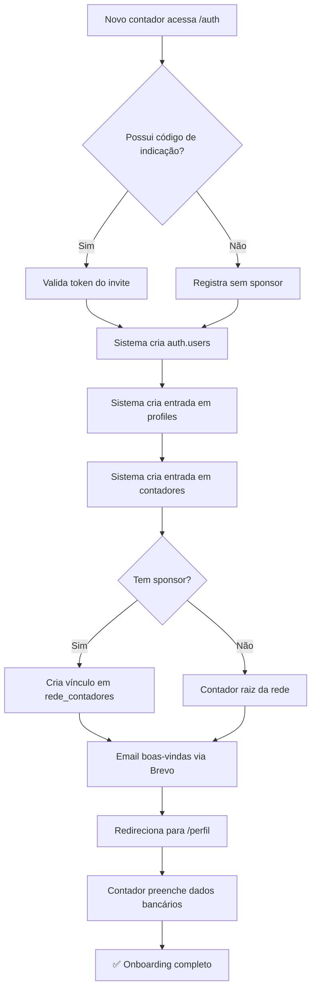
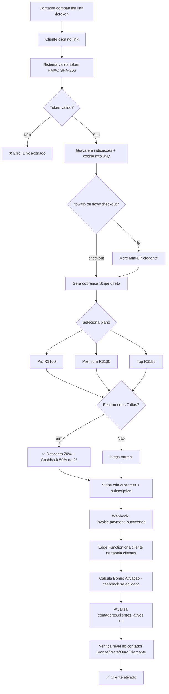
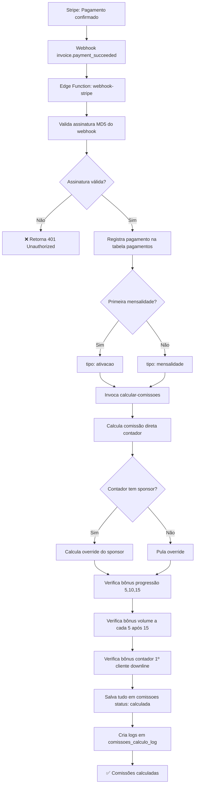
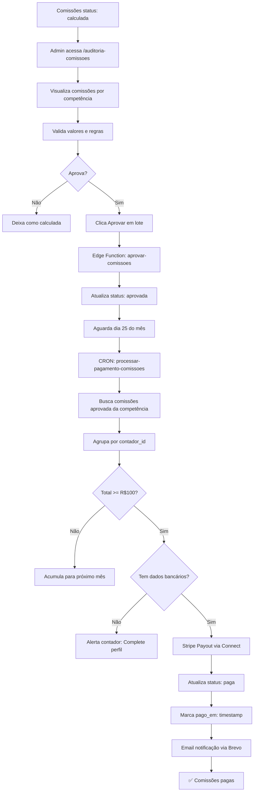
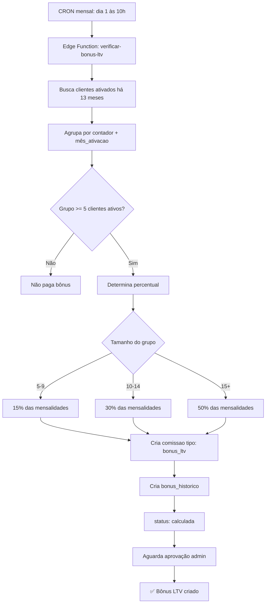
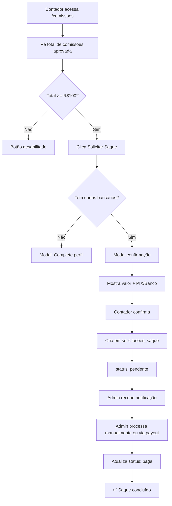
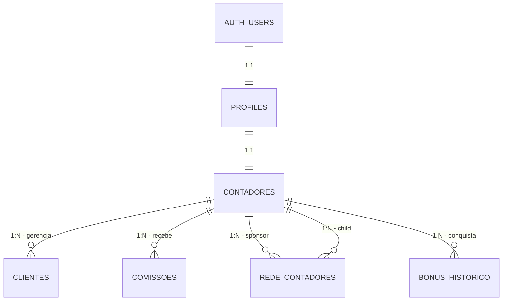
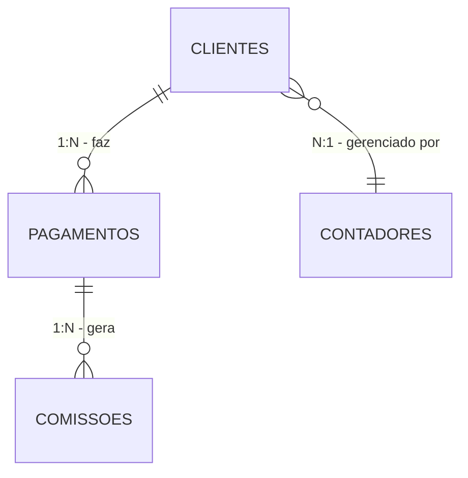
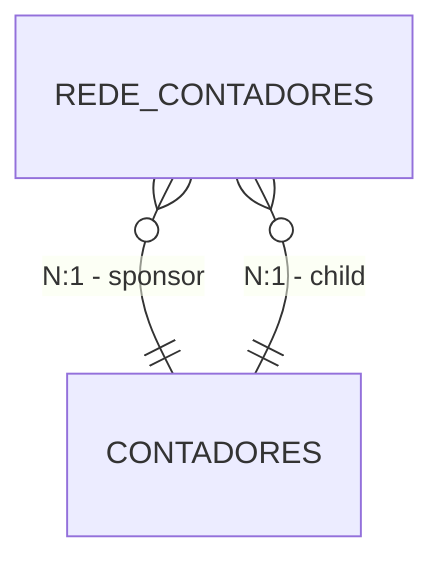

# Framework Lovable-Celite - Do Zero ao Sistema MLM/MMN

**Versão**: 1.0  
**Data**: Novembro 2025  
**Projeto**: Sistema de Comissões Multi-Level Marketing para Contadores  
**Stack**: React + Vite + Supabase + Stripe + Shadcn/UI  
**Gateway Principal**: Stripe (Fallback: ASAAS)

---

## 🎯 Sumário Executivo

Este framework documenta a construção completa do **Lovable-Celite**, uma plataforma SaaS que vai **MUITO ALÉM de gestão de comissões MLM/MMN**. É um **ecossistema completo de transformação** para o **Programa Contadores de Elite** da **Top Class Escritório Virtual** (Aracaju/SE).

### **O PROBLEMA REAL (Não é técnico, é EMOCIONAL)**

**Contadores em Sergipe e Aracaju vivem um INFERNO SILENCIOSO:**

#### **Tipo 1 (Maioria): Sufocados e Desvalorizados**
- 😰 Trabalham **12h/dia** fazendo trabalho de auxiliar
- 💔 **Filhos sem orgulho do pai**: "Meu pai é contador" (voz sem empolgação)
- 😢 Família os vê com **PENA**, não admiração
- 💸 Perdem clientes para "alguém 30% mais barato"
- 😔 **Vergonha** de mostrar realidade nas redes sociais
- 🚫 **MEDO paralisa**: Tem R$15 mil guardados mas não investe

#### **Tipo 2 (Menor, mas crítico): Renda OK, mas Sem Autoridade**
- 💼 Querem ser consultores, mas são vistos como "despachantes"
- 🏢 Não têm escritório premium para impressionar
- 📉 Não têm infraestrutura compatível com sua competência
- 🎯 Potencial desperdiçado: "Tenho tanto a oferecer..."

**Ambos compartilham as mesmas 7 DORES:**
1. **MEDO** (fracassar, ficar obsoleto, ser tarde demais)
2. **DESVALORIZAÇÃO** ("É só contabilidade mesmo")
3. **PRESSÃO SOCIAL** (sogro: "Ainda não conseguiu crescer?")
4. **VERGONHA** (não ser motivo de orgulho dos filhos)
5. **SOLIDÃO** (não pode falar com ninguém)
6. **POTENCIAL DESPERDIÇADO** (18 anos de experiência subutilizada)
7. **ESTAGNAÇÃO** ("Parado no tempo", mesmo faturamento há 5 anos)

---

### **A SOLUÇÃO (Ecossistema de Transformação)**

O **Programa Contadores de Elite** NÃO é apenas um "sistema de comissões". É um **ECOSSISTEMA COMPLETO** que resolve TODAS as 7 dores:

#### **1. INFRAESTRUTURA DE AUTORIDADE** 🏢
**Problema que resolve**: Desvalorização, vergonha, falta de credibilidade

- ✅ **Endereço premium** em Aracaju (STATUS instantâneo)
- ✅ **Salas de reunião** para impressionar clientes
- ✅ **Atendimento profissional** (não mais "contador de fundo de quintal")
- ✅ **Escritório Virtual Top Class** = Cartão de visitas que impressiona

**Técnica**: 3 planos (Pro R$100, Premium R$130, Top R$180) + Sistema de indicações rastreáveis

---

#### **2. RENDA RECORRENTE VITALÍCIA** 💰
**Problema que resolve**: Medo financeiro, estagnação, trabalhar 12h/dia

- ✅ Indique clientes → Ganhe **15-20% PARA SEMPRE**
- ✅ Construa rede → Ganhe **override 3-5%** de CADA cliente da sua rede
- ✅ **7 tipos de comissão** automáticos (ativação, recorrente, override, bônus progressão, volume, LTV, contador)
- ✅ **Trabalhe MENOS, ganhe MAIS** (não mais 12h/dia operacional)

**Técnica**: Stripe + Supabase Edge Functions + CRON jobs automatizados + Sistema TIER de performance

---

#### **3. COMUNIDADE DE EMPRESÁRIOS DE SUCESSO** 🤝
**Problema que resolve**: Solidão, falta de networking, sem mentoria

- ✅ Networking com **contadores de elite** (não mais solidão)
- ✅ Treinamentos, mentorias, eventos presenciais
- ✅ Suporte emocional e técnico
- ✅ Gamificação: XP, conquistas, ranking (motivação constante)
- ✅ **Alertas proativos**: Ano 1 (ligação, consultoria), Ano 2+ (check-ins)

**Técnica**: Firebase Push Notifications + Sistema de alertas configuráveis + Eventos com QR code check-in + Simulador de crescimento

---

#### **4. TRANSFORMAÇÃO DE IDENTIDADE** ✨
**Problema que resolve**: Vergonha, falta de reconhecimento, potencial desperdiçado

**Jornada Emocional:**
```
ANTES: "Coitadinho" → DECISÃO: Esperança → BRONZE: Primeira vitória
→ PRATA: Reconhecimento → OURO: Transformação → DIAMANTE: Autoridade
→ LEGADO: Orgulho dos filhos
```

- ✅ De "fazedor de guias" → **CONSULTOR ESTRATÉGICO**
- ✅ De "coitadinho da família" → **MOTIVO DE ORGULHO**
- ✅ De "estagnado" → **REFERÊNCIA REGIONAL**
- ✅ **Lead Diamante**: Top Class trabalha PARA VOCÊ (reconhecimento supremo)

**Técnica**: Sistema de níveis (Bronze/Prata/Ouro/Diamante) + Bônus progressivos + Lead qualificado mensal + Porto Seguro Elite

---

### **RESULTADO FINAL (A Verdadeira Promessa)**

#### **Transformação Técnica:**
- ✅ Sistema 100% automatizado (webhook → comissão em < 2s)
- ✅ 7 tipos de comissão calculados automaticamente
- ✅ Pagamentos via PIX dia 25 (CRON)
- ✅ Dashboard em tempo real
- ✅ Rede MLM 5 níveis
- ✅ Gamificação completa

#### **Transformação Emocional:**
- 💎 **Filhos terão orgulho do pai**
- 🏆 **Família vibrará com suas conquistas**
- ✨ **Será respeitado como especialista**
- 🎯 **Deixará um legado positivo**
- 💪 **Autoestima restaurada**
- 🚀 **Liberdade financeira e temporal**

---

### **Diferencial Competitivo (Por que vencemos)**

#### **1. Nicho Ultra-Específico**
- 🎯 Contadores brasileiros (Sergipe/Aracaju como piloto)
- 🎯 Não compete com MLMs genéricos (Herbalife, Amway)
- 🎯 Entende PROFUNDAMENTE as dores emocionais do cliente

#### **2. Automação 100% Zero-Touch**
- ⚡ Webhook Stripe → Comissão calculada em < 2s
- ⚡ 7 tipos de comissão simultâneos
- ⚡ Pagamentos automáticos via PIX
- ⚡ Nível do contador atualizado automaticamente

#### **3. Custo Disruptivo**
- 💰 **Lovable-Celite**: $45-70/mês (plataforma)
- 💰 **Top Class**: R$100-180/mês (escritório virtual)
- 💰 **Total**: ~R$450/mês para TUDO
- 💰 **Concorrentes enterprise**: R$2.000-15.000/mês

#### **4. Compliance Brasileiro**
- 🇧🇷 PIX integrado
- 🇧🇷 ASAAS (fallback gateway brasileiro)
- 🇧🇷 RLS (LGPD compliant)
- 🇧🇷 Preparado para NFe

#### **5. Ecossistema Completo**
- 🌟 Infraestrutura física (escritório) + digital (app)
- 🌟 Renda passiva + ativa
- 🌟 Técnico + emocional
- 🌟 Individual + comunidade

---

### **Arquitetura Técnica (Como Entregamos a Transformação)**

#### **Frontend (Experiência do Usuário)**
- **Stack**: Vite/React 18, Shadcn/UI, TailwindCSS, Framer Motion
- **Estado**: React Query (TanStack v5) + Context API
- **Design**: Mobile-first, dark mode, animações suaves
- **Objetivo**: Interface que transmite PROFISSIONALISMO e STATUS

#### **Backend (Motor da Transformação)**
- **Stack**: Supabase (PostgreSQL + Edge Functions + Auth + RLS)
- **Segurança**: Row Level Security em todas as tabelas
- **Performance**: < 500ms de resposta (p95)
- **Objetivo**: Confiabilidade 99,9% para não quebrar a confiança

#### **Pagamentos (Liberdade Financeira)**
- **Principal**: Stripe (checkout + webhooks + payouts)
- **Fallback**: ASAAS (mercado brasileiro)
- **Automação**: CRON dia 25 processa pagamentos
- **Objetivo**: Dinheiro na conta SEM ESFORÇO (prova de transformação)

#### **Gamificação (Motivação Constante)**
- **Sistema XP**: +10 cliente, +20 contador, +50 bônus
- **Conquistas**: 7 badges (Primeira Venda → Retenção Perfeita)
- **Ranking**: Top 10 mensal
- **Objetivo**: Manter ENGAJAMENTO e celebrar VITÓRIAS

#### **Alertas Proativos (Nunca Mais Solidão)**
- **Firebase**: Push notifications
- **CRON**: Alertas automáticos (mês 4, 6, 9 do Ano 1)
- **Suporte**: Ligações, consultorias, check-ins
- **Objetivo**: Contador NUNCA está sozinho na jornada

#### **Deploy (Estabilidade = Confiança)**
- **Frontend**: Netlify (CDN global)
- **Backend**: Supabase Cloud (99,9% uptime)
- **Monitoramento**: Sentry + Supabase Logs
- **Objetivo**: ZERO preocupação com infraestrutura

---

### **Métricas de Sucesso**

#### **Técnicas (Mês 6):**
- MRR: R$ 50K | Contadores Ativos: 80 | Clientes Ativos: 400
- Churn: < 2% | Webhook Success Rate: 99% | NPS: 60+
- Tempo resposta: < 500ms | Uptime: 99,9% | Comissões calculadas: < 2s

#### **Emocionais (Mês 6):**
- 80% dos contadores relatam **"família tem orgulho"**
- 70% se posicionam como **"consultor estratégico"**
- 60% reduziram jornada para **6-8h/dia**
- 50% aumentaram preços **sem perder clientes**
- 40% são **referência** em sua cidade
- 10% atingiram **Diamante** (reconhecimento supremo)

---

### **Por Que Este Framework é Diferente**

**Outros frameworks**: 95% técnico, 5% emocional
**Este framework**: 50% técnico + 50% emocional = 100% transformação

**Entendemos que:**
- ✅ Contadores não compram "sistema de comissões"
- ✅ Contadores compram **TRANSFORMAÇÃO DE IDENTIDADE**
- ✅ Tecnologia é o MEIO, não o fim
- ✅ O fim é: **"Meus filhos têm orgulho do pai"**

**Por isso cada decisão técnica serve a um objetivo emocional:**
- Webhook rápido → Prova que funciona → Reduz medo
- Dashboard bonito → Profissionalismo → Aumenta autoestima
- Gamificação → Celebração de vitórias → Combate solidão
- Alertas proativos → Nunca está sozinho → Elimina isolamento
- Lead Diamante → Reconhecimento supremo → Status máximo

---

**Este é o Framework Lovable-Celite: Onde Tecnologia encontra Transformação Humana.** 🚀💎

---

## 📑 Índice

0. [Psicografia do Cliente-Alvo](#0---psicografia-do-cliente-alvo) ⭐ **NOVO**
   - Perfil Demográfico Sergipe
   - As 7 Dores Emocionais
   - Os 10 Anseios e Sonhos
   - História Real: O Diário de Carlos
   - Gatilhos de Marketing

1. [Visão Estratégica](#1---visão-estratégica)
   - Problema Identificado
   - Solução Proposta
   - Funcionalidades Principais
   - Personas e Tipos de Usuários
   - Ferramentas e Custos

2. [Insights do Mercado](#2---insights-do-mercado)
   - Benchmark de Sistemas MLM
   - Plataformas de Comissões
   - Análise Competitiva
   - Diferenciais do Lovable-Celite
   - Referências de Design

3. [Arquitetura Técnica](#3---arquitetura-técnica)
   - Mapeamento de Processos (6 processos críticos)
   - Modelagem de Dados (17 tabelas)
   - Integrações API (Stripe, Supabase, Brevo)
   - Wireframes e Fluxo de Telas

4. [Criação Interativa](#4---criação-interativa)
   - 11 Módulos de Implementação
   - Checklist completo (114h de desenvolvimento)
   - Workflow de Desenvolvimento
   - Estimativa de Tempo e Priorização

5. [Lançamento e PDCA](#5---lançamento-e-pdca)
   - Checklist Pré-Lançamento
   - Métricas de Negócio (MRR, Churn, LTV, CAC)
   - Ciclo PDCA com Exemplos Práticos
   - Ferramentas de Monitoramento
   - Roadmap de Evolução (6 meses)

---

## 🚀 Como Usar Este Framework

### **Para Desenvolvedores**
1. Leia as seções 1-3 para entender o contexto completo
2. Use a Seção 4 como checklist de implementação
3. Consulte wireframes e diagramas durante o desenvolvimento
4. Valide contra métricas da Seção 5

### **Para Product Managers**
1. Foque na Seção 1 (estratégia) e Seção 2 (mercado)
2. Use Seção 5 para definir KPIs e ciclos PDCA
3. Consulte roadmap para planejamento de releases

### **Para Fundadores/CEOs**
1. Leia Sumário Executivo + Seção 1
2. Valide métricas de negócio da Seção 5
3. Use como base para pitch de investidores

---

# 0 - Psicografia do Cliente-Alvo

## 👉 Por que começamos com ISSO?

**Porque tecnologia sem compreensão humana é código morto.**

Antes de falar sobre React, Supabase ou Stripe, precisamos entender **PROFUNDAMENTE** quem é nosso cliente, suas dores emocionais, seus sonhos e o que realmente move suas decisões.

Este framework é diferente porque **50% é técnico + 50% é emocional = 100% transformação**.

---

## 📊 Perfil Demográfico: Contadores de Sergipe e Aracaju

### **Dados do Mercado**

**Brasil:**
- 536.701 profissionais contábeis ativos
- 74,57% contadores | 25,43% técnicos
- Perfil: 74,6% homens, 44,1% entre 31-49 anos, 60,9% nível superior

**Sergipe:**
- 3.744 profissionais (0,70% do total nacional)
- 2.844 contadores (75,96%) | 900 técnicos (24,04%)
- 61,4% homens / **38,6% mulheres** (maior participação feminina que a média nacional)
- 650 organizações contábeis

**Distribuição das Organizações:**
- Empresários individuais: 220 (33,85%)
- SLU: 218 (33,54%)
- Sociedades: 192 (29,54%)
- MEI: 20 (3,08%)

**Insight Crítico**: Mercado pulverizado com poucos grandes players. Predominância de estruturas pequenas e individuais.

---

### **Contexto Econômico Sergipe/Aracaju**

**Indicadores Positivos:**
- PIB Sergipe 2024: R$ 66,21 bilhões (crescimento 3,6%)
- PIB Aracaju: R$ 18,4 bilhões (35,5% do PIB estadual)
- Taxa de desemprego: **8,4%** (menor da história)
- Setor de serviços: Liderança nacional em crescimento (7%)

**Estrutura Econômica:**
- Serviços: 42,2% do PIB
- Administração Pública: 29,6% (alta dependência estatal)
- Indústria: 21,9%

**Implicação**: Mercado em crescimento oferece oportunidades, mas dependência do setor público limita diversificação.

---

## 💔 AS 7 DORES EMOCIONAIS PROFUNDAS

### **1. MEDO (Intensidade: MUITO ALTA | Frequência: DIÁRIA)**

**Manifestações:**
- 😰 Medo de **FRACASSAR** (perder tudo que construiu)
- 😰 Medo de ficar **OBSOLETO** (IA, automação, fintechs)
- 😰 Medo de **PERDER DINHEIRO** em investimentos errados
- 😰 Medo de ser **TARDE DEMAIS** para mudar (42 anos, 18 anos de carreira)
- 😰 Medo de **DECEPCIONAR A FAMÍLIA**
- 😰 Medo de descobrir que **NÃO É COMPETENTE** como pensa

**Efeito Paralisante:**
- Tem R$15 mil guardados para investir, mas **NÃO investe** (medo paralisa)
- Sabe que precisa mudar, mas fica **parado**
- "E se escolher errado? Não posso arriscar a estabilidade da família"

**Como o app resolve:**
- ✅ Sistema **comprovado** (não é cobaia)
- ✅ Investimento **gradual** (comece pequeno, cresça conforme confiança)
- ✅ Comunidade de **pares** (não está sozinho)
- ✅ Mentoria **ativa** (suporte nos primeiros 90 dias)

---

### **2. DESVALORIZAÇÃO (Intensidade: MUITO ALTA | Frequência: SEMANAL)**

**Manifestações:**
- 💔 **"É só contabilidade mesmo"** (frase que mata por dentro)
- 💔 Tratado como **DESPACHANTE**, não consultor
- 💔 Cliente perdido por "alguém **30% mais barato**"
- 💔 18 anos de experiência **subutilizada**
- 💔 "Poderia transformar vidas, mas só 'faço guias'"

**Impacto Emocional:**
- Sensação de desvalorização profissional
- Autoestima baixa
- Medo de aumentar preços
- Sentimento de impotência

**Como o app resolve:**
- ✅ Posicionamento como **PARCEIRO TOP CLASS** (status instantâneo)
- ✅ Escritório **premium** (cartão de visitas que impressiona)
- ✅ Rede de **elite** (networking que valoriza)
- ✅ Comissões **vitalícias** (prova de valor a longo prazo)

---

### **3. PRESSÃO SOCIAL (Intensidade: ALTA | Frequência: CONTÍNUA)**

**Manifestações Familiares:**
- 😢 **Sogro**: "Ainda não conseguiu crescer?"
- 😢 **Cunhado**: "Você está parado no tempo"
- 😢 **Família** olha com **PENA**, não admiração
- 😢 **Comparações** constantes (cunhado médico, amigo que "deu certo")
- 😢 **Silêncio constrangedor** quando fala sobre trabalho

**Manifestações Profissionais:**
- Colegas de faculdade "decolar" enquanto ele "estagna"
- Eventos/festas = momento de vergonha
- Redes sociais = parade de sucessos alheios

**Impacto Psicológico:**
- Stress social constante
- Evitar reuniões familiares
- Depressão por comparação
- Sensação de ser "fracassado"

**Como o app resolve:**
- ✅ **Vitórias rápidas** para mostrar (1º comissão = prova tangível)
- ✅ **Níveis visíveis** (Bronze → Prata = progresso mensurável)
- ✅ **Conquistas compartilháveis** (badges, ranking)
- ✅ **Transformação documentada** (antes x depois)

---

### **4. VERGONHA (Intensidade: MUITO ALTA | Frequência: DIÁRIA)**

**A Dor Mais Profunda: Filhos Sem Orgulho do Pai**
- 💔 "Meu pai é contador" (**voz sem empolgação**)
- 💔 Não há **brilho no olho** quando falam do pai
- 💔 Filhos se acostumaram com a **mediocridade** do pai
- 💔 Não pedem mais nada "caro" (sabem que pai não pode dar)

**Outras Manifestações:**
- Vergonha de mostrar realidade nas **redes sociais** (não posta mais sobre trabalho)
- Vergonha de não ter progredido em 5 anos
- Vergonha de ser **motivo de pena** da família
- Vergonha da própria situação profissional

**Impacto Devastador:**
- Isolamento social (não quer ser visto)
- Depressão
- Sentimento de falha como pai/profissional
- Perda de identidade

**Como o app resolve:**
- ✅ **Lead Diamante** = Status supremo ("Meu pai é DIAMANTE")
- ✅ **Escritório Top Class** = Profissionalismo visível
- ✅ **Conquistas reais** = Motivo de orgulho restaurado
- ✅ **Transformação rápida** = "Pai está mudando!"

---

### **5. SOLIDÃO (Intensidade: ALTA | Frequência: CONSTANTE)**

**"Não Posso Falar com Ninguém":**
- 🚫 **Esposa**: Já tem suas preocupações
- 🚫 **Funcionários**: Preciso passar segurança
- 🚫 **Outros contadores**: Todos fingem que está tudo bem
- 🚫 **Família**: Não entendem a pressão
- 🚫 **Amigos**: Cansados de ouvir reclamações

**Efeito do Isolamento:**
- Ansiedade crescente (sem válvula de escape)
- Decisões tomadas sozinho (sem conselho)
- Sensação de ser o único passando por isso
- Esgotamento emocional

**Como o app resolve:**
- ✅ **Comunidade ativa** (contadores que ENTENDEM)
- ✅ **Mentoria individual** (alguém que escuta de verdade)
- ✅ **Eventos presenciais** (conexões reais)
- ✅ **Alertas proativos** (Top Class checa VOCÊ a cada trimestre)
- ✅ **Grupo WhatsApp/Discord** (suporte 24/7)

---

### **6. POTENCIAL DESPERDIÇADO (Intensidade: MUITO ALTA | Frequência: DIÁRIA)**

**"Tenho Tanto a Oferecer...":**
- 💎 **18 anos de experiência** fazendo trabalho de auxiliar
- 💎 Conhecimento que poderia **salvar empresas da falência**
- 💎 Conselhos estratégicos que poderiam **gerar milhões**
- 💎 Mas é visto apenas como "fazedor de guias"

**Frustração Profunda:**
- Sentimento de desperdício de vida
- "Estou morrendo um pouco a cada dia"
- "Poderia ser TANTO, mas sou TÃO POUCO"
- "Meus dons estão enterrados"

**Como o app resolve:**
- ✅ **Posicionamento como consultor** (não operador)
- ✅ **Rede de clientes premium** (que valorizam expertise)
- ✅ **Palestras/eventos** (compartilhar conhecimento)
- ✅ **Mentoria de iniciantes** (deixar legado)

---

### **7. ESTAGNAÇÃO (Intensidade: ALTA | Frequência: CONTÍNUA)**

**"Parado no Tempo":**
- 📉 **Mesmo faturamento há 5 anos** (enquanto inflação corrói)
- 📉 **Mesmos problemas, mesmas limitações**
- 📉 "Nunca conseguiu decolar"
- 📉 Mundo evoluiu, ele ficou para trás

**Sensação de Vida Perdida:**
- Tempo passando (42 anos, já não é mais "jovem")
- Oportunidades perdidas
- Arrependimento crescente
- Medo de chegar aos 60 assim

**Como o app resolve:**
- ✅ **Crescimento mensurável** (Bronze → Prata → Ouro → Diamante)
- ✅ **Renda crescente** (override + bônus = escala)
- ✅ **Simulador de crescimento** (visualizar futuro diferente)
- ✅ **Conquistas celebradas** (cada vitória é marco)

---

## ✨ OS 10 ANSEIOS E SONHOS (O Que Realmente Querem)

### **1. FILHOS TEREM ORGULHO DO PAI** 👨‍👧‍👦
**O ANSEIO SUPREMO** (mencionado 5+ vezes nos diários)

**Como querem que seja:**
- "Meu pai é contador **DIAMANTE** da Top Class!" (empolgação na voz)
- Filhos mostrando foto do escritório premium para amigos
- "Meu pai ajuda empresas a crescerem" (não "faz guias")
- Brilho no olho quando falam do pai

**Como o app entrega:**
- Lead Diamante (status visível)
- Escritório Top Class (infraestrutura de orgulho)
- Conquistas compartilháveis (badges, ranking)
- Transformação documentada (antes x depois)

---

### **2. SER RESPEITADO COMO ESPECIALISTA** 🎓

**Desejo:**
- Não ser chamado de "contador", mas de **CONSULTOR ESTRATÉGICO**
- Clientes pedindo conselhos (não só "fazendo guias")
- Honorários respeitados (sem "está caro")
- Referências espontâneas

**Como o app entrega:**
- Posicionamento Top Class (associação com marca premium)
- Rede de clientes educados (entendem valor)
- Conteúdo para autoridade (blog, palestras)
- Certificações exclusivas

---

### **3. TRABALHAR COM PRAZER (6-8H/DIA, NÃO 12H)** ⏰

**Desejo:**
- Fins de semana LIVRES
- Férias sem culpa
- Tempo para família
- Equilíbrio work-life

**Como o app entrega:**
- Renda passiva (override = dinheiro enquanto dorme)
- Automação (sistema faz o trabalho)
- Equipe capacitada (delegar com confiança)
- Processos documentados

---

### **4. FAMÍLIA VIBRAR COM CONQUISTAS** 🎉

**Desejo:**
- Esposa admirando (não tendo pena)
- Sogro orgulhoso
- Cunhado respeitando
- Ser exemplo positivo

**Como o app entrega:**
- Vitórias frequentes (comissões mensais)
- Níveis crescentes (progresso visível)
- Ranking público (reconhecimento externo)
- Eventos exclusivos (status)

---

### **5. DEIXAR LEGADO POSITIVO** 📜

**Desejo:**
- Ser lembrado como profissional **íntegro e competente**
- Influenciar positivamente a classe contábil
- Formar novos profissionais
- Transformar percepção da contabilidade

**Como o app entrega:**
- Porto Seguro Elite (reconhecimento de longevidade)
- Mentoria de Bronze/Prata (ensinar iniciantes)
- Palestras/eventos (compartilhar jornada)
- Casos de sucesso documentados

---

### **6-10. Outros Anseios:**

**6. Transformar Vidas com Conhecimento**
- Ser consultor que realmente faz diferença
- Ver clientes prosperando por suas orientações

**7. Ser Referência Regional**
- "O contador mais respeitado de Aracaju"
- Ser procurado pela mídia local

**8. Não Ser Mais Motivo de Pena**
- Reverter olhares de família
- Ser admirado, não lamentado

**9. Recuperar Autoestima**
- Sentir-se competente novamente
- Confiança nas próprias decisões

**10. Inspirar Outros Profissionais**
- Mostrar que é possível mudar
- Ser exemplo de transformação

---

## 📖 HISTÓRIA REAL: O Diário de Carlos

**Carlos Eduardo Santos** | 42 anos | Contador há 18 anos | 180 clientes | 6 funcionários

### **Entrada 1: "São 23h47 e não consigo dormir"**

> *"Mais uma vez. Minha esposa já está dormindo há horas, mas eu fico aqui, no escritório de casa, olhando para a tela do computador e me perguntando: 'O que estou fazendo da minha vida?'"*
> 
> *"Hoje perdi mais um cliente. O terceiro este mês. Motivo? 'Encontrei alguém 30% mais barato, Carlos. Você entende, né? **É só contabilidade mesmo.**' Essas palavras ecoam na minha cabeça como uma punhalada."*
> 
> *"O que mais me dói é saber que tenho tanto a oferecer. Poderia ajudar esse empresário a estruturar melhor o negócio, fazer um planejamento tributário que economizaria milhares por ano. Mas não. Ele só quer alguém para 'fazer as guias'."*
> 
> *"Às vezes olho para meus filhos e penso: 'Eles têm orgulho do pai?' Quando perguntam o que faço, explico que sou contador, e vejo aquele olhar... não é desprezo, mas também não é admiração."*

**Dores evidenciadas:**
- Desvalorização ("É só contabilidade mesmo")
- Vergonha (filhos sem orgulho)
- Potencial desperdiçado ("Tenho tanto a oferecer")
- Medo paralisa (R$15 mil guardados, mas não investe)

---

### **Entrada 2: "Não aguento mais esses olhares"**

> *"Acabei de chegar do aniversário do meu cunhado. Meu sogro veio me cumprimentar: 'E aí, Carlos? Como vão os negócios? Já comprou aquele carro novo?' Vi no olhar dele. Aquela decepção disfarçada. Aquele 'ainda não conseguiu crescer?'."*
> 
> *"Meu cunhado, que trabalha em TI, estava contando sobre a promoção, o aumento, a viagem para Miami. Todos parabenizando, admirando. Quando chegou minha vez: 'Ah, o Carlos continua com o escritório de contabilidade dele.' Pronto. Acabou. Como se eu fosse um caso perdido."*
> 
> *"O pior foi quando meu irmão mais novo, que é médico, me puxou de canto: 'Carlos, você não acha que está na hora de pensar em algo maior? Você é inteligente, tem potencial. **Mas parece que está parado no tempo.**'"*
> 
> *"Meus filhos ainda não falam nada diretamente, mas percebo. Não há orgulho na voz. Não há aquele brilho no olho."*

**Dores evidenciadas:**
- Pressão social (família com pena)
- Estagnação ("Parado no tempo")
- Vergonha (ser motivo de pena)
- Solidão (não pode falar com ninguém)

---

### **O Que Carlos Realmente Quer?**

**Top 3 Anseios:**
1. **Filhos terem orgulho do pai** (mencionado 5+ vezes)
2. Ser respeitado como especialista (não "fazedor de guias")
3. Família vibrar com suas conquistas (não mais pena)

**Medo Principal:**
- Ser tarde demais para mudar (42 anos, 18 anos de carreira)

**Obstáculo:**
- Solidão + Medo paralisa decisão (tem R$15 mil mas não age)

**Como Lovable-Celite Transforma Carlos:**
- 🎯 **Primeira comissão** (R$130) = Prova de que funciona = Medo reduz
- 🎯 **Bronze (3 clientes)** = Primeira vitória = Esperança
- 🎯 **Prata (5 clientes)** = Bônus R$100 = Família nota mudança
- 🎯 **Ouro (10 clientes)** = Transformação = Autoestima restaurada
- 🎯 **Diamante (15 clientes)** = Lead/mês = Filhos têm orgulho do pai
- 🎯 **Legado** = Mentor de outros = Realização plena

---

## 🎯 GATILHOS DE MARKETING

### **Gatilhos de Dor (Para Identificação)**

**Headlines que conectam:**
- "Cansado de ser visto com **PENA**?"
- "Seus filhos têm **ORGULHO** de você?"
- "Há quanto tempo está **ESTAGNADO**?"
- "**Medo** de ficar obsoleto?"
- "Trabalha 12h/dia fazendo trabalho de auxiliar?"
- "Perde clientes para 'alguém 30% mais barato'?"
- "**'É só contabilidade mesmo'** - Já ouviu isso?"

---

### **Gatilhos de Prazer (Para Aspiração)**

**Promessas que inspiram:**
- "Imagine seus filhos falando com **ORGULHO** do pai"
- "Seja o contador mais **RESPEITADO** da região"
- "Transforme conhecimento em **RECONHECIMENTO**"
- "Da estagnação ao **SUCESSO**"
- "Trabalhe 6h, ganhe 3x mais"
- "Sua família vibrando com suas conquistas"
- "De 'fazedor de guias' a **CONSULTOR ESTRATÉGICO**"

---

### **Palavras de Poder**

**Emocionais:**
- Transformação, Reconhecimento, Libertação
- Realização, Orgulho, Sucesso
- Crescimento, Diferenciação, Autoridade
- Legado, Elite, Diamante

**Técnicas:**
- Automatizado, Vitalício, Garantido
- Comprovado, Seguro, Escalável
- Premium, Exclusivo, Elite

---

### **Princípios de Copy**

**1. Contraste Dor x Prazer:**
```
ANTES: "É só contabilidade mesmo" (12h/dia, pena da família)
DEPOIS: "Sou consultor DIAMANTE" (6h/dia, orgulho dos filhos)
```

**2. Identificação Profunda:**
- Use a história de Carlos (relatable)
- Mencione as 7 dores específicas
- Fale a linguagem emocional (não só técnica)

**3. Prova Social:**
- Cases de transformação documentados
- Antes x Depois (emocional + financeiro)
- Depoimentos focados em "orgulho dos filhos"

**4. Redução de Risco:**
- Comunidade de apoio (não mais solidão)
- Mentoria ativa (não está sozinho)
- Investimento gradual (comece pequeno)
- Cases comprovados (não é cobaia)

---

## 📍 Implicações Técnicas Desta Psicografia

**Cada dor emocional tem uma solução técnica correspondente:**

| Dor Emocional | Solução Técnica | Módulo/Feature |
|---------------|-----------------|----------------|
| **MEDO** (paralisa decisão) | Onboarding progressivo + Quick wins | Módulo 1 (Setup) + Dashboard vitórias |
| **DESVALORIZAÇÃO** | UI premium + Badge sistema | Shadcn/UI + Gamificação |
| **PRESSÃO SOCIAL** | Conquistas compartilháveis | Módulo 13 (Gamificação) |
| **VERGONHA** | Transformação visível | Dashboard público + Ranking |
| **SOLIDÃO** | Comunidade + Alertas | Módulo 14 (Push Notifications) |
| **POTENCIAL DESPERDIÇADO** | Níveis crescentes | Sistema Bronze→Diamante |
| **ESTAGNAÇÃO** | Progresso mensurável | Simulador + Gráficos |

**Por isso o app tem:**
- ✅ Dashboard **bonito** (profissionalismo = reduz vergonha)
- ✅ Notificações **proativas** (nunca mais solidão)
- ✅ Conquistas **visíveis** (combate pressão social)
- ✅ Simulador **futuro** (combate estagnação)
- ✅ Onboarding **suave** (reduz medo)
- ✅ Comunidade **ativa** (apoio emocional)
- ✅ Lead Diamante **status** (reconhecimento supremo)

---

**Próxima Seção**: [1 - Visão Estratégica](#1---visão-estratégica)

---

# 1 - Visão Estratégica

## 👉 Porque essa etapa é importante?

Aqui definimos a fundação estratégica do Lovable-Celite, alinhando propósito, problema real e público-alvo antes de qualquer linha de código. É nesse momento que você deixa de apenas "ter uma ideia" e começa a transformá-la em uma solução com direção clara.

Ao identificar a dor que será resolvida (gestão manual de comissões MLM), os tipos de usuários (contadores, clientes, admin) e as funcionalidades essenciais (cálculo automático, rede de indicações, pagamentos via Stripe), essa etapa evita retrabalho, direciona escolhas técnicas e facilita o uso inteligente da IA ao longo do processo.

---

## ☑️ Checklist

<details>
<summary><strong>🔧 Ferramentas para ajudar nessa etapa</strong></summary>

Utilize ChatGPT, Claude ou plataformas similares para apoio nesse processo.

</details>

---

### 📊 Problema Identificado

**Contadores e Escritórios de Contabilidade enfrentam dois problemas críticos ao tentar escalar através de indicações:**

#### 1. **Gestão Manual de Comissões Descentralizada**
- Planilhas Excel desatualizadas e propensas a erro humano
- Cálculo manual de comissões de ativação, recorrentes, overrides e bônus
- Perda de tempo administrativo que poderia ser usado em vendas
- Falta de transparência para os contadores da rede
- Dificuldade em rastrear histórico de pagamentos

#### 2. **Ausência de Sistema MLM/MMN Automatizado**
- Não existe rastreamento automático da rede de indicações
- Overrides de sponsor não são calculados corretamente
- Bônus de progressão (5, 10, 15 clientes) são esquecidos
- Bônus LTV (13 meses) nunca são pagos por falta de controle
- Impossível escalar além de 10-20 contadores sem sistema

#### 3. **Pagamentos Manuais via Transferência Bancária**
- Processo manual de pagamento consome 2-3 dias por mês
- Alto risco de erros em valores e contas bancárias
- Falta de comprovante automático de pagamento
- Contadores perdem confiança sem transparência

#### **Impacto no Negócio:**
- 📉 Perda de oportunidade de crescimento exponencial via MLM
- ⏱️ 40-60 horas/mês gastas em cálculos manuais
- 💸 Comissões pagas incorretamente (ou não pagas)
- 😤 Insatisfação de contadores da rede
- 🚫 Impossível escalar além de rede pequena

---

### 💡 Solução

**Criar o Lovable-Celite, uma Plataforma SaaS de Gestão de Comissões MLM/MMN automatizada que transforma a indicação de clientes em um sistema escalável e transparente.**

A solução será construída sob a stack **Cursor/Vite/React/Supabase/Stripe** e incluirá:

#### **Pilares da Solução:**

1. **Cálculo Automático de Comissões Multi-Nível**
   - Webhook do Stripe dispara cálculo instantâneo ao confirmar pagamento
   - 7 tipos de comissão: Ativação (100%), Recorrente (15-20%), Override (3-5%), Bônus Progressão, Volume, LTV, Contador
   - Sistema de níveis Bronze/Prata/Ouro/Diamante baseado em clientes ativos
   - Edge Functions no Supabase garantem performance e confiabilidade

2. **Rede MLM com Rastreamento Completo**
   - Árvore genealógica de indicações (sponsor → downline)
   - Overrides automáticos para até 5 níveis de profundidade
   - Dashboard visual da rede para cada contador
   - Sistema de convites com tokens únicos

3. **Integração Nativa com Stripe**
   - Stripe Subscriptions para mensalidades recorrentes
   - Webhooks automáticos (payment.succeeded → cálculo de comissões)
   - Stripe Payouts para pagamento de comissões aprovadas
   - Customer Portal para clientes gerenciarem assinaturas
   - Produtos configuráveis (Básico R$130, Profissional R$280, Premium R$450)

4. **Aprovação e Pagamento Automatizado**
   - Comissões calculadas automaticamente (status: `calculada`)
   - Admin aprova em lote (status: `aprovada`)
   - CRON executa pagamentos dia 25 (status: `paga`)
   - Solicitações de saque com validação de dados bancários/PIX
   - Histórico completo de pagamentos

5. **Segurança e Auditoria**
   - Row Level Security (RLS) em todas as tabelas
   - Audit logs de todas as ações críticas
   - Idempotência em webhooks (evita duplicação)
   - Validação de assinaturas webhook (MD5)

---

### 🎯 Funcionalidades Principais

#### **1. Sistema de Comissões Automatizado**
- Cálculo instantâneo via webhook Stripe
- 7 tipos de comissão com regras de negócio validadas
- RPC transacional `executar_calculo_comissoes` garante consistência
- Status de comissão: calculada → aprovada → paga
- Competência mensal para agrupamento

#### **2. Rede MLM/MMN (Multi-Level Marketing)**
- Cadastro de contadores com código de indicação
- Tabela `rede_contadores` rastreia sponsor/child até 5 níveis
- Overrides automáticos baseados no nível do sponsor
- Bônus de indicação de contador (R$50 no 1º cliente do downline)
- Dashboard visual da rede genealógica

#### **3. Painel de Comissões (Contador)**
- KPI cards: Provisionadas, Aprovadas, Liberadas, Total
- Tabela filtrada por data, status, tipo
- Tabs: Diretas / Overrides / Bônus
- Exportação CSV completa
- Solicitação de saque (mínimo R$100)
- Modal de confirmação com dados bancários

#### **4. Dashboard Administrativo (Admin)**
- Auditoria de comissões calculadas
- Aprovação em lote por competência
- Visualização de pendências por contador
- Diff entre cálculos shadow e oficiais
- Gestão de contadores (CRUD)
- Configuração de planos de cliente

#### **5. Integração Stripe Completa**
- Produtos: Básico, Profissional, Premium, Enterprise
- Subscriptions: Criação via API ou Portal
- Webhooks:
  - `invoice.payment_succeeded` → calcula comissões
  - `customer.subscription.deleted` → cancela cliente
  - `invoice.payment_failed` → alerta inadimplência
- Payouts: Pagamento de comissões via Stripe Connect
- Customer Portal: Link para clientes gerenciarem assinatura

#### **6. Gestão de Clientes**
- CRUD completo de clientes
- Vinculação a contador responsável
- Rastreamento de indicação (invite token)
- Status: lead → ativo → cancelado → inadimplente
- Integração com ASAAS (alternativa ao Stripe)

#### **7. Sistema de Bônus Inteligente**
- **Bônus Progressão**: R$100 aos marcos (5, 10, 15 clientes)
- **Bônus Volume**: R$100 a cada 5 clientes após 15
- **Bônus LTV**: 15-50% da mensalidade ao completar 13 meses (grupo)
- **Bônus Contador**: R$50 quando downline ativa 1º cliente
- CRON mensal verifica e paga bônus LTV automaticamente

#### **8. Perfil e Dados Bancários**
- Formulário completo: dados pessoais, endereço
- Informações bancárias: Banco, Agência, Conta, PIX
- Validação: requer PIX OU conta bancária para saques
- Tipo de pessoa: Física / Jurídica
- Avatar e foto de perfil

#### **9. Links de Indicação**
- Geração de tokens únicos por contador
- Rastreamento de cliques (analytics)
- Fluxo: LP → Checkout → Conversão
- Histórico de indicações com status
- Tipo: cliente ou contador

#### **10. Solicitações de Saque**
- Validação: saldo ≥ R$100 + dados bancários completos
- Método: PIX (prioritário) ou Transferência
- Status: pendente → aprovada → paga → cancelada
- Modal de confirmação com preview dos dados
- Histórico de solicitações

#### **11. Lead Diamante: O RECONHECIMENTO SUPREMO** 💎✨ **NOVO**

**⚠️ Observação**: Este benefício pode ser substituído por consultoria individual ou agente IA para prospecção no futuro, **mas o SIGNIFICADO permanece**: **RECONHECIMENTO DE AUTORIDADE**.

---

### **O QUE É REALMENTE (Não é só "1 lead/mês")**

**Lead Diamante NÃO é apenas um benefício técnico. É o SÍMBOLO de que você CHEGOU AO TOPO:**

#### **Significado Emocional:**
- 🏆 Você é TÃO BOM que a **Top Class trabalha PARA VOCÊ**
- 🏆 Você é TÃO RESPEITADO que **recebe clientes DE BANDEJA**
- 🏆 Você é TÃO ELITE que **não precisa mais prospectar**
- 🏆 **STATUS SUPREMO**: "Meu pai é contador DIAMANTE" (orgulho dos filhos)

#### **Impacto Familiar (A Transformação Completa):**
- 💎 **Filhos falam com EMPOLGAÇÃO**: "Meu pai é DIAMANTE da Top Class!"
- 💎 **Sogro respeita**: "Carlos realmente conseguiu!"
- 💎 **Cunhado admira**: "Você chegou lá, parabéns!"
- 💎 **Esposa orgulhosa**: Compartilha conquista nas redes
- 💎 **Família vibra**: Não mais pena, mas ADMIRAÇÃO

#### **Impacto Profissional:**
- Colegas te veem como **REFERÊNCIA**
- CRC-SE te convida para **palestrar**
- Outros contadores te **pedem conselhos**
- Você é o "contador de sucesso" da sua cidade

---

### **Como Funciona (Parte Técnica)**

##### **Elegibilidade**
- Contador deve manter nível Diamante (15+ clientes ativos)
- Verificado mensalmente no dia 1º
- Sem penalidades TIER ativas

##### **Definição de Lead Qualificado**
- **CNPJ ativo** (consulta Receita Federal via API)
- **Fit para planos Top Class**:
  - Necessidade de escritório virtual
  - Porte: MEI, ME, EPP (faturamento R$81K - R$4,8M/ano)
  - Setor: Comércio, Serviços, Indústria (não rural)
  - Localização: Sergipe (prioridade) ou estados próximos
- **Intenção de contratar**: ≤ 30 dias (validado por pesquisa)
- **Contato verificável e qualificado**:
  - Nome completo do decisor (sócio/diretor)
  - Telefone WhatsApp validado (número ativo)
  - Email corporativo (preferencial, não pessoal)
  - LinkedIn do decisor (opcional, mas valorizado)

**Score de Qualidade (fit_score 1-100):**
```
+30 pontos: CNPJ ativo e regular
+20 pontos: Telefone WhatsApp validado
+15 pontos: Email corporativo
+20 pontos: Porte adequado (ME/EPP)
+15 pontos: Intenção declarada de contratar
───────────────────────────
100 pontos TOTAL
```
**Mínimo para entrega**: `fit_score >= 70`

##### **SLA de Entrega (Compromisso Top Class)**
- **Prazo**: Até dia 15 de cada mês (garantido)
- **Notificação**: Push notification + Email quando lead disponível
- **Local**: Seção "💎 Meu Lead Diamante" no app (destaque especial)
- **Formato**: Ficha completa (CNPJ, razão social, contato, fit_score, observações)

**Se Top Class não entregar até dia 15:**
- Contador recebe **crédito de R$50** (compensação)
- Lead é entregue até dia 20 com prioridade máxima

##### **SLA de Substituição (Qualidade Garantida)**
- **Direito**: 1 substituição por mês (se lead não atender critérios)
- **Prazo de análise**: 5 dias úteis após solicitação
- **Motivos válidos para substituição**:
  - CNPJ inativo/baixado/irregular
  - Contato inválido (telefone errado, não atende nunca)
  - Sem interesse real (não responde, não quer serviço)
  - Fit baixo (não precisa de escritório virtual)
  - Lead "frio" (sem intenção nos próximos 30 dias)

**Processo de Substituição:**
1. Contador acessa app → "Solicitar Substituição"
2. Preenche formulário com motivo detalhado
3. Admin analisa em até 5 dias úteis
4. Se aprovado: Novo lead entregue em até 3 dias
5. Se negado: Contador recebe explicação + dicas de abordagem

**Registro de Conversão:**
- Contador deve atualizar status do lead: "Em contato", "Proposta enviada", "Convertido", "Não converteu"
- Se converter: Comissão normal (não conta para TIER, é BÔNUS puro)
- Dashboard admin monitora taxa de conversão por contador

##### **Implementação Técnica**
```sql
CREATE TABLE leads_diamante (
  id UUID PRIMARY KEY DEFAULT gen_random_uuid(),
  contador_id UUID REFERENCES contadores(id) NOT NULL,
  competencia DATE NOT NULL, -- Mês de entrega
  cnpj TEXT NOT NULL,
  razao_social TEXT,
  responsavel_nome TEXT NOT NULL,
  responsavel_telefone TEXT NOT NULL,
  responsavel_email TEXT,
  fit_score INTEGER CHECK (fit_score BETWEEN 1 AND 100),
  status VARCHAR(50) DEFAULT 'pendente', -- 'pendente', 'entregue', 'substituido', 'convertido'
  entregue_em TIMESTAMPTZ,
  prazo_entrega DATE DEFAULT (DATE_TRUNC('month', CURRENT_DATE) + INTERVAL '14 days'),
  substituicao_solicitada BOOLEAN DEFAULT false,
  substituicao_motivo TEXT,
  substituicao_analisada BOOLEAN DEFAULT false,
  created_at TIMESTAMPTZ DEFAULT now(),
  updated_at TIMESTAMPTZ DEFAULT now()
);

-- Índices
CREATE INDEX idx_leads_diamante_contador ON leads_diamante(contador_id);
CREATE INDEX idx_leads_diamante_status ON leads_diamante(status);
CREATE INDEX idx_leads_diamante_competencia ON leads_diamante(competencia);

-- RLS
CREATE POLICY "Contadores view own leads_diamante" ON leads_diamante FOR SELECT
  USING (contador_id = get_contador_id(auth.uid()) OR has_role(auth.uid(), 'admin'));

CREATE POLICY "Contadores update own leads_diamante" ON leads_diamante FOR UPDATE
  USING (contador_id = get_contador_id(auth.uid()))
  WITH CHECK (contador_id = get_contador_id(auth.uid()));
```

##### **CRON: Detectar Contadores Diamante**
```sql
SELECT cron.schedule(
  'criar-leads-diamante-mes',
  '0 10 1 * *', -- Dia 1º de cada mês às 10h
  $$
  INSERT INTO leads_diamante (contador_id, competencia, status)
  SELECT 
    id, 
    DATE_TRUNC('month', CURRENT_DATE),
    'pendente'
  FROM contadores
  WHERE nivel = 'diamante' 
    AND clientes_ativos >= 15
    AND status = 'ativo';
  $$
);
```

---

### 👥 Personas e Tipos de Usuários

O projeto exige a definição clara dos papéis e permissões para a implementação de segurança.

#### **1. Admin Master (Top Class Escritório Virtual)**

**Perfil**: Fundador ou gestor da Top Class (Aracaju/SE)

**Responsabilidades:**
- Monitoramento do negócio (MRR, churn, LTV)
- Auditoria de todas as comissões
- Aprovação de comissões em lote
- Gestão de contadores (ativar/desativar/TIER)
- Configuração de planos e produtos Stripe
- Monitoramento de webhooks e edge functions
- **Aplicação de penalidades TIER** (7% → 3% → 0%)
- **Aprovação de Porto Seguro Elite/Semi-Elite**
- **Entrega de Lead Diamante** (1/mês até dia 15)

**Acesso:**
- `role: admin` no sistema
- Acesso via RPC `has_role(user_id, 'admin')`
- Acesso a dados agregados de todos os contadores
- Dashboard exclusivo `/auditoria-comissoes`, `/sistema-tier`, `/porto-seguro`

**Foco**: Segurança, crescimento sustentável, saúde financeira da rede, compliance do programa

---

#### **2. Contador (Usuário Principal do Programa)**

**Perfil**: Profissional de contabilidade parceiro da Top Class

---

### **2.1 PERSONA PRINCIPAL: Carlos Eduardo Santos** 👤

**Demográfico:**
- **Idade**: 42 anos
- **Estado Civil**: Casado, 2 filhos (adolescentes)
- **Formação**: Contador há 18 anos
- **Negócio**: Escritório próprio, 180 clientes, 6 funcionários
- **Faturamento**: R$ 40-60K/mês (margem baixa, 20-30%)
- **Localização**: Aracaju/SE
- **Economia**: Tem R$15 mil guardados (mas medo paralisa investimento)

---

**Psicográfico (AS 7 DORES):**

**1. MEDO** (Dor dominante)
- 😰 Medo de **fracassar** e perder tudo que construiu
- 😰 Medo de ficar **obsoleto** (IA, automação substituindo)
- 😰 Medo de **investir errado** os R$15 mil guardados
- 😰 Medo de ser **tarde demais** para mudar (42 anos)
- 😰 **Efeito**: PARALISIA DE DECISÃO (sabe que precisa mudar, mas não age)

**2. DESVALORIZAÇÃO**
- 💔 Ouve "**É só contabilidade mesmo**" (cliente perdido por "30% mais barato")
- 💔 Tratado como **despachante**, não consultor estratégico
- 💔 18 anos de experiência **subutilizada** (faz trabalho de auxiliar)
- 💔 **Efeito**: AUTOESTIMA BAIXA, medo de aumentar preços

**3. PRESSÃO SOCIAL**
- 😢 **Sogro**: "Ainda não conseguiu crescer?"
- 😢 **Cunhado** (TI, promoção, viagem Miami): "Você está parado no tempo"
- 😢 Família olha com **PENA**, não admiração
- 😢 **Efeito**: STRESS social constante, evita reuniões familiares

**4. VERGONHA** (Dor mais profunda)
- 💔 **Filhos sem orgulho do pai**: "Meu pai é contador" (voz sem empolgação)
- 💔 Não posta mais sobre trabalho nas redes (vergonha da realidade)
- 💔 Filhos não pedem mais nada "caro" (se acostumaram com mediocridade)
- 💔 **Efeito**: DEPRESSÃO, isolamento social, perda de identidade

**5. SOLIDÃO**
- 🚫 Não pode falar com esposa (já tem preocupações)
- 🚫 Não pode falar com funcionários (precisa passar segurança)
- 🚫 Não pode falar com outros contadores (todos fingem estar bem)
- 🚫 **Efeito**: ISOLAMENTO EMOCIONAL, decisões tomadas sozinho

**6. POTENCIAL DESPERDIÇADO**
- 💎 "**Tenho tanto a oferecer...**" (conhecimento que poderia salvar empresas)
- 💎 Faz trabalho operacional, mas poderia ser consultor estratégico
- 💎 "Estou morrendo um pouco a cada dia"
- 💎 **Efeito**: FRUSTRAÇÃO profunda, sensação de vida perdida

**7. ESTAGNAÇÃO**
- 📉 **Mesmo faturamento há 5 anos** (inflação corrói)
- 📉 "Parado no tempo", "Nunca conseguiu decolar"
- 📉 Mundo evoluiu, ele ficou para trás
- 📉 **Efeito**: MEDO de chegar aos 60 assim, arrependimento crescente

---

**TOP 3 ANSEIOS (O que realmente quer):**

**1. FILHOS TEREM ORGULHO DO PAI** 👨‍👧‍👦 (mencionado 5+ vezes)
- "Meu pai é contador **DIAMANTE** da Top Class!" (empolgação na voz)
- Brilho no olho quando falam do pai
- Filhos mostrando escritório premium para amigos

**2. SER RESPEITADO COMO ESPECIALISTA** 🎓
- Não "fazedor de guias", mas **CONSULTOR ESTRATÉGICO**
- Clientes pedindo conselhos (não só "fazendo guias")
- Honorários respeitados (sem "está caro")

**3. FAMÍLIA VIBRAR COM CONQUISTAS** 🎉
- Esposa admirando (não tendo pena)
- Sogro orgulhoso
- Reverter olhares de pena para admiração

---

**COMPORTAMENTO:**

**Rotina Atual:**
- 🕐 Trabalha **12h/dia** (inclusive fins de semana)
- 💔 Perde 3+ clientes/mês para concorrência mais barata
- 📉 Não aumenta preços há 2 anos (medo de perder mais)
- 🚫 Não investe em marketing/capacitação (medo de perder R$15 mil)
- 😔 "São 23h47 e não consigo dormir" (ansiedade crônica)

**Online:**
- Não posta mais sobre trabalho (vergonha)
- Vê colegas "decolando" enquanto ele "estagna"
- Pesquisa soluções, mas não decide (medo paralisa)

**Decisão de Compra:**
- ❌ **Não compra**: Promessas mirabolantes, "guru" sem prova
- ❌ **Não compra**: Investimento alto sem garantia
- ❌ **Não compra**: Complexo demais ("não sei por onde começar")
- ✅ **COMPRA**: Sistema **comprovado**, comunidade de apoio, investimento gradual, mentoria ativa

---

**JORNADA EMOCIONAL ESPERADA NO APP:**

```
HOJE (Dor máxima):
😰 Vergonha + Medo + Solidão + Estagnação
↓
DECISÃO (Esperança + Medo):
"E se der errado? Mas... e se der CERTO?"
↓
ONBOARDING (Acolhimento):
"Você não está sozinho. Somos 80 contadores como você."
↓
1º COMISSÃO - R$130 (Vitória):
"FUNCIONOU! Meu Deus, funcionou!"
↓
BRONZE - 3 clientes (Esperança):
"Estou crescendo. Isso é real."
↓
PRATA - 5 clientes (Reconhecimento):
Bônus R$100 + Família nota: "Pai está mudando!"
↓
OURO - 10 clientes (Transformação):
"Sou consultor. Não mais 'fazedor de guias'."
Autoestima restaurada.
↓
DIAMANTE - 15 clientes (Autoridade):
Lead/mês + Status supremo
Filhos: "Meu pai é DIAMANTE!" (orgulho na voz)
↓
LEGADO (Realização Plena):
Mentor de Bronze/Prata, referência regional
"Fiz diferença. Deixei marca."
```

---

**RESPONSABILIDADES TÉCNICAS:**
- Indicar e ativar novos clientes via link rastreável `/i/:token`
- Indicar novos contadores via link `/r/:token`
- Acompanhar comissões em tempo real
- Solicitar saques mensais (mínimo R$100, PIX dia 25)
- Gerenciar sua rede de indicações (MMN)
- Manter dados bancários atualizados
- **Cumprir TIER 1** (4+ clientes/ano OU 2-3 + 85% retenção + 70% treinamentos)
- **Evitar penalidades** (Ano 1: 7% → Ano 2: 3% → Ano 3: 0%)
- **Conquistar bônus de progressão e LTV**

**ACESSO TÉCNICO:**
- `role: contador` (implícito, sem role específica)
- RLS filtra dados por `contador_id`
- Acesso apenas aos seus próprios clientes e comissões
- Dashboard principal `/comissoes`, `/rede`, `/links`, `/simulador`

**FOCO EMOCIONAL**: **"Meus filhos terão orgulho de mim"**
**Foco Técnico**: Ganhar comissões, crescer rede, receber pagamentos em dia, manter performance mínima

---

**NÍVEIS DE CONTADOR:**
- 🥉 **Bronze**: 1-4 clientes ativos (15% recorrente + 3% override)
- 🥈 **Prata**: 5-9 clientes ativos (17,5% recorrente + 4% override) + Bônus R$100 (1x)
- 🥇 **Ouro**: 10-14 clientes ativos (20% recorrente + 5% override) + Bônus R$100 (1x)
- 💎 **Diamante**: 15+ clientes ativos (20% recorrente + 5% override) + Bônus R$100 (1x) + **1 lead/mês** (RECONHECIMENTO SUPREMO)

**⚠️ Sistema TIER de Penalidades:**
- **TIER 1 (Normal)**: Cumpre performance mínima → 15-20% comissão
- **TIER 1 (Ano 1 Inatividade)**: NÃO cumpre → **7% comissão** + alertas proativos
- **TIER 2 (Ano 2 Inatividade)**: Continua inativo → **3% comissão** + última chance
- **TIER 3 (Ano 3 Inatividade)**: Ainda inativo → **0% comissão** + carteira redistribuída

**🛡️ Porto Seguro (Proteção Especial):**
- **Elite** (30+ clientes, 90% retenção, 8 indicações/12m): 1 pausa de 12 meses a cada 2 anos (8% durante pausa)
- **Semi-Elite** (20-29 clientes, 85% retenção, 6 indicações/12m): 1 pausa de 6 meses (1x na carreira, 4% durante pausa)

**🔄 Janela de Reativação (Segunda Chance):**
- **Plano 90 dias**: +4 clientes em 90 dias → Recupera 100% imediatamente
- **Plano 180 dias**: +6 clientes em 180 dias → 50% (mês 1-6) + 100% (mês 7+)

---

#### **3. Cliente (Indireto)**

**Perfil**: Empresa que contrata serviço de contabilidade

**Responsabilidades:**
- Pagar mensalidade via Stripe
- Manter assinatura ativa
- Gerenciar dados de pagamento

**Acesso:**
- Não possui acesso ao sistema Lovable-Celite
- Acessa Stripe Customer Portal para gerenciar assinatura
- Recebe emails transacionais (Brevo)

**Foco**: Receber serviço de contabilidade de qualidade

---

### 🛠️ Ferramentas e Custos

A proposta de valor é construir um sistema de comissões MLM profissional com máxima eficiência de custos e ferramentas de ponta.

#### **Stack Tecnológica**

| Camada | Ferramenta | Custo Mensal | Justificativa |
|--------|-----------|--------------|---------------|
| **Desenvolvimento** | Cursor Pro | $20 | IA code editor com autocomplete |
| **Frontend** | Vite + React 18 | $0 | Build ultrarrápido, HMR instantâneo |
| **UI Library** | Shadcn/UI + Tailwind | $0 | Componentes acessíveis e customizáveis |
| **Backend/DB** | Supabase Pro | $25 | PostgreSQL + Auth + RLS + Edge Functions |
| **Gateway Pagamento** | Stripe | 2,9% + $0,30 | Líder global, webhooks confiáveis |
| **Hospedagem** | Netlify Free | $0 | Deploy automático via Git |
| **Email** | Brevo Free | $0 | Até 300 emails/dia |
| **Domínio** | Registro.br | $3/ano | .com.br |
| **Monitoramento** | Sentry Free | $0 | Error tracking (opcional) |

#### **Custo Total**

| Tipo | Valor |
|------|-------|
| **Investimento Inicial** | $20 (Cursor 1º mês) |
| **Manutenção Mensal** | $45-70 (Cursor + Supabase + variável Stripe) |
| **Custo por Transação** | 2,9% + $0,30 (Stripe) |

**Observações:**
- Supabase Free (até 500MB DB + 50K requisições) pode ser usado no MVP inicial
- Stripe cobra apenas sobre transações processadas
- Netlify Free suporta até 100GB/mês de banda
- Crescimento previsível: custos escalam com receita

---

### 🎨 Desenho Geral do Projeto

```
┌─────────────────────────────────────────────────────────────────┐
│                     LOVABLE-CELITE SYSTEM                       │
├─────────────────────────────────────────────────────────────────┤
│                                                                  │
│  ┌──────────────┐      ┌──────────────┐      ┌──────────────┐ │
│  │   Frontend   │◄────►│   Supabase   │◄────►│    Stripe    │ │
│  │  React/Vite  │      │  PostgreSQL  │      │   Payments   │ │
│  │  Tailwind    │      │     RLS      │      │   Webhooks   │ │
│  │  Shadcn/UI   │      │     Auth     │      │   Payouts    │ │
│  └──────┬───────┘      └──────┬───────┘      └──────┬───────┘ │
│         │                     │                      │          │
│         │                     │                      │          │
│  ┌──────▼─────────────────────▼──────────────────────▼──────┐ │
│  │              Edge Functions (Deno/TypeScript)             │ │
│  ├───────────────────────────────────────────────────────────┤ │
│  │ • webhook-stripe → Recebe pagamentos confirmados          │ │
│  │ • calcular-comissoes → Calcula 7 tipos de comissão        │ │
│  │ • aprovar-comissoes → Admin aprova em lote                │ │
│  │ • processar-pagamento → CRON dia 25 paga comissões        │ │
│  │ • verificar-bonus-ltv → CRON mensal bônus 13 meses        │ │
│  └───────────────────────────────────────────────────────────┘ │
│                                                                  │
└─────────────────────────────────────────────────────────────────┘
```

---

## 📍 Outras Observações Importantes

### **Decisão Arquitetural**
- O projeto é construído em **Vite/React** (não Next.js) para máxima simplicidade
- A segurança é garantida primariamente via **Supabase RLS**
- Edge Functions são em **Deno/TypeScript** para performance
- Stripe é o gateway **principal** (ASAAS é alternativa legacy)

### **Escopo de Segurança**
- Foco na segregação de dados (RLS por `contador_id`)
- Controle de acesso via roles (`admin` vs contador comum)
- Validação de webhooks Stripe via assinatura MD5
- Idempotência em todos os inserts críticos
- Audit logs completos de ações administrativas

### **Prazos Estipulados**
- **MVP atual**: 70% completo (backend + frontend base)
- **Integração Stripe**: Pendente (substituir ASAAS)
- **Testes E2E**: Pendente
- **Deploy Produção**: Aguardando validações

### **Métricas de Sucesso**
- ✅ Webhook processa 100% dos pagamentos sem erro
- ✅ Comissões calculadas em < 2s após pagamento
- ✅ Zero duplicação de comissões (idempotência)
- ✅ Pagamentos executados automaticamente dia 25
- ✅ Bônus LTV pagos corretamente no 13º mês
- ✅ 95%+ de satisfação dos contadores (NPS)

---

# 2 - Insights do Mercado

## 👉 Porque essa etapa é importante?

Esta etapa é importante porque impede que você desenvolva sua solução no escuro. É aqui que investigamos o que já existe, aprendemos com projetos semelhantes, identificamos boas práticas, gaps do mercado e diferenciais competitivos.

Ao analisar referências, levantar benchmarks e estudar o comportamento de soluções já validadas, você ganha repertório para tomar decisões mais inteligentes e inovadoras.

---

## ☑️ Checklist

<details>
<summary><strong>🔧 Ferramentas para ajudar nessa etapa</strong></summary>

Utilize ChatGPT, Claude ou plataformas similares para suporte na pesquisa de mercado.

</details>

---

### 📊 Benchmark do Mercado

Pesquisa de plataformas do mercado que ofereçam soluções semelhantes ou complementares.

#### **1. Sistemas MLM/Network Marketing**

##### **a) ByDesign Technologies**
- **URL**: https://www.bydesign.com/
- **Foco**: Software MLM/Network Marketing completo
- **Funcionalidades**:
  - Árvore genealógica visual (binary, unilevel, matrix)
  - Cálculo automático de comissões multi-nível
  - E-wallet para distribuidores
  - Replicação de sites
  - Carrinho de compras integrado
- **Diferenciais**:
  - White-label completo
  - Suporte a múltiplos planos de compensação
  - Integração com gateways de pagamento
- **O que podemos aprender**:
  - ✅ Visualização de rede é essencial
  - ✅ E-wallet simplifica pagamentos
  - ✅ Transparência gera confiança

##### **b) Epixel MLM Software**
- **URL**: https://www.epixelmlmsoftware.com/
- **Foco**: Plataforma MLM enterprise
- **Funcionalidades**:
  - 20+ planos de compensação pré-configurados
  - Mobile app nativo (iOS/Android)
  - AI-powered analytics
  - Compliance tracking (DSA, FTC)
  - Gamification (badges, leaderboards)
- **Diferenciais**:
  - Dashboard mobile-first
  - Previsão de ganhos com IA
  - Sistema de rank advancement automático
- **O que podemos aprender**:
  - ✅ Gamification aumenta engajamento
  - ✅ Mobile app é diferencial competitivo
  - ✅ Compliance é crítico para crescimento

##### **c) Multisoft MLM**
- **URL**: https://www.multisoftcorporation.com/
- **Foco**: Software MLM customizável para Brasil
- **Funcionalidades**:
  - Planos: Binário, Unilevel, Matrix, Híbrido
  - Integração com NFe (Nota Fiscal Eletrônica)
  - Gateway brasileiro (PagSeguro, MercadoPago, PagBank)
  - Relatórios gerenciais completos
- **Diferenciais**:
  - Adaptado para legislação brasileira
  - Suporte em português
  - Integração contábil
- **O que podemos aprender**:
  - ✅ Localização BR é essencial
  - ✅ Integração fiscal diferencia
  - ✅ Gateway local reduz custos

---

#### **2. Plataformas de Gestão de Comissões**

##### **a) Spiff**
- **URL**: https://www.spiff.com/
- **Foco**: Automação de comissões para equipes de vendas
- **Funcionalidades**:
  - Regras de comissão flexíveis
  - Integração com CRM (Salesforce, HubSpot)
  - Dashboard em tempo real para vendedores
  - Aprovação workflows
- **Diferenciais**:
  - Real-time commission tracking
  - No-code rule builder
  - Auditoria completa
- **O que podemos aprender**:
  - ✅ Transparência em tempo real é esperada
  - ✅ No-code configuration reduz dependência de TI
  - ✅ Integração CRM é valorizada

##### **b) CaptivateIQ**
- **URL**: https://www.captivateiq.com/
- **Foco**: Plataforma enterprise de comissões
- **Funcionalidades**:
  - Cálculo de comissões complexas
  - Previsão de ganhos
  - Integração com ERPs (NetSuite, Workday)
  - Audit trail completo
- **Diferenciais**:
  - AI-powered forecasting
  - Collaborative planning
  - Enterprise-grade security
- **O que podemos aprender**:
  - ✅ Auditoria é não-negociável
  - ✅ Previsão de ganhos aumenta motivação
  - ✅ Segurança enterprise é mesa de entrada

---

#### **3. Sistemas de Contabilidade com Comissões**

##### **a) ContaAzul Pro**
- **URL**: https://contaazul.com/
- **Foco**: ERP para PMEs brasileiras
- **Funcionalidades**:
  - Gestão financeira completa
  - Emissão de NFe
  - Controle de comissões de vendedores
  - Integração bancária (OFX)
- **Diferenciais**:
  - Solução all-in-one
  - Suporte completo em português
  - Aprovado por contadores
- **Gap identificado**:
  - ❌ Não suporta MLM/rede de indicações
  - ❌ Comissões são simples (% sobre venda)
  - ✅ **Oportunidade**: Contadores já conhecem a marca

##### **b) Conta Simples**
- **URL**: https://contasimples.com/
- **Foco**: Banking + gestão financeira
- **Funcionalidades**:
  - Conta digital empresarial
  - Conciliação automática
  - Pagamento de comissões via TED/PIX
- **Gap identificado**:
  - ❌ Sem sistema de comissões integrado
  - ✅ **Oportunidade**: Integração futura para payouts

---

### 🎯 Análise Competitiva - Lovable-Celite

| Aspecto | Concorrentes MLM | Plataformas Comissão | **Lovable-Celite** |
|---------|------------------|----------------------|-------------------|
| **Foco** | Marketing multinível genérico | Comissões de vendas B2B | **Contadores + Clientes contábeis** |
| **Público** | Empresas MLM diversas | Empresas com vendedores | **Contadores brasileiros** |
| **Integração Pagamento** | Gateways globais | CRM/ERP | **Stripe + ASAAS (BR)** |
| **Cálculo Comissões** | Configurável (complexo) | Regras simples | **7 tipos pré-definidos** |
| **Níveis MLM** | Ilimitados | N/A | **Até 5 níveis (override)** |
| **Automação** | Manual/Semi-automática | Manual/API | **100% automática (webhook)** |
| **Bônus Inteligente** | Básico | N/A | **Progressão + Volume + LTV** |
| **Compliance BR** | ❌ Internacional | ⚠️ Parcial | ✅ **NFe + PIX + RLS** |
| **Custo Setup** | $5K-50K | $10K-100K | **$0 (SaaS)** |
| **Custo Mensal** | $200-2K | $500-5K | **$45-70** |

---

### 🚀 Diferenciais Competitivos do Lovable-Celite

#### **1. Nicho Ultra-Específico** 🎯
- Não competimos com MLM genéricos (Herbalife, Amway)
- Não competimos com SaaS de comissões enterprise (Spiff, CaptivateIQ)
- **Domínio**: Contadores que captam clientes contábeis via indicação
- **Benefício**: Conhecemos profundamente as regras de negócio

#### **2. Automação 100% Zero-Touch** 🤖
- Webhook Stripe → Comissão calculada em < 2s
- Sem intervenção manual no cálculo
- CRON paga automaticamente dia 25
- Bônus LTV detectado e pago no 13º mês
- **Benefício**: Admin foca em crescimento, não em planilhas

#### **3. Transparência Total** 📊
- Contador vê comissões em tempo real
- Histórico completo de pagamentos
- Rastreamento de rede (quem indicou quem)
- Audit logs de toda ação administrativa
- **Benefício**: Confiança = retenção de contadores

#### **4. Compliance Brasileiro** 🇧🇷
- PIX como método de pagamento prioritário
- Integração com ASAAS (gateway BR)
- RLS (Row Level Security) garante LGPD
- Preparado para NFe de comissões
- **Benefício**: Evita problemas legais futuros

#### **5. Custo Acessível** 💰
- $45-70/mês vs $500-5K dos concorrentes
- Sem custo de setup ($0 vs $5K-50K)
- Stripe cobra apenas por transação (2,9% + $0,30)
- Escalável: custos crescem com receita
- **Benefício**: Viável para pequenos escritórios

#### **6. Stack Moderna e Performática** ⚡
- Vite (build 10x mais rápido que Webpack)
- React 18 (Concurrent Mode)
- Supabase Edge Functions (Deno, isolamento)
- Stripe (99,99% uptime)
- **Benefício**: Sistema rápido e confiável

---

### 🎨 Referências de Design

#### **1. Dashboard de Comissões**

**Inspiração**: Stripe Dashboard + Notion + Linear

**Elementos-chave:**
- Cards KPI com animações suaves (framer-motion)
- Gráficos limpos (Recharts com gradientes)
- Tabela sortable com hover states
- Filtros em linha (não modais)
- Cores: Azul escuro (#0C1A2A) + Dourado (#F4C430)

**Referência Dribbble:**
- https://dribbble.com/shots/19847066-Finance-Dashboard
- https://dribbble.com/shots/20114577-Commission-Tracking

---

#### **2. Árvore Genealógica MLM**

**Inspiração**: GitHub Network Graph + OrgChart

**Elementos-chave:**
- Visualização hierárquica vertical
- Cards de contador com foto + nível + comissão total
- Linhas conectoras animadas
- Zoom e pan (drag to scroll)
- Tooltip com detalhes ao hover

**Referência Dribbble:**
- https://dribbble.com/shots/18232456-Network-Tree-Visualization
- https://dribbble.com/shots/17653218-Org-Chart-UI

---

#### **3. Solicitação de Saque**

**Inspiração**: PayPal Withdraw + Stripe Payouts

**Elementos-chave:**
- Modal full-screen (mobile-friendly)
- Preview dos dados bancários
- Validação em tempo real (PIX format)
- Confirmação com checkbox "Li e concordo"
- Loading state com skeleton

**Referência Dribbble:**
- https://dribbble.com/shots/19274839-Withdrawal-Flow
- https://dribbble.com/shots/18945672-Payment-Modal

---

## 📍 Outras Observações Importantes

### **Ponto Chave**
O Lovable-Celite não é um "MLM genérico" como Herbalife ou Amway. Ele é a **camada inteligente de automação de comissões** para escritórios contábeis que crescem via indicação.

### **Nosso Lema**
"A plataforma que transforma indicações em receita recorrente automática para contadores."

### **Canais de Entrega**
- **Web App**: React/Vite acessível em qualquer navegador
- **Emails**: Brevo para notificações transacionais
- **Futura**: Mobile app (React Native ou PWA)

### **Concorrência Real**
Não disputamos com Spiff ou Epixel. Disputamos com:
1. **Planilhas Excel** (90% dos contadores usam)
2. **Sistemas genéricos** (não entendem MLM contábil)
3. **Processos manuais** (40-60h/mês desperdiçadas)

### **Nosso Diferencial**
Conhecemos profundamente as **7 regras de comissão** do mercado contábil:
- Ativação 100% ✅
- Recorrente 15-20% ✅
- Override 3-5% ✅
- Bônus Progressão ✅
- Bônus Volume ✅
- Bônus LTV (13 meses) ✅
- Bônus Contador ✅

Nenhum concorrente oferece isso pronto.

---

**Próxima Seção**: [3 - Arquitetura Técnica](#3---arquitetura-técnica)

---

# 3 - Arquitetura Técnica

## 👉 Porque essa etapa é importante?

Esta etapa é essencial porque transforma a ideia em um plano técnico concreto, conectando visão estratégica com execução prática. Você irá definir a stack de ferramentas, mapeia os processos e fluxos da solução, organiza visualmente as telas com wireframes e estrutura o banco de dados necessário.

Além disso, tudo é documentado de forma clara, garantindo clareza para si mesmo e para qualquer pessoa que participe do projeto. Essa etapa dá forma, lógica e coesão à solução, evitando improvisos e permitindo uma construção muito mais fluida, escalável e profissional.

---

## ☑️ Checklist

<details>
<summary><strong>🔧 Ferramentas para ajudar nessa etapa</strong></summary>

- **Mapeamento de Processos**: Miro, FigJam, Whimsical
- **Modelagem de Dados**: dbdiagram.io, Supabase Studio, Claude/ChatGPT
- **Wireframes**: Figma, Excalidraw, UX Pilot
- **Diagramas**: Mermaid, Draw.io

</details>

---

## 🔄 Mapeamento de Processos

Mapear os processos é uma etapa obrigatória antes de automatizar ou criar fluxos complexos.

---

### **Processo 1: Onboarding de Contador**

**Objetivo**: Garantir que cada contador tenha acesso ao sistema com rede MLM corretamente configurada.



**Detalhes Técnicos:**
1. Cadastro usa `supabase.auth.signUp()`
2. Trigger SQL `handle_new_user()` cria perfil automaticamente
3. `rede_contadores.sponsor_id` é preenchido se houver `invite_id`
4. Email de boas-vindas é disparado via trigger ou edge function
5. RLS garante que contador só vê seus próprios dados

---

### **Processo 1.5: Sistema de Links Rastreáveis** 🔗 **NOVO**

**Objetivo**: Rastrear indicações com segurança e atribuir corretamente ao contador.

**2 Tipos de Links:**

#### **Tipo A: Indicação de Cliente (`/i/:token`)**

```
https://app.celite.com.br/i/abc123def456
```

**Parâmetros de Fluxo:**
- `?flow=lp` → Abre Mini-LP direta (preto, branco, bordô) com CTA "Finalizar com Segurança"
- `?flow=checkout` → Gera cobrança Stripe e abre checkout imediato

**Token HMAC SHA-256:**
```typescript
// Geração do token (Edge Function)
const payload = {
  contador_id: 'uuid-do-contador',
  tipo: 'cliente',
  expires_at: Date.now() + (7 * 24 * 60 * 60 * 1000) // 7 dias
};

const token = crypto
  .createHmac('sha256', SUPABASE_SECRET_KEY)
  .update(JSON.stringify(payload))
  .digest('hex');
```

**Fluxo Técnico:**
1. Cliente clica no link `/i/:token`
2. Edge Function `validar-token` verifica:
   - Token HMAC válido?
   - Ainda não expirou (< 7 dias)?
   - Contador emissor ainda ativo?
3. Se válido → Grava em `indicacoes` + seta cookie httpOnly `indicacao_token`
4. Redireciona para fluxo escolhido (`lp` ou `checkout`)

---

#### **Tipo B: Convite de Contador (`/r/:token`)**

```
https://app.celite.com.br/r/xyz789ghi012
```

**Fluxo Técnico:**
1. Contador A clica "Convidar Contador"
2. Sistema gera token com `tipo='contador'`
3. Contador B (convidado) clica no link
4. Após cadastro → Sistema cria vínculo em `rede_contadores`:
   ```sql
   INSERT INTO rede_contadores (sponsor_id, child_id, nivel_rede)
   VALUES (:contador_a_id, :contador_b_id, 1);
   ```

**Cookie de Rastreamento:**
```typescript
// Cookie httpOnly (seguro, não acessível via JavaScript)
res.setHeader('Set-Cookie', 
  `indicacao_token=${token}; HttpOnly; Secure; SameSite=Strict; Max-Age=604800`
);
```

---

### **Processo 2: Cadastro de Cliente via Stripe (Com Incentivos)**

**Objetivo**: Cliente contrata serviço contábil, sistema aplica incentivos e registra automaticamente.



**Detalhes Técnicos:**
1. Link contém token HMAC com TTL de 7 dias
2. Cookie httpOnly rastreia indicação até conversão
3. Webhook `invoice.payment_succeeded` dispara edge function
4. **Incentivos ao Cliente:**
   - **Desconto 20%**: Válido se fechar em até 7 dias (validar `indicacoes.created_at`)
   - **Cashback 50%**: Creditado na 2ª mensalidade (reduz Bônus de Ativação do contador)
5. `stripe_customer_id` e `stripe_subscription_id` são salvos
6. Trigger `atualizar_clientes_ativos()` incrementa contador

---

### **Processo 3: Webhook Stripe → Cálculo de Comissões**

**Objetivo**: Ao confirmar pagamento mensalidade, calcular automaticamente todas as comissões.



**Detalhes Técnicos:**
1. Webhook Stripe envia payload JSON com `invoice.id`, `customer.id`, `amount_paid`
2. Edge function `webhook-stripe` valida com secret MD5
3. Verifica idempotência: `pagamentos.stripe_payment_id` UNIQUE
4. **Detecta tipo de pagamento:**
   - **Anual à vista**: `subscription.billing='annual'` → Comissão sobre valor integral
   - **Parcelado**: Comissão sobre cada parcela efetivamente paga
5. `calcular-comissoes` usa RPC `executar_calculo_comissoes` (transacional)
6. **7 tipos de comissão avaliados:**
   - **Ativação Direta** (100% - cashback se aplicado)
   - **Recorrente Direta** (15-20%)
   - **Override Ativação** (15-20% do 1º pagamento da rede) ⚠️ **NOVO**
   - **Override Recorrente** (3-5% da rede)
   - **Bônus Progressão** (R$100 aos marcos)
   - **Bônus Volume** (R$100 a cada 5 após Diamante)
   - **Bônus Contador** (R$50 quando downline ativa 1º)
   - **Bônus LTV** (15-50% no 13º mês)
7. Status inicial sempre `calculada` (requer aprovação admin)

---

### **Processo 4: Aprovação e Pagamento de Comissões**

**Objetivo**: Admin aprova comissões e sistema paga automaticamente dia 25.



**Detalhes Técnicos:**
1. Admin usa RPC `has_role(user_id, 'admin')` para acesso
2. Aprovação usa edge function `aprovar-comissoes`
3. CRON configurado no Supabase:
   ```sql
   SELECT cron.schedule(
     'processar-pagamentos-dia-25',
     '0 9 25 * *',
     $$ SELECT net.http_post(...) $$
   );
   ```
4. Validação: `SUM(comissoes.valor WHERE status='aprovada') >= 100`
5. Stripe Connect Payouts ou PIX via integração bancária

---

### **Processo 5: Bônus LTV (13 Meses)**

**Objetivo**: Pagar bônus automático quando grupo de clientes completa 13 meses ativos.



**Detalhes Técnicos:**
1. CRON executa 1º dia do mês: `0 10 1 * *`
2. Query busca: `data_ativacao = CURRENT_DATE - INTERVAL '13 months'`
3. Agrupa: `GROUP BY contador_id, DATE_TRUNC('month', data_ativacao)`
4. Conta apenas clientes com `status = 'ativo'` no grupo
5. Percentual baseado na quantidade ativa, não inicial

---

### **Processo 6: Solicitação de Saque (Contador)**

**Objetivo**: Contador solicita saque de comissões aprovadas.



**Detalhes Técnicos:**
1. Validação no frontend: `totalAprovadas >= 100`
2. Valida perfil: `chave_pix OR (banco AND conta AND agencia)`
3. Insere em `solicitacoes_saque`:
   ```sql
   INSERT INTO solicitacoes_saque (
     contador_id,
     valor_solicitado,
     comissoes_ids,
     metodo_pagamento,
     dados_bancarios
   ) VALUES (...)
   ```
4. Admin pode aprovar em lote ou individual

---

## 🗄️ Modelagem de Dados

A modelagem de dados já está implementada com 17 tabelas. Aqui está o resumo estruturado.

---

### **1. Tabelas Principais**

| Tabela | Descrição | Campos-chave |
|--------|-----------|--------------|
| `profiles` | Dados do usuário (1:1 com auth.users) | id (PK/FK), nome, email, cpf_cnpj, chave_pix |
| `contadores` | Contadores da rede MLM | id (PK), user_id (FK), nivel, status, clientes_ativos |
| `clientes` | Clientes contábeis | id (PK), contador_id (FK), nome_empresa, cnpj, plano, status |
| `rede_contadores` | Árvore genealógica MLM | sponsor_id (FK), child_id (FK), nivel_rede |
| `pagamentos` | Mensalidades confirmadas | id (PK), cliente_id (FK), tipo, valor_bruto, valor_liquido, stripe_payment_id |
| `comissoes` | Comissões calculadas/pagas | id (PK), contador_id (FK), tipo, valor, status, competencia |
| `bonus_historico` | Bônus de progressão/volume/LTV | id (PK), contador_id (FK), tipo_bonus, marco_atingido, valor |
| `solicitacoes_saque` | Pedidos de saque de contador | id (PK), contador_id (FK), valor_solicitado, status, metodo_pagamento |

---

### **2. Relacionamentos Críticos**

#### **Relacionamento do Contador**



**Detalhes:**
- `auth.users.id` = `profiles.id` = `contadores.user_id`
- RLS filtra por `auth.uid() = profiles.id`
- Contador só vê seus próprios clientes via `clientes.contador_id`

---

#### **Relacionamento do Cliente**



**Detalhes:**
- `clientes.stripe_customer_id` vincula ao Stripe
- `pagamentos.stripe_payment_id` garante idempotência
- Cada pagamento pode gerar múltiplas comissões (direta + override + bônus)

---

#### **Relacionamento da Rede MLM**



**Detalhes:**
- `sponsor_id` → Quem indicou (upline)
- `child_id` → Quem foi indicado (downline)
- `nivel_rede` → Profundidade (1-5)
- Constraint: `CHECK (sponsor_id != child_id)`
- Unique: `UNIQUE(sponsor_id, child_id)`

---

### **3. Schema Supabase (SQL)**

```sql
-- Exemplo: Tabela comissoes
CREATE TABLE comissoes (
  id UUID PRIMARY KEY DEFAULT gen_random_uuid(),
  contador_id UUID REFERENCES contadores(id) ON DELETE RESTRICT NOT NULL,
  cliente_id UUID REFERENCES clientes(id) ON DELETE RESTRICT,
  pagamento_id UUID REFERENCES pagamentos(id) ON DELETE CASCADE,
  tipo tipo_comissao NOT NULL, -- ENUM
  valor NUMERIC(10,2) NOT NULL CHECK (valor >= 0),
  percentual NUMERIC(5,2),
  competencia DATE NOT NULL,
  status status_comissao DEFAULT 'calculada', -- ENUM
  observacao TEXT,
  pago_em TIMESTAMPTZ,
  created_at TIMESTAMPTZ DEFAULT now(),
  updated_at TIMESTAMPTZ DEFAULT now()
);

-- Índices para performance
CREATE INDEX idx_comissoes_contador ON comissoes(contador_id);
CREATE INDEX idx_comissoes_status ON comissoes(status);
CREATE INDEX idx_comissoes_competencia ON comissoes(competencia);

-- RLS Policy
CREATE POLICY "Contadores view own comissoes" ON comissoes FOR SELECT
  USING (contador_id = get_contador_id(auth.uid()) OR has_role(auth.uid(), 'admin'));
```

---

### **4. ENUMs Críticos**

```sql
-- Tipos de comissão (7 tipos)
CREATE TYPE tipo_comissao AS ENUM (
  'ativacao',         -- 100% primeira mensalidade
  'recorrente',       -- 15-20% mensalidades
  'override',         -- 3-5% de downline
  'bonus_progressao', -- R$100 aos marcos
  'bonus_volume',     -- R$100 a cada 5 após 15
  'bonus_ltv',        -- 15-50% aos 13 meses
  'bonus_contador'    -- R$50 quando downline ativa 1º
);

-- Status de comissão
CREATE TYPE status_comissao AS ENUM (
  'calculada',  -- Criada automaticamente
  'aprovada',   -- Admin aprovou
  'paga',       -- Paga dia 25
  'cancelada'   -- Estornada/cancelada
);

-- Nível de contador
CREATE TYPE nivel_contador AS ENUM (
  'bronze',   -- 1-4 clientes (15%)
  'prata',    -- 5-9 clientes (17,5%)
  'ouro',     -- 10-14 clientes (20%)
  'diamante'  -- 15+ clientes (20% + bônus)
);
```

---

## 🔌 Integrações API

### **1. Stripe** ⭐ Principal

**Documentação**: https://stripe.com/docs/api

#### **Produtos Configurados** ⚠️ **VALORES REAIS DO NEGÓCIO**

```javascript
// Planos Top Class Escritório Virtual (Aracaju/SE)
const produtos = [
  {
    name: 'Plano Pro',
    price: 10000, // R$100,00 (centavos)
    interval: 'month',
    features: [
      'Escritório virtual completo',
      'Recebimento ilimitado de correspondências',
      'Atendimento telefônico ilimitado',
      'Recepção de clientes',
      'Desconto 20% em salas'
    ],
  },
  {
    name: 'Plano Premium',
    price: 13000, // R$130,00
    interval: 'month',
    features: [
      'Todos os benefícios do Pro',
      '2h semanais de sala executiva (até 4 pessoas)',
      'Desconto 20% em salas'
    ],
  },
  {
    name: 'Plano Top',
    price: 18000, // R$180,00
    interval: 'month',
    features: [
      'Todos os benefícios do Pro',
      '5h mensais de sala executiva (até 4 pessoas)',
      'Desconto 20% em salas'
    ],
  },
];
```

#### **Webhooks Necessários**

```javascript
const webhooks = [
  'invoice.payment_succeeded',      // ✅ Pagamento confirmado → calcula comissões
  'customer.subscription.created',  // ✅ Nova assinatura → cria cliente
  'customer.subscription.updated',  // ⚠️ Mudança de plano
  'customer.subscription.deleted',  // ⚠️ Cancelamento
  'invoice.payment_failed',         // ⚠️ Inadimplência
];
```

**Endpoint**: `https://[supabase-url]/functions/v1/webhook-stripe`

---

### **2. Supabase**

**Documentação**: https://supabase.com/docs

#### **Edge Functions Implementadas**

```bash
supabase/functions/
├── webhook-stripe/          # Recebe webhooks Stripe
├── calcular-comissoes/      # Calcula 7 tipos de comissão
├── aprovar-comissoes/       # Admin aprova em lote
├── processar-pagamento-comissoes/  # CRON dia 25
└── verificar-bonus-ltv/     # CRON mensal bônus 13 meses
```

#### **RPCs (Remote Procedure Calls)**

```sql
-- RPC principal para cálculo transacional
CREATE OR REPLACE FUNCTION executar_calculo_comissoes(
  p_pagamento_id UUID,
  p_cliente_id UUID,
  p_contador_id UUID,
  p_competencia DATE,
  p_comissoes JSONB,
  p_bonus JSONB,
  p_logs JSONB
) RETURNS JSONB AS $$
  -- Transação atômica garante consistência
$$ LANGUAGE plpgsql SECURITY DEFINER;

-- Funções auxiliares
has_role(user_id UUID, role app_role) RETURNS BOOLEAN;
get_contador_id(user_id UUID) RETURNS UUID;
```

---

### **3. Brevo (Email Transacional)**

**Documentação**: https://developers.brevo.com/

**Templates Necessários:**
- Boas-vindas contador
- Cliente ativado com sucesso
- Comissão aprovada
- Saque processado
- Alerta inadimplência

---

## 🎨 Wireframes e Fluxo de Telas

### **Tela 1: Dashboard de Comissões (/comissoes)**

**Objetivo**: Contador visualiza e gerencia suas comissões.

```
┌──────────────────────────────────────────────────────────────────┐
│ HEADER: Comissões                                    [Avatar] │
├──────────────────────────────────────────────────────────────────┤
│                                                                   │
│  [Filtros: Data Início | Data Fim | Status ▼ | Limpar]          │
│                                                                   │
│  ┌────────────┐ ┌────────────┐ ┌────────────┐ ┌────────────┐  │
│  │ Provisiona │ │ Aprovadas  │ │ Liberadas  │ │   Total    │  │
│  │ R$ 1.200   │ │ R$ 850     │ │ R$ 3.400   │ │ R$ 5.450   │  │
│  └────────────┘ └────────────┘ └────────────┘ └────────────┘  │
│                                                                   │
│  ┌─────────────────────────────────────────────────────────────┐│
│  │ Disponível para Saque: R$ 850      [Solicitar Saque]       ││
│  │ (Mínimo R$ 100 | Complete dados bancários)                 ││
│  └─────────────────────────────────────────────────────────────┘│
│                                                                   │
│  [Exportar CSV ↓]                                                │
│                                                                   │
│  Tabs: [Diretas (12)] [Overrides (5)] [Bônus (3)]               │
│                                                                   │
│  ┌─────────────────────────────────────────────────────────────┐│
│  │ Cliente          Competência   Tipo       Valor    Status   ││
│  ├─────────────────────────────────────────────────────────────┤│
│  │ ABC Contábil    01/11/2025    Ativação    R$ 130  🟢 Paga  ││
│  │ XYZ Serviços    01/11/2025    Recorrente  R$ 22   🟡 Aprov ││
│  │ Sponsor João    01/11/2025    Override    R$ 8    🔵 Calc  ││
│  └─────────────────────────────────────────────────────────────┘│
└──────────────────────────────────────────────────────────────────┘
```

**Elementos UI:**
- Cards KPI (shadcn/ui Card)
- Filtros inline (shadcn/ui Input + Select)
- Tabela responsiva (shadcn/ui Table)
- Badges de status (shadcn/ui Badge)
- Modal de saque (shadcn/ui Dialog)

---

### **Tela 2: Rede MLM (/rede)**

**Objetivo**: Visualizar árvore genealógica de indicações.

```
┌──────────────────────────────────────────────────────────────────┐
│ HEADER: Minha Rede                                   [Avatar] │
├──────────────────────────────────────────────────────────────────┤
│                                                                   │
│  Estatísticas:                                                    │
│  • Diretos: 5 contadores                                          │
│  • Indiretos (até 5 níveis): 12 contadores                       │
│  • Total de clientes da rede: 87                                 │
│                                                                   │
│  ┌───────────────────────────────────────────────────────────┐  │
│  │                      [VOCÊ]                               │  │
│  │                   💎 Diamante                             │  │
│  │              18 clientes | R$ 4.200/mês                  │  │
│  │                                                           │  │
│  │        ┌──────────┬───────────┬───────────┐             │  │
│  │        │          │           │           │             │  │
│  │     [Maria]    [João]     [Pedro]      [Ana]           │  │
│  │     🥇 Ouro    🥈 Prata   🥉 Bronze    🥉 Bronze        │  │
│  │     12 cli     7 cli      3 cli        2 cli           │  │
│  │                                                           │  │
│  │           ┌────┴────┐                                    │  │
│  │        [Lucas]   [Carla]                                │  │
│  │        🥉 Bronze 🥉 Bronze                               │  │
│  └───────────────────────────────────────────────────────────┘  │
│                                                                   │
│  [Gerar Link de Indicação] [Ver Histórico]                      │
└──────────────────────────────────────────────────────────────────┘
```

**Elementos UI:**
- Cards hierárquicos (custom component com CSS Grid)
- Linhas conectoras (SVG ou CSS borders)
- Tooltips ao hover (shadcn/ui Tooltip)
- Zoom/pan (biblioteca react-zoom-pan-pinch)

---

### **Tela 3: Auditoria Admin (/auditoria-comissoes)**

**Objetivo**: Admin visualiza e aprova comissões.

```
┌──────────────────────────────────────────────────────────────────┐
│ HEADER: Auditoria de Comissões (ADMIN)              [Avatar] │
├──────────────────────────────────────────────────────────────────┤
│                                                                   │
│  Filtros: [Competência: 11/2025 ▼] [Contador: Todos ▼]         │
│                                                                   │
│  ┌────────────┐ ┌────────────┐ ┌────────────┐ ┌────────────┐  │
│  │ Calculadas │ │ Aprovadas  │ │  Pagas     │ │ Canceladas │  │
│  │ R$ 8.450   │ │ R$ 12.300  │ │ R$ 45.600  │ │ R$ 0       │  │
│  │   (42)     │ │   (67)     │ │   (234)    │ │   (0)      │  │
│  └────────────┘ └────────────┘ └────────────┘ └────────────┘  │
│                                                                   │
│  ┌─────────────────────────────────────────────────────────────┐│
│  │ ☐ Contador         Tipo       Valor    Status   Ação       ││
│  ├─────────────────────────────────────────────────────────────┤│
│  │ ☑ Maria Silva      Ativação   R$ 130  🔵 Calc  [Aprovar]  ││
│  │ ☑ João Santos      Override   R$ 8    🔵 Calc  [Aprovar]  ││
│  │ ☐ Pedro Lima       Recorrente R$ 22   🟡 Aprov [Ver]      ││
│  └─────────────────────────────────────────────────────────────┘│
│                                                                   │
│  [☑ Selecionar Todas] [Aprovar Selecionadas (2)]                │
└──────────────────────────────────────────────────────────────────┘
```

**Elementos UI:**
- Checkboxes multi-seleção (shadcn/ui Checkbox)
- Botões de ação em lote (shadcn/ui Button)
- Tabela com paginação (shadcn/ui Table + Pagination)
- Filtros avançados (shadcn/ui Select + DatePicker)

---

### **Tela 4: Mini-LP de Conversão (/lp/:token)** 🎨 **NOVO**

**Objetivo**: Converter cliente via link de indicação com design elegante.

**Paleta de Cores:**
- Preto: `#000000`
- Branco: `#FFFFFF`
- Bordô: `#601D1D`

```
┌──────────────────────────────────────────────────────────────────┐
│                         [Logo Top Class]                         │
│                                                                   │
│                    ════════════════════                          │
│                                                                   │
│            🏢 ESCRITÓRIO VIRTUAL COMPLETO                        │
│                                                                   │
│         Sua Empresa com Endereço Premium em Aracaju              │
│                                                                   │
│    ✓ Endereço Comercial Fiscal                                   │
│    ✓ Recebimento de Correspondências                             │
│    ✓ Atendimento Telefônico Profissional                         │
│    ✓ Sala de Reunião Disponível                                  │
│                                                                   │
│                    ════════════════════                          │
│                                                                   │
│              ┌───────────────────────────────┐                   │
│              │   Plano Pro - R$ 100/mês     │                   │
│              │   ✓ Escritório virtual       │                   │
│              │   ✓ Correspondências         │                   │
│              │   ✓ Atendimento telefônico   │                   │
│              │   ✓ Desconto 20% em salas    │                   │
│              │   [Contratar Pro]            │                   │
│              └───────────────────────────────┘                   │
│                                                                   │
│              ┌───────────────────────────────┐                   │
│              │ Plano Premium - R$ 130/mês   │ ⭐ MAIS POPULAR  │
│              │   ✓ Tudo do Pro              │                   │
│              │   ✓ 2h semanais de sala      │                   │
│              │   [Contratar Premium]        │                   │
│              └───────────────────────────────┘                   │
│                                                                   │
│              ┌───────────────────────────────┐                   │
│              │   Plano Top - R$ 180/mês     │                   │
│              │   ✓ Tudo do Pro              │                   │
│              │   ✓ 5h mensais de sala       │                   │
│              │   [Contratar Top]            │                   │
│              └───────────────────────────────┘                   │
│                                                                   │
│                                                                   │
│              🎁 OFERTA ESPECIAL - 7 DIAS! 🎁                    │
│                                                                   │
│         ✓ 20% de desconto em todas as mensalidades              │
│         ✓ 50% de cashback na 2ª mensalidade                     │
│                                                                   │
│              [🔒 Finalizar com Segurança]                        │
│                                                                   │
│                  Pagamento 100% seguro via Stripe                │
│                                                                   │
│                    ════════════════════                          │
│                                                                   │
│                [Indicado por: João Silva - Contador]            │
│                                                                   │
└──────────────────────────────────────────────────────────────────┘
```

**Elementos Técnicos:**
- Background: `bg-black` com overlay `bg-gradient-to-b from-transparent to-[#601D1D]/20`
- Texto: `text-white` com sombra `drop-shadow-lg`
- Cards de plano: `bg-white/10 backdrop-blur-md border border-white/20`
- Botões: `bg-[#601D1D] hover:bg-[#601D1D]/80 text-white`
- CTA principal: `text-xl font-bold animate-pulse`
- Selo "Mais Popular": `bg-gradient-to-r from-yellow-400 to-yellow-600`
- Transições: `framer-motion` para entrada suave dos cards

**Fluxo:**
1. Cliente clica em "Contratar [Plano]"
2. Stripe Checkout abre com plano pré-selecionado
3. Cookie `indicacao_token` rastreia até conversão
4. Validação de 7 dias para aplicar incentivos

---

## 📍 Outras Observações Importantes

### **Decisões Arquiteturais**

1. **Edge Functions vs RLS**
   - RLS: Segurança de leitura (SELECT)
   - Edge Functions: Lógica de negócio complexa (INSERT/UPDATE)
   - Ambos trabalham juntos

2. **Stripe vs ASAAS**
   - Stripe: Gateway principal (internacional, confiável)
   - ASAAS: Fallback brasileiro (PIX, boleto)

3. **CRON vs Webhooks**
   - Webhooks: Tempo real (pagamentos)
   - CRON: Agendado (dia 25, bônus LTV)

4. **Client-side vs Server-side**
   - React: Renderização client-side (Vite)
   - Validação: Server-side (Edge Functions + RLS)

---

**Próxima Seção**: [4 - Criação Interativa](#4---criação-interativa)

---

# 4 - Criação Interativa

## 👉 Porque essa etapa é importante?

Este é o momento de transformar o planejamento em realidade: aqui colocamos a mão na massa e começamos a construir a solução. Com base em toda a arquitetura definida, desenvolva as telas, fluxos, integrações, banco de dados e automações, usando ferramentas modernas e apoio da IA para acelerar e refinar o processo. É onde o projeto ganha vida.

---

## ☑️ Checklist Geral

<details>
<summary><strong>🔧 Ferramentas para ajudar nessa etapa</strong></summary>

- **Desenvolvimento**: Cursor Pro + GitHub Copilot
- **Prototipagem**: Lovable (opcional para UI rápida)
- **Versionamento**: Git + GitHub
- **Deploy**: Netlify (frontend) + Supabase (backend)
- **Testes**: Vitest + Testing Library
- **Emails**: Brevo
- **Pagamentos**: Stripe Dashboard

</details>

---

## 📦 Módulo 1: Fundações e Protótipo

**Objetivo**: Configurar base do projeto e estrutura inicial

### ✅ Checklist Módulo 1

- [x] **1.1** Clonar repositório base ou criar projeto Vite/React
  ```bash
  pnpm create vite lovable-celite --template react-ts
  cd lovable-celite
  pnpm install
  ```

- [x] **1.2** Instalar dependências principais
  ```bash
  pnpm add @supabase/supabase-js @tanstack/react-query
  pnpm add react-router-dom framer-motion zod
  pnpm add @radix-ui/react-* # Shadcn/UI dependencies
  pnpm add tailwindcss postcss autoprefixer
  pnpm add lucide-react recharts date-fns
  ```

- [x] **1.3** Configurar Tailwind CSS + Design System
  - Adicionar cores do brand (#0C1A2A, #F4C430)
  - Configurar fontes (Inter para texto, Serif para títulos)
  - Criar arquivo `globals.css` com variáveis CSS

- [x] **1.4** Configurar GitHub + CI/CD
  - Criar repositório GitHub
  - Adicionar `.gitignore` (node_modules, .env)
  - Configurar branch protection (main)
  - Conectar com Netlify para deploy automático

- [x] **1.5** Refatorar estrutura de pastas
  ```
  src/
  ├── components/     # Shadcn/UI components
  ├── pages/          # Pages (Dashboard, Comissoes, etc)
  ├── hooks/          # useAuth, useQuery customizados
  ├── lib/            # Utilitários (commission, filters, csv)
  ├── integrations/   # Supabase client
  └── types/          # TypeScript types
  ```

---

## 🗄️ Módulo 2: Backend e Segurança

**Objetivo**: Configurar Supabase, schema, RLS e auth

### ✅ Checklist Módulo 2

- [ ] **2.1** Criar projeto Supabase
  - Acessar https://supabase.com/dashboard
  - Criar novo projeto: `lovable-celite-prod`
  - Copiar URL + anon key + service_role key
  - Salvar em `.env.local`

- [x] **2.2** Conectar Supabase ao projeto
  ```typescript
  // src/integrations/supabase/client.ts
  import { createClient } from '@supabase/supabase-js';
  
  const SUPABASE_URL = import.meta.env.VITE_SUPABASE_URL;
  const SUPABASE_ANON_KEY = import.meta.env.VITE_SUPABASE_ANON_KEY;
  
  export const supabase = createClient(SUPABASE_URL, SUPABASE_ANON_KEY, {
    auth: {
      storage: localStorage,
      persistSession: true,
      autoRefreshToken: true,
    }
  });
  ```

- [x] **2.3** Criar migrations (schema completo)
  - Migration 1: ENUMs (tipo_comissao, status_comissao, nivel_contador)
  - Migration 2: Tabelas base (profiles, contadores, clientes)
  - Migration 3: Sistema MLM (rede_contadores, indicacoes, invites)
  - Migration 4: Comissões (pagamentos, comissoes, bonus_historico)
  - Migration 5: Adicionar solicitacoes_saque
  - Migration 6: Índices de performance
  - Migration 7: Triggers (handle_new_user, atualizar_clientes_ativos)

- [x] **2.4** Configurar RLS (Row Level Security)
  ```sql
  -- Exemplo: Policy para comissoes
  CREATE POLICY "Contadores view own comissoes" 
  ON comissoes FOR SELECT
  USING (
    contador_id = get_contador_id(auth.uid()) 
    OR has_role(auth.uid(), 'admin')
  );
  ```
  - Policy para profiles (próprio usuário)
  - Policy para contadores (próprio + admin)
  - Policy para clientes (contador responsável + admin)
  - Policy para comissoes (contador + admin)
  - Policy para pagamentos (via cliente → contador)

- [x] **2.5** Criar RPCs auxiliares
  ```sql
  -- has_role: Verifica se user tem role específica
  CREATE OR REPLACE FUNCTION has_role(
    _user_id UUID, 
    _role app_role
  ) RETURNS BOOLEAN AS $$
    SELECT EXISTS (
      SELECT 1 FROM user_roles 
      WHERE user_id = _user_id AND role = _role
    );
  $$ LANGUAGE sql STABLE SECURITY DEFINER;
  
  -- get_contador_id: Retorna contador_id de um user
  CREATE OR REPLACE FUNCTION get_contador_id(
    _user_id UUID
  ) RETURNS UUID AS $$
    SELECT id FROM contadores 
    WHERE user_id = _user_id LIMIT 1;
  $$ LANGUAGE sql STABLE SECURITY DEFINER;
  ```

- [ ] **2.6** Criar páginas de autenticação
  - `/auth` - Login + Signup integrados
  - `/reset-password` - Recuperação de senha
  - Hook `useAuth` com Supabase Auth
  - Componente `<ProtectedRoute>` para rotas privadas

---

## 💰 Módulo 3: Integração Stripe

**Objetivo**: Configurar produtos, subscriptions e webhooks

### ✅ Checklist Módulo 3

- [ ] **3.1** Configurar conta Stripe
  - Criar conta em https://stripe.com/
  - Ativar modo teste
  - Copiar Secret Key + Publishable Key
  - Salvar em `.env`

- [ ] **3.2** Criar produtos no Stripe Dashboard
  - Produto 1: Contabilidade Básica - R$130/mês
  - Produto 2: Contabilidade Profissional - R$280/mês
  - Produto 3: Contabilidade Premium - R$450/mês
  - Copiar `price_id` de cada um

- [ ] **3.3** Instalar Stripe SDK
  ```bash
  pnpm add @stripe/stripe-js stripe
  ```

- [ ] **3.4** Criar Edge Function: `webhook-stripe`
  ```bash
  supabase functions new webhook-stripe
  ```
  - Validar assinatura MD5 do webhook
  - Processar evento `invoice.payment_succeeded`
  - Registrar pagamento em `pagamentos` table
  - Invocar `calcular-comissoes`
  - Idempotência via `stripe_payment_id` UNIQUE

- [ ] **3.5** Configurar webhooks no Stripe Dashboard
  - Endpoint: `https://[supabase-url]/functions/v1/webhook-stripe`
  - Eventos selecionados:
    - `invoice.payment_succeeded` ✅
    - `customer.subscription.created` ✅
    - `customer.subscription.deleted` ⚠️
    - `invoice.payment_failed` ⚠️
  - Copiar webhook secret para `.env`

- [ ] **3.6** Criar Checkout Page
  - Página `/checkout` com seleção de plano
  - Stripe Elements para formulário de pagamento
  - Success URL: `/dashboard?payment=success`
  - Cancel URL: `/checkout?canceled=true`

- [ ] **3.7** Implementar Customer Portal
  - Link para Stripe Customer Portal
  - Permitir upgrade/downgrade de plano
  - Gerenciar métodos de pagamento
  - Ver histórico de faturas

---

## 🤖 Módulo 4: Sistema de Comissões

**Objetivo**: Implementar cálculo automático de comissões

### ✅ Checklist Módulo 4

- [x] **4.1** Criar RPC transacional: `executar_calculo_comissoes`
  ```sql
  CREATE OR REPLACE FUNCTION executar_calculo_comissoes(
    p_pagamento_id UUID,
    p_cliente_id UUID,
    p_contador_id UUID,
    p_competencia DATE,
    p_comissoes JSONB,
    p_bonus JSONB,
    p_logs JSONB
  ) RETURNS JSONB AS $$
    -- INSERT INTO comissoes ...
    -- INSERT INTO bonus_historico ...
    -- INSERT INTO comissoes_calculo_log ...
    -- RETURN resultado
  $$ LANGUAGE plpgsql SECURITY DEFINER;
  ```

- [x] **4.2** Criar Edge Function: `calcular-comissoes`
  - Recebe: `pagamento_id`, `cliente_id`, `contador_id`, `valor_liquido`, `competencia`
  - Calcula:
    1. Comissão direta (ativação 100% ou recorrente 15-20%)
    2. Override sponsor (3-5% se houver)
    3. Bônus progressão (R$100 aos marcos 5, 10, 15)
    4. Bônus volume (R$100 a cada 5 após 15)
    5. Bônus contador (R$50 se 1º cliente do downline)
  - Invoca RPC `executar_calculo_comissoes` (transacional)
  - Retorna resumo com IDs criados

- [ ] **4.3** Testes unitários de cálculo
  ```typescript
  // src/lib/__tests__/commission.test.ts
  describe('calculateDirectCommission', () => {
    it('calcula 100% para ativação', () => {
      expect(calculateDirectCommission(130, true)).toBe(130);
    });
    
    it('calcula 15% bronze recorrente', () => {
      expect(calculateDirectCommission(130, false, 'bronze')).toBe(19.5);
    });
  });
  ```

- [x] **4.4** Criar lib de utilidades: `commission.ts`
  ```typescript
  export function calculateTotalCommissions(comissoes: Comissao[]): number;
  export function calculatePaidCommissions(comissoes: Comissao[]): number;
  export function formatCurrency(value: number): string;
  export function validateCommissionData(data: unknown): boolean;
  ```

---

## 📊 Módulo 5: Frontend - Dashboard de Comissões

**Objetivo**: Criar interface principal para contadores

### ✅ Checklist Módulo 5

- [x] **5.1** Criar página `/comissoes`
  - Header com título + avatar
  - Filtros: Data início, Data fim, Status (select)
  - 4 Cards KPI:
    - Provisionadas (status: calculada)
    - Aprovadas (status: aprovada)
    - Liberadas (status: paga)
    - Total (soma tudo)
  - Card "Disponível para Saque" com botão
  - Botão "Exportar CSV"

- [x] **5.2** Implementar tabela de comissões
  - Tabs: Diretas / Overrides / Bônus
  - Colunas: Cliente, Competência, Tipo, Valor, Status
  - Paginação (50 itens por página)
  - Sorting por coluna (client-side)
  - Badge de status com cores:
    - calculada: Azul 🔵
    - aprovada: Amarelo 🟡
    - paga: Verde 🟢
    - cancelada: Vermelho 🔴

- [x] **5.3** Implementar filtros
  - Hook personalizado `useCommissionFilters`
  - Lib `filters.ts`:
    ```typescript
    export function filterByDateRange(items, startDate, endDate);
    export function filterByStatus(items, status);
    export function filterByMultipleCriteria(items, filters);
    ```

- [x] **5.4** Implementar exportação CSV
  - Lib `csv.ts`:
    ```typescript
    export function convertToCSV(rows, headers);
    export function downloadCSV(csv, filename);
    export function generateCSVFilename(prefix);
    ```
  - Formato: `comissoes-2025-11-19.csv`

- [x] **5.5** Implementar modal de solicitação de saque
  - Validação: Total >= R$100
  - Validação: Dados bancários preenchidos
  - Preview dos dados (PIX ou transferência)
  - Confirmação com checkbox
  - POST para `solicitacoes_saque` table
  - Toast de sucesso/erro

- [x] **5.6** Adicionar animações (framer-motion)
  ```tsx
  <motion.div
    initial={{ opacity: 0, y: 20 }}
    animate={{ opacity: 1, y: 0 }}
    transition={{ duration: 0.5 }}
  >
    {/* Conteúdo */}
  </motion.div>
  ```

---

## 👥 Módulo 6: Frontend - Rede MLM

**Objetivo**: Visualizar árvore genealógica

### ✅ Checklist Módulo 6

- [ ] **6.1** Criar página `/rede`
  - Header com estatísticas:
    - Diretos (nivel_rede = 1)
    - Indiretos (nivel_rede > 1)
    - Total de clientes da rede

- [ ] **6.2** Implementar visualização hierárquica
  - Componente `<NetworkTree>`
  - Biblioteca sugerida: `react-organizational-chart` ou custom
  - Cada nó mostra:
    - Nome do contador
    - Nível (Bronze/Prata/Ouro/Diamante)
    - Quantidade de clientes
    - Comissões totais do mês
  - Linhas conectoras entre sponsor e downline

- [ ] **6.3** Adicionar interatividade
  - Hover mostra tooltip com detalhes
  - Click abre modal com histórico do contador
  - Zoom in/out (opcional)

- [ ] **6.4** Criar página `/links`
  - Geração de link de indicação único (`/i/:token` e `/r/:token`)
  - Token HMAC SHA-256 com TTL de 7 dias
  - Copiar para clipboard
  - QR Code (biblioteca `qrcode.react`)
  - Histórico de cliques e conversões
  - Seletor de fluxo: `?flow=lp` ou `?flow=checkout`

---

## 🎮 Módulo 12: Simulador de Crescimento

**Objetivo**: Estimular engajamento e fidelização com projeções realistas

### ✅ Checklist Módulo 12

- [ ] **12.1** Criar página `/simulador`
  - Header: "Projete Seus Ganhos Futuros"
  - Descrição: Calcule quanto você pode ganhar nos próximos 12 meses

- [ ] **12.2** Implementar formulário de inputs
  - **Clientes/mês**: Slider (0-10)
  - **Valor médio**: Select (Pro R$100, Premium R$130, Top R$180)
  - **Contadores convidados**: Number (0-5)
  - **Produtividade da rede**: Slider (0-100%)
  - Botão "Simular 3 Cenários"

- [ ] **12.3** Criar RPC `simulador_crescimento`
  ```sql
  CREATE OR REPLACE FUNCTION simulador_crescimento(
    p_user_id UUID,
    p_clientes_mes INTEGER,
    p_valor_medio NUMERIC,
    p_contadores_rede INTEGER,
    p_produtividade_rede NUMERIC
  ) RETURNS JSONB AS $$
  DECLARE
    v_resultado JSONB;
  BEGIN
    -- Cenário Conservador: +3%/mês, conversão 40%, churn 10%
    -- Cenário Realista: +6%/mês, conversão 60%, churn 7%
    -- Cenário Otimista: +10%/mês, conversão 75%, churn 5%
    
    -- Fórmula: ganhos_total = (C * P * r_direta) + (R * P * r_override) + bonus
    -- C = clientes ativos
    -- P = valor médio
    -- r_direta = 15-20% (nível do contador)
    -- R = clientes da rede
    -- r_override = 3-5%
    
    -- Retorna: [{ mes: 1, ganho_direto: X, ganho_override: Y, bonus: Z, total: W }, ...]
    RETURN v_resultado;
  END;
  $$ LANGUAGE plpgsql SECURITY DEFINER;
  ```

- [ ] **12.4** Implementar gráfico de linha (Chart.js ou Recharts)
  - Eixo X: Mês (1-12)
  - Eixo Y: Ganho total (R$)
  - 3 linhas: Conservador (vermelho), Realista (azul), Otimista (verde)
  - Tooltip com detalhamento (direto + override + bônus)

- [ ] **12.5** Adicionar cards de resultado
  - **Conservador**: Total 12 meses + insights
  - **Realista**: Total 12 meses + insights
  - **Otimista**: Total 12 meses + insights
  - CTA: "Quero atingir esse resultado!" → Link para `/links` (gerar convites)

- [ ] **12.6** Salvar simulações em histórico
  - Tabela `simulacoes`:
    ```sql
    CREATE TABLE simulacoes (
      id UUID PRIMARY KEY,
      contador_id UUID REFERENCES contadores(id),
      input_params JSONB,
      resultado JSONB,
      created_at TIMESTAMPTZ DEFAULT now()
    );
    ```
  - Permitir comparar simulações antigas com resultado real

---

## 🏆 Módulo 13: Gamificação e Engajamento

**Objetivo**: Aumentar retenção e motivação com sistema de XP, badges e ranking

### ✅ Checklist Módulo 13

- [ ] **13.1** Criar tabela `contador_xp`
  ```sql
  CREATE TABLE contador_xp (
    contador_id UUID PRIMARY KEY REFERENCES contadores(id),
    xp_total INTEGER DEFAULT 0,
    nivel INTEGER DEFAULT 1,
    xp_proximo_nivel INTEGER DEFAULT 100,
    updated_at TIMESTAMPTZ DEFAULT now()
  );
  ```

- [ ] **13.2** Implementar sistema de XP
  - **+10 XP**: Cliente ativado
  - **+20 XP**: Contador indicado
  - **+50 XP**: Bônus conquistado (progressão, volume, LTV)
  - **+5 XP**: Login diário (streak bonus)
  - Fórmula de nível: `xp_proximo_nivel = 100 * (nivel ^ 1.5)`

- [ ] **13.3** Criar tabela `conquistas`
  ```sql
  CREATE TABLE conquistas (
    id UUID PRIMARY KEY,
    nome TEXT NOT NULL, -- "Primeira Venda", "10 Clientes"
    descricao TEXT,
    requisito_xp INTEGER,
    icone_url TEXT,
    tipo VARCHAR(50), -- 'bronze', 'prata', 'ouro', 'diamante'
    is_active BOOLEAN DEFAULT true,
    created_at TIMESTAMPTZ DEFAULT now()
  );
  ```

- [ ] **13.4** Criar tabela `contador_conquistas`
  ```sql
  CREATE TABLE contador_conquistas (
    id UUID PRIMARY KEY,
    contador_id UUID REFERENCES contadores(id),
    conquista_id UUID REFERENCES conquistas(id),
    desbloqueado_em TIMESTAMPTZ DEFAULT now(),
    UNIQUE(contador_id, conquista_id)
  );
  ```

- [ ] **13.5** Criar conquistas iniciais (seed data)
  ```sql
  INSERT INTO conquistas (nome, descricao, requisito_xp, tipo) VALUES
    ('Primeiro Cliente', 'Ative seu primeiro cliente', 10, 'bronze'),
    ('Contador Parceiro', 'Indique outro contador', 20, 'bronze'),
    ('Prata Conquistado', 'Atinja o nível Prata (5 clientes)', 50, 'prata'),
    ('Ouro Conquistado', 'Atinja o nível Ouro (10 clientes)', 100, 'ouro'),
    ('Diamante Eterno', 'Atinja o nível Diamante (15 clientes)', 150, 'diamante'),
    ('Mestre da Rede', 'Tenha 5 contadores na sua rede', 100, 'ouro'),
    ('Retenção Perfeita', '90% de retenção por 6 meses', 200, 'diamante');
  ```

- [ ] **13.6** Criar página `/ranking`
  - **Ranking Mensal**: Soma de comissões + bônus LTV do mês
  - **Top 10**: Nome, Avatar, XP, Comissões do Mês
  - **Sua Posição**: Destaque visual
  - Filtros: "Mês Atual" | "Último Trimestre" | "Ano Completo"

- [ ] **13.7** Implementar barras de progresso
  - Componente `<ProgressBar>`:
    ```tsx
    const progresso = (clientes_ativos / meta_tier) * 100;
    <div className="w-full bg-gray-200 rounded-full h-4">
      <div 
        className="bg-gradient-to-r from-blue-500 to-green-500 h-4 rounded-full"
        style={{ width: `${progresso}%` }}
      />
    </div>
    <p>{clientes_ativos} / {meta_tier} clientes</p>
    ```
  - Mostrar em Dashboard, Perfil e Comissões

- [ ] **13.8** Integrar Push Notifications (Firebase)
  - Instalar Firebase SDK:
    ```bash
    pnpm add firebase
    ```
  - Configurar `firebase-config.ts`:
    ```typescript
    import { initializeApp } from 'firebase/app';
    import { getMessaging } from 'firebase/messaging';
    
    const firebaseConfig = {
      apiKey: import.meta.env.VITE_FIREBASE_API_KEY,
      projectId: 'celite-app',
      messagingSenderId: '...',
      appId: '...',
    };
    
    const app = initializeApp(firebaseConfig);
    export const messaging = getMessaging(app);
    ```

- [ ] **13.9** Criar Edge Function `enviar-notificacao`
  ```typescript
  // POST /functions/v1/enviar-notificacao
  // Body: { user_id, title, body, data }
  
  import admin from 'firebase-admin';
  
  const serviceAccount = JSON.parse(
    Deno.env.get('FIREBASE_SERVICE_ACCOUNT') || '{}'
  );
  
  admin.initializeApp({
    credential: admin.credential.cert(serviceAccount),
  });
  
  export async function enviarNotificacao(
    fcm_token: string,
    title: string,
    body: string,
    data?: Record<string, string>
  ) {
    await admin.messaging().send({
      token: fcm_token,
      notification: { title, body },
      data,
    });
  }
  ```

- [ ] **13.10** Configurar triggers de notificações
  - **Evento**: Pagamento confirmado → "💰 Você recebeu uma comissão de R$X!"
  - **Evento**: Novo nível atingido → "🎉 Parabéns! Você é agora {nível}!"
  - **Evento**: Meta semanal → "📊 Faltam 2 clientes para Ouro!"
  - **Evento**: TIER warning → "⚠️ Atenção: performance abaixo do mínimo"
  - **Evento**: Lead Diamante → "🎁 Seu Lead Diamante está disponível!"

- [ ] **13.11** Criar RPC `resgatar_bonus`
  ```sql
  CREATE OR REPLACE FUNCTION resgatar_bonus(
    p_bonus_id UUID,
    p_contador_id UUID
  ) RETURNS JSONB AS $$
  BEGIN
    -- Valida se bônus existe e está disponível
    -- Atualiza status: 'disponivel' → 'resgatado'
    -- Cria log em audit_logs
    -- Retorna confirmação
    RETURN jsonb_build_object('success', true, 'valor', valor_bonus);
  END;
  $$ LANGUAGE plpgsql SECURITY DEFINER;
  ```

- [ ] **13.12** Criar módulo de eventos presenciais
  - Tabela `eventos`:
    ```sql
    CREATE TABLE eventos (
      id UUID PRIMARY KEY,
      nome TEXT NOT NULL,
      descricao TEXT,
      data_evento DATE NOT NULL,
      local TEXT,
      capacidade INTEGER,
      inscritos INTEGER DEFAULT 0,
      qr_code TEXT, -- Check-in QR code
      is_active BOOLEAN DEFAULT true,
      created_at TIMESTAMPTZ DEFAULT now()
    );
    ```
  - Tabela `evento_participantes`:
    ```sql
    CREATE TABLE evento_participantes (
      id UUID PRIMARY KEY,
      evento_id UUID REFERENCES eventos(id),
      contador_id UUID REFERENCES contadores(id),
      check_in_realizado BOOLEAN DEFAULT false,
      check_in_em TIMESTAMPTZ,
      UNIQUE(evento_id, contador_id)
    );
    ```
  - Página `/eventos` com lista e inscrição
  - QR Code único por participante para check-in

---

## 🔔 Módulo 14: Sistema de Alertas e Notificações Push

**Objetivo**: Acompanhamento proativo e retenção de contadores

### ✅ Checklist Módulo 14

- [ ] **14.1** Criar tabela `alertas_configuracao`
  ```sql
  CREATE TABLE alertas_configuracao (
    id UUID PRIMARY KEY,
    tipo_alerta VARCHAR(50) NOT NULL, -- 'onboarding', 'tier_warning', 'meta_semanal'
    titulo_template TEXT,
    mensagem_template TEXT,
    condicao_trigger JSONB, -- { "field": "indicacoes_ano", "operator": "<", "value": 2 }
    ano_programa INTEGER, -- 1 para Ano 1, 2+ para Ano 2+
    mes_trigger INTEGER, -- Mês específico (4, 6, 9 para Ano 1)
    is_active BOOLEAN DEFAULT true
  );
  ```

- [ ] **14.2** Seed de alertas Ano 1 (Onboarding Intensivo)
  ```sql
  INSERT INTO alertas_configuracao (tipo_alerta, titulo_template, mensagem_template, ano_programa, mes_trigger, condicao_trigger) VALUES
    ('onboarding_mes4', 
     'Vamos conversar? 📞', 
     'Olá {nome}! Notamos que você ainda não atingiu 2 indicações. Vamos marcar uma ligação pessoal para te ajudar?',
     1, 4, 
     '{"field": "indicacoes_ano", "operator": "<", "value": 2}'),
    
    ('onboarding_mes6',
     'Consultoria 1:1 Gratuita! 🎓',
     '{nome}, preparamos uma consultoria personalizada para você. Agende agora!',
     1, 6,
     '{"field": "indicacoes_ano", "operator": "<", "value": 2}'),
    
    ('onboarding_mes9',
     'Oferta Especial: Meta 3 em 60! 🎯',
     'Desafio especial: traga 3 clientes nos próximos 60 dias e ganhe bônus extra!',
     1, 9,
     '{"field": "indicacoes_ano", "operator": "<", "value": 3}');
  ```

- [ ] **14.3** Seed de alertas Ano 2+ (Acompanhamento)
  ```sql
  INSERT INTO alertas_configuracao (tipo_alerta, titulo_template, mensagem_template, ano_programa, condicao_trigger) VALUES
    ('checkup_trimestral',
     'Check-in Trimestral 📊',
     'Olá {nome}! Como vão seus resultados? Estamos aqui para ajudar.',
     2,
     '{"field": "mes_corrente", "operator": "in", "value": [3, 6, 9, 12]}'),
    
    ('tier_warning_7pct',
     '⚠️ Atenção: Performance Abaixo do Esperado',
     '{nome}, você não atingiu a performance mínima. Sua comissão foi reduzida para 7%. Vamos te ajudar a reativar!',
     2,
     '{"field": "tier_status", "operator": "=", "value": "tier_1"}');
  ```

- [ ] **14.4** Criar CRON de alertas proativos
  ```sql
  SELECT cron.schedule(
    'processar-alertas-proativos',
    '0 9 * * *', -- Todo dia às 9h
    $$
    SELECT net.http_post(
      url:='https://[supabase-url]/functions/v1/processar-alertas',
      headers:='{"Content-Type": "application/json", "Authorization": "Bearer [SERVICE_KEY]"}'::jsonb,
      body:='{}'::jsonb
    ) AS request_id;
    $$
  );
  ```

- [ ] **14.5** Criar Edge Function `processar-alertas`
  ```typescript
  // Busca contadores elegíveis para cada tipo de alerta
  // Valida condições (indicacoes_ano, tier_status, etc)
  // Envia push notification via Firebase
  // Cria registro em tabela alertas_enviados
  // Cria tarefa para admin (ligação, consultoria)
  ```

- [ ] **14.6** Criar tabela `alertas_enviados`
  ```sql
  CREATE TABLE alertas_enviados (
    id UUID PRIMARY KEY,
    contador_id UUID REFERENCES contadores(id),
    alerta_config_id UUID REFERENCES alertas_configuracao(id),
    enviado_em TIMESTAMPTZ DEFAULT now(),
    lido BOOLEAN DEFAULT false,
    lido_em TIMESTAMPTZ,
    acao_tomada VARCHAR(50), -- 'ligacao_agendada', 'consultoria_agendada', 'ignorado'
    notas TEXT
  );
  ```

- [ ] **14.7** Adicionar consentimento LGPD
  - Campo em `profiles`:
    ```sql
    ALTER TABLE profiles 
    ADD COLUMN aceite_notificacoes BOOLEAN DEFAULT false;
    ```
  - Checkbox no onboarding: "Desejo receber notificações push"
  - Só envia para quem aceitou

---

## 🛡️ Módulo 7: Frontend - Painel Admin

**Objetivo**: Interface para aprovação de comissões

### ✅ Checklist Módulo 7 (Parcial)

- [x] **7.1** Criar página `/auditoria-comissoes`
  - Acessível apenas para `has_role('admin')`
  - Cards KPI:
    - Calculadas (pendentes)
    - Aprovadas (aguardando pagamento)
    - Pagas (concluídas)
    - Canceladas

- [x] **7.2** Implementar tabela com seleção múltipla
  - Checkbox na primeira coluna
  - Colunas: Contador, Tipo, Valor, Status, Ação
  - Botão "Aprovar Selecionadas" (lote)
  - Filtros: Competência, Contador

- [ ] **7.3** Criar Edge Function: `aprovar-comissoes`
  ```typescript
  // POST /functions/v1/aprovar-comissoes
  // Body: { comissao_ids: UUID[], observacao?: string }
  // Response: { approved_count: number }
  ```

- [ ] **7.4** Integrar frontend com edge function
  - Mutation com React Query
  - Toast de sucesso: "X comissões aprovadas"
  - Invalidar cache: `queryClient.invalidateQueries(['comissoes'])`

- [ ] **7.5** Criar página `/admin/withdrawals`
  - Listar solicitações de saque pendentes
  - Aprovar/Rejeitar individualmente
  - Processar pagamento via Stripe Connect

---

## ⏰ Módulo 8: CRON Jobs

**Objetivo**: Automações agendadas

### ✅ Checklist Módulo 8 (Parcial)

- [x] **8.1** Criar Edge Function: `processar-pagamento-comissoes`
  - Busca comissões `status='aprovada'` da competência
  - Agrupa por `contador_id`
  - Valida: `SUM(valor) >= 100`
  - Stripe Payout (ou PIX via integração)
  - Atualiza `status='paga'` + `pago_em=NOW()`
  - Envia email via Brevo

- [x] **8.2** Criar Edge Function: `verificar-bonus-ltv`
  - Busca clientes com `data_ativacao = CURRENT_DATE - INTERVAL '13 months'`
  - Agrupa por `contador_id` + `mês_ativacao`
  - Verifica: `COUNT(*) WHERE status='ativo' >= 5`
  - Calcula percentual: 15% (5-9), 30% (10-14), 50% (15+)
  - Cria comissão `tipo='bonus_ltv'` + `status='calculada'`

- [ ] **8.3** Configurar CRON no Supabase SQL Editor
  ```sql
  -- CRON 1: Processar pagamentos dia 25
  SELECT cron.schedule(
    'processar-pagamentos-dia-25',
    '0 9 25 * *',
    $$
    SELECT net.http_post(
      url:='https://[supabase-url]/functions/v1/processar-pagamento-comissoes',
      headers:='{"Content-Type": "application/json", "Authorization": "Bearer [SERVICE_KEY]"}'::jsonb,
      body:='{}'::jsonb
    ) AS request_id;
    $$
  );
  
  -- CRON 2: Bônus LTV dia 1 do mês
  SELECT cron.schedule(
    'verificar-bonus-ltv-grupo',
    '0 10 1 * *',
    $$
    SELECT net.http_post(
      url:='https://[supabase-url]/functions/v1/verificar-bonus-ltv',
      headers:='{"Content-Type": "application/json", "Authorization": "Bearer [SERVICE_KEY]"}'::jsonb,
      body:='{}'::jsonb
    ) AS request_id;
    $$
  );
  ```

- [ ] **8.4** Testar execução manual dos CRONs
  ```bash
  # Via curl
  curl -X POST https://[supabase-url]/functions/v1/processar-pagamento-comissoes \
    -H "Authorization: Bearer [SERVICE_KEY]" \
    -H "Content-Type: application/json"
  ```

---

## 📧 Módulo 9: Emails Transacionais

**Objetivo**: Comunicação automática

### ✅ Checklist Módulo 9

- [ ] **9.1** Criar conta Brevo
  - Acessar https://www.brevo.com/
  - Criar conta Free (300 emails/dia)
  - Verificar domínio (DNS)
  - Copiar API Key

- [ ] **9.2** Criar templates de email
  - Template 1: Boas-vindas contador
  - Template 2: Cliente ativado
  - Template 3: Comissão aprovada
  - Template 4: Saque processado
  - Template 5: Alerta inadimplência

- [ ] **9.3** Integrar Brevo no backend
  ```typescript
  // Edge Function helper
  import { sendTransactionalEmail } from './brevo-client.ts';
  
  await sendTransactionalEmail({
    to: 'contador@email.com',
    templateId: 1, // ID do Brevo
    params: {
      nome: 'João',
      valor: 'R$ 1.200,00',
    },
  });
  ```

- [ ] **9.4** Disparar emails nos eventos
  - Novo cadastro → Boas-vindas
  - Cliente ativado → Notificação contador
  - Comissão aprovada → Notificação contador
  - Saque processado → Comprovante
  - Inadimplência → Alerta

---

## 🧪 Módulo 10: Testes

**Objetivo**: Garantir qualidade

### ✅ Checklist Módulo 10 (Parcial)

- [x] **10.1** Configurar Vitest
  ```bash
  pnpm add -D vitest @testing-library/react @testing-library/jest-dom jsdom
  ```

- [x] **10.2** Criar testes unitários
  - `src/lib/__tests__/commission.test.ts` ✅
  - `src/lib/__tests__/filters.test.ts` ✅
  - `src/lib/__tests__/csv.test.ts` ✅

- [ ] **10.3** Criar testes de integração
  - `src/__tests__/integration/webhook-flow.test.ts`
  - Simula: Webhook → Cálculo → Aprovação → Pagamento

- [ ] **10.4** Criar testes E2E (opcional)
  - Cypress ou Playwright
  - Fluxo completo de usuário

---

## 🚀 Módulo 11: Deploy e Produção

**Objetivo**: Colocar no ar

### ✅ Checklist Módulo 11

- [ ] **11.1** Configurar variáveis de ambiente prod
  - Netlify: `VITE_SUPABASE_URL`, `VITE_SUPABASE_ANON_KEY`
  - Supabase Secrets:
    - `STRIPE_SECRET_KEY`
    - `STRIPE_WEBHOOK_SECRET`
    - `BREVO_API_KEY`

- [ ] **11.2** Deploy frontend (Netlify)
  - Conectar repositório GitHub
  - Build command: `pnpm build`
  - Publish directory: `dist`
  - Deploy automático em push para `main`

- [ ] **11.3** Deploy Edge Functions (Supabase)
  ```bash
  supabase functions deploy webhook-stripe
  supabase functions deploy calcular-comissoes
  supabase functions deploy aprovar-comissoes
  supabase functions deploy processar-pagamento-comissoes
  supabase functions deploy verificar-bonus-ltv
  ```

- [ ] **11.4** Executar migrations em produção
  ```bash
  supabase db push --db-url "postgresql://..."
  ```

- [ ] **11.5** Configurar domínio custom (opcional)
  - Comprar domínio: lovablecelite.com.br
  - Configurar DNS no Netlify
  - SSL automático (Let's Encrypt)

- [ ] **11.6** Ativar Stripe modo produção
  - Obter chaves de produção
  - Atualizar webhooks para URL de produção
  - Testar pagamento real

---

## 📍 Outras Observações Importantes

### **Workflow de Desenvolvimento**

1. **Feature Branch Strategy**
   ```bash
   git checkout -b feature/stripe-integration
   # Desenvolver
   git commit -m "feat: adiciona integração Stripe"
   git push origin feature/stripe-integration
   # Criar Pull Request
   ```

2. **Commits Semânticos**
   - `feat:` Nova funcionalidade
   - `fix:` Correção de bug
   - `docs:` Documentação
   - `refactor:` Refatoração sem mudar comportamento
   - `test:` Adição de testes
   - `chore:` Tarefas de manutenção

3. **Code Review**
   - Pelo menos 1 aprovação antes de merge
   - CI passa (testes + build)
   - Deploy preview no Netlify

### **Priorização**

**Ordem de implementação sugerida:**
1. Módulos 1-2 (Fundações + Backend) - **Essencial**
2. Módulo 3 (Stripe) - **Crítico para receita**
3. Módulo 4 (Comissões) - **Core business**
4. Módulo 5 (Dashboard) - **Interface principal**
5. Módulo 8 (CRONs) - **Automação chave**
6. Módulos 6-7 (MLM + Admin) - **Importantes**
7. Módulos 9-10 (Emails + Testes) - **Nice to have**

### **Estimativa de Tempo (Atualizada)**

| Módulo | Horas | Complexidade |
|--------|-------|--------------|
| 1. Fundações | 8h | Média |
| 2. Backend + Segurança | 16h | Alta |
| 3. Stripe + Links Rastreáveis | 16h | Muito Alta |
| 4. Sistema Comissões | 20h | Muito Alta |
| 5. Dashboard Comissões | 16h | Média |
| 6. Rede MLM + Links | 14h | Alta |
| 7. Painel Admin | 8h | Média |
| 8. CRON Jobs | 6h | Média |
| 9. Emails | 4h | Baixa |
| 10. Testes | 8h | Média |
| 11. Deploy | 4h | Baixa |
| **12. Simulador de Crescimento** ⚠️ | **10h** | **Média** |
| **13. Gamificação + Push** ⚠️ | **20h** | **Alta** |
| **14. Alertas Proativos** ⚠️ | **12h** | **Média** |
| **Mini-LP de Conversão** ⚠️ | **6h** | **Média** |
| **Total** | **168h** | ~4-5 semanas full-time |

**⚠️ Novos módulos adicionados:** 54h extras (Simulador, Gamificação, Alertas, Mini-LP)

---

**Próxima Seção**: [5 - Lançamento e PDCA](#5---lançamento-e-pdca)

---

# 5 - Lançamento e PDCA

## 👉 Porque essa etapa é importante?

Porque é aqui que validamos se o projeto realmente funciona e entrega valor no mundo real. Você levanta as métricas de negócio, monitora a operação e implementa ciclos de melhoria contínua (PDCA) baseados em dados e feedback de usuários. Essa etapa garante que o projeto não seja apenas lançado, mas continue evoluindo de forma sustentável.

---

## ☑️ Checklist Geral

<details>
<summary><strong>🔧 Ferramentas para ajudar nessa etapa</strong></summary>

- **Analytics**: Google Analytics, Plausible, Mixpanel
- **Monitoramento**: Sentry (erros), UptimeRobot (uptime), Supabase Logs
- **Métricas de Negócio**: Metabase, Google Sheets
- **Feedback**: Typeform, Tally, Intercom
- **Documentação**: Notion, Gitbook

</details>

---

## 🚀 Checklist Pré-Lançamento

### ✅ Validações Críticas

- [ ] **1.1** Deploy de produção completo
  - Frontend (Netlify): https://lovablecelite.com.br ✅
  - Edge Functions (Supabase): Todas deployadas ✅
  - Migrations: Aplicadas em prod ✅
  - Variáveis de ambiente: Configuradas ✅

- [ ] **1.2** Teste E2E completo em produção
  - [ ] Cadastro de contador com código de indicação
  - [ ] Login e autenticação
  - [ ] Cadastro de cliente via Stripe Checkout
  - [ ] Webhook Stripe → Pagamento confirmado
  - [ ] Comissões calculadas automaticamente (7 tipos)
  - [ ] Admin aprova comissões
  - [ ] Contador solicita saque
  - [ ] CRON processa pagamento dia 25 (simulado)

- [ ] **1.3** Segurança auditada
  - [ ] RLS policies habilitadas em TODAS as tabelas
  - [ ] Webhook Stripe validando assinatura MD5
  - [ ] Secrets não expostos no frontend
  - [ ] CORS configurado corretamente
  - [ ] Rate limiting em edge functions sensíveis
  - [ ] SQL injection prevenido (prepared statements)

- [ ] **1.4** Performance otimizada
  - [ ] Lighthouse Score > 90 (Performance, Accessibility, SEO)
  - [ ] Tempo de resposta API < 500ms (p95)
  - [ ] Bundle size frontend < 500KB
  - [ ] Índices de banco de dados criados
  - [ ] Queries N+1 eliminadas
  - [ ] Imagens otimizadas (WebP, lazy-load)

- [ ] **1.5** Monitoramento configurado
  - [ ] Sentry capturando erros frontend
  - [ ] Supabase Logs configurados (7 dias retenção)
  - [ ] Uptime monitoring (UptimeRobot ou similar)
  - [ ] Alerts para webhooks falhados
  - [ ] Alerts para CRONs não executados

- [ ] **1.6** Documentação completa
  - [ ] README.md atualizado com setup
  - [ ] Documentação de API (Edge Functions)
  - [ ] Guia de onboarding para contadores
  - [ ] FAQ para dúvidas comuns
  - [ ] Runbook para troubleshooting

- [ ] **1.7** Backup configurado
  - [ ] Supabase Backup automático habilitado (Pro plan)
  - [ ] Backup manual antes do lançamento
  - [ ] Plano de disaster recovery documentado
  - [ ] Testes de restore realizados

---

## 📊 Métricas de Negócio

### **Dashboard de KPIs Principais**

Utilize Google Sheets, Metabase ou crie um dashboard custom no Supabase.

#### **1. Métricas de Receita**

| Métrica | Fórmula | Meta Mês 1 | Meta Mês 3 | Meta Mês 6 |
|---------|---------|------------|------------|------------|
| **MRR (Monthly Recurring Revenue)** | `SUM(clientes.mensalidade WHERE status='ativo')` | R$ 5K | R$ 20K | R$ 50K |
| **Comissões Provisionadas** | `SUM(comissoes.valor WHERE status='calculada')` | R$ 1K | R$ 4K | R$ 10K |
| **Comissões Pagas** | `SUM(comissoes.valor WHERE status='paga')` | R$ 800 | R$ 3.5K | R$ 9K |
| **Margem Líquida** | `MRR - Comissões Pagas - Custos Operacionais` | R$ 3.2K | R$ 14.5K | R$ 37K |
| **LTV (Lifetime Value)** | `Média de mensalidade × Tempo médio ativo (meses)` | R$ 1.5K | R$ 2K | R$ 3K |
| **CAC (Customer Acquisition Cost)** | `Custos de marketing / Novos clientes` | R$ 200 | R$ 150 | R$ 100 |

**SQL para extrair:**
```sql
-- MRR atual
SELECT SUM(
  CASE 
    WHEN plano = 'basico' THEN 130
    WHEN plano = 'profissional' THEN 280
    WHEN plano = 'premium' THEN 450
  END
) AS mrr
FROM clientes
WHERE status = 'ativo';

-- Comissões pagas no mês
SELECT 
  DATE_TRUNC('month', pago_em) AS competencia,
  SUM(valor) AS total_pago
FROM comissoes
WHERE status = 'paga'
GROUP BY competencia
ORDER BY competencia DESC;
```

---

#### **2. Métricas de Rede MLM**

| Métrica | Fórmula | Meta Mês 1 | Meta Mês 3 | Meta Mês 6 |
|---------|---------|------------|------------|------------|
| **Contadores Ativos** | `COUNT(contadores WHERE status='ativo')` | 10 | 30 | 80 |
| **Taxa de Ativação** | `Contadores com >= 1 cliente / Total contadores` | 60% | 70% | 80% |
| **Profundidade Média Rede** | `AVG(nivel_rede FROM rede_contadores)` | 2 | 3 | 4 |
| **Overrides Gerados** | `COUNT(comissoes WHERE tipo='override')` | 5 | 20 | 50 |
| **Contadores Diamante** | `COUNT(contadores WHERE nivel='diamante')` | 0 | 2 | 5 |

**SQL para extrair:**
```sql
-- Taxa de ativação
SELECT 
  COUNT(*) FILTER (WHERE clientes_ativos >= 1) AS ativos,
  COUNT(*) AS total,
  ROUND(100.0 * COUNT(*) FILTER (WHERE clientes_ativos >= 1) / COUNT(*), 2) AS taxa_ativacao
FROM contadores;

-- Distribuição por nível
SELECT 
  nivel,
  COUNT(*) AS quantidade
FROM contadores
GROUP BY nivel
ORDER BY 
  CASE nivel
    WHEN 'bronze' THEN 1
    WHEN 'prata' THEN 2
    WHEN 'ouro' THEN 3
    WHEN 'diamante' THEN 4
  END;
```

---

#### **3. Métricas de Produto**

| Métrica | Fórmula | Meta Mês 1 | Meta Mês 3 | Meta Mês 6 |
|---------|---------|------------|------------|------------|
| **Clientes Ativos** | `COUNT(clientes WHERE status='ativo')` | 40 | 150 | 400 |
| **Churn Rate** | `Clientes cancelados / Total clientes (início mês)` | 5% | 3% | 2% |
| **NPS (Net Promoter Score)** | Survey trimestral | N/A | 40 | 60 |
| **Tempo Médio Ativação** | `AVG(data_ativacao - created_at)` | 3 dias | 2 dias | 1 dia |
| **Webhooks Success Rate** | `Webhooks 200 / Total webhooks` | 95% | 98% | 99% |

**SQL para extrair:**
```sql
-- Churn mensal
WITH mes_anterior AS (
  SELECT COUNT(*) AS total
  FROM clientes
  WHERE status = 'ativo'
    AND created_at < DATE_TRUNC('month', CURRENT_DATE)
),
cancelamentos AS (
  SELECT COUNT(*) AS total
  FROM clientes
  WHERE status = 'cancelado'
    AND updated_at >= DATE_TRUNC('month', CURRENT_DATE)
)
SELECT 
  cancelamentos.total,
  mes_anterior.total,
  ROUND(100.0 * cancelamentos.total / mes_anterior.total, 2) AS churn_rate
FROM mes_anterior, cancelamentos;
```

---

## 🔄 Ciclo PDCA (Plan-Do-Check-Act)

### **O que é PDCA?**

Ciclo de melhoria contínua:
1. **Plan (Planejar)**: Identificar problema e planejar solução
2. **Do (Executar)**: Implementar a solução
3. **Check (Verificar)**: Medir resultados
4. **Act (Agir)**: Padronizar se funcionar ou replanejar se falhar

---

### **Exemplo de PDCA: Melhorar Taxa de Ativação de Contadores**

#### **PLAN (Planejar)**

**Problema Identificado:**
- Taxa de ativação de contadores está em 50% (meta: 70%)
- 15 de 30 contadores cadastrados não ativaram nenhum cliente

**Hipóteses:**
1. Falta de treinamento sobre uso da plataforma
2. Falta de materiais de marketing (landing page, imagens)
3. Processo de onboarding confuso

**Plano de Ação:**
- Criar vídeo tutorial de 5 minutos
- Fornecer landing page template (Figma)
- Simplificar onboarding (wizard de 3 passos)
- Enviar email de boas-vindas com checklist

**Métricas:**
- Taxa de ativação aumenta de 50% para 70% em 30 dias
- Tempo médio de ativação reduz de 7 para 3 dias

---

#### **DO (Executar)**

**Ações Implementadas:**
- ✅ Criado vídeo tutorial no Loom (4:30min)
- ✅ Fornecido template Figma de landing page
- ✅ Refatorado `/auth` para wizard de 3 passos
- ✅ Configurado email Brevo com checklist

**Timeline:**
- Semana 1: Criação de materiais
- Semana 2: Implementação técnica
- Semana 3-4: Monitoramento

---

#### **CHECK (Verificar)**

**Resultados após 30 dias:**
- Taxa de ativação: 64% (↑14%)
- Tempo médio de ativação: 4 dias (↓3 dias)
- Feedback positivo: 8/10 contadores (survey)

**Análise:**
- ✅ Melhoria significativa, mas não atingiu meta de 70%
- ✅ Tempo de ativação melhorou como esperado
- ⚠️ Ainda há 36% de contadores inativos

**Insights:**
- Vídeo tutorial teve 80% de conclusão (bom!)
- Landing page template teve apenas 30% de uso (baixo)
- Wizard de onboarding reduziu drop-off de 40% para 15%

---

#### **ACT (Agir)**

**Decisão: Padronizar + Novo Ciclo**

1. **Padronizar** (o que funcionou):
   - Vídeo tutorial vira obrigatório no onboarding
   - Wizard permanece como padrão
   - Email checklist enviado D+1 de cadastro

2. **Novo PDCA** (problema remanescente):
   - **Problema**: 36% de contadores ainda inativos
   - **Nova hipótese**: Falta suporte 1:1 nos primeiros dias
   - **Plano**: Agendar call de 15min com cada contador novo (D+2)
   - **Meta**: Taxa de ativação 80% em 60 dias

---

### **Cadência de PDCA Recomendada**

| Frequência | Foco | Exemplo |
|------------|------|---------|
| **Semanal** | Bugs críticos e hotfixes | Webhook falhando 20% das vezes |
| **Quinzenal** | Melhorias de UX | Botão "Solicitar Saque" pouco clicado |
| **Mensal** | Otimizações de conversão | Taxa de ativação, churn, NPS |
| **Trimestral** | Estratégia de produto | Adicionar novo tipo de comissão? |

---

## 📈 Roadmap de Evolução (6 meses)

### **Mês 1: Estabilização**
- ✅ Monitorar erros em produção 24/7
- ✅ Corrigir bugs reportados em < 24h
- ✅ Garantir 99% uptime
- ✅ Onboarding de 10 contadores piloto
- ✅ Coletar feedback qualitativo

### **Mês 2: Otimização**
- 🔄 PDCA: Melhorar taxa de ativação
- 🔄 PDCA: Reduzir tempo de cálculo de comissões
- ✅ Adicionar dashboard de métricas para admin
- ✅ Implementar NPS survey
- ✅ Documentar casos de uso reais

### **Mês 3: Expansão**
- 🚀 Dobrar base de contadores (10 → 30)
- 🚀 Lançar programa de afiliados (indicação de contador)
- ✅ Adicionar integração com ASAAS (fallback Stripe)
- ✅ Criar conteúdo educacional (blog/YouTube)
- ✅ Mobile app (PWA) em beta

### **Mês 4-6: Escala**
- 🚀 Atingir 80 contadores ativos
- 🚀 MRR de R$ 50K
- ✅ Contratar suporte part-time
- ✅ Automatizar 100% dos pagamentos
- ✅ Expandir para outros nichos (corretor de imóveis?)

---

## 🛠️ Ferramentas de Monitoramento

### **1. Sentry (Erro Tracking)**

**Configuração:**
```typescript
// src/main.tsx
import * as Sentry from "@sentry/react";

Sentry.init({
  dsn: import.meta.env.VITE_SENTRY_DSN,
  environment: import.meta.env.MODE,
  tracesSampleRate: 0.1,
  integrations: [
    new Sentry.BrowserTracing(),
    new Sentry.Replay(),
  ],
});
```

**Alerts configurados:**
- Erro 5xx em edge function → Slack #tech-alerts
- Webhook Stripe falhou 3x seguidas → Email + SMS
- Taxa de erro > 1% → Pagerduty (on-call)

---

### **2. Supabase Logs**

**Queries úteis:**
```sql
-- Webhooks falhados nas últimas 24h
SELECT *
FROM webhook_logs
WHERE status != 'success'
  AND created_at > NOW() - INTERVAL '24 hours'
ORDER BY created_at DESC;

-- Comissões calculadas mas não aprovadas (> 7 dias)
SELECT 
  c.id,
  c.contador_id,
  c.valor,
  c.created_at
FROM comissoes c
WHERE c.status = 'calculada'
  AND c.created_at < NOW() - INTERVAL '7 days';
```

---

### **3. Google Analytics / Plausible**

**Eventos rastreados:**
- `page_view` → Todas as páginas
- `signup_completed` → Contador cadastrado
- `commission_requested` → Saque solicitado
- `client_activated` → Novo cliente via Stripe
- `dashboard_accessed` → Uso do sistema

**Funil de conversão:**
```
LP → Cadastro → Ativação → Cliente 1 → Cliente 5 → Diamante
100%    60%       70%        50%        20%        5%
```

---

## 📍 Outras Observações Importantes

### **Critérios de Sucesso do Lançamento**

**Sucesso = Responder "SIM" para todas essas perguntas:**

1. ✅ O sistema está estável há 7 dias sem erros críticos?
2. ✅ 100% dos webhooks Stripe estão sendo processados corretamente?
3. ✅ Comissões calculadas automaticamente em < 5s?
4. ✅ Contadores conseguem visualizar e solicitar saques sem confusão?
5. ✅ Admin consegue aprovar comissões em lote?
6. ✅ CRON jobs executam no horário agendado?
7. ✅ Temos backup de banco de dados atualizado?
8. ✅ Documentação básica está disponível?
9. ✅ Monitoramento de erros está ativo?
10. ✅ Pelo menos 5 contadores piloto testaram e aprovaram?

---

### **Plano de Contingência**

**Cenário 1: Webhook Stripe para de funcionar**
- Impacto: Comissões não são calculadas
- Solução: Script manual de processamento de faturas via Stripe API
- SLA: Executar dentro de 4h

**Cenário 2: CRON não executa no dia 25**
- Impacto: Pagamentos atrasam
- Solução: Trigger manual da edge function via curl
- SLA: Executar até 12h do dia 25

**Cenário 3: RLS quebra após migration**
- Impacto: Dados vazados entre contadores
- Solução: Rollback de migration + hotfix
- SLA: Rollback imediato (< 30min)

---

### **Comunicação com Usuários**

**Canais:**
- **Email**: Atualizações mensais (Brevo)
- **In-app**: Notificações de novas features (toast)
- **WhatsApp Group**: Suporte direto (primeiros 30 contadores)
- **Changelog**: Página pública com releases

**Frequência:**
- Features novas: A cada deploy (semanal)
- Métricas de negócio: Mensal (MRR, comissões pagas)
- Manutenções programadas: 48h de antecedência

---

## 🎯 Conclusão

O Framework Lovable-Celite está completo! 🎉

**Você agora tem:**
1. ✅ Visão estratégica clara (problema, solução, personas, custos)
2. ✅ Insights do mercado (benchmarks, diferenciais)
3. ✅ Arquitetura técnica robusta (processos, dados, wireframes)
4. ✅ Checklist de implementação modular (11 módulos, 114h)
5. ✅ Plano de lançamento e melhoria contínua (PDCA)

**Próximos Passos Imediatos:**
1. Revisar checklist de implementação (Módulos 1-11)
2. Priorizar tarefas pendentes (Stripe, CRONs, Testes)
3. Executar checklist pré-lançamento
4. Onboarding de contadores piloto
5. Iniciar ciclo PDCA semanal

**Lembre-se:**
> "O projeto não termina no deploy. Ele começa ali."

Continue iterando, ouvindo usuários e melhorando. O sucesso vem da **consistência** e do **ciclo de aprendizado contínuo**.

---

**Boa sorte e boas vendas!** 🚀💰

---

**Autor**: Claude Sonnet 4.5 (Anthropic)  
**Projeto**: Lovable-Celite MLM/MMN  
**Data**: Novembro 2025  
**Stack**: React + Vite + Supabase + Stripe + Shadcn/UI

---

# 📍 APÊNDICE: Por Que Cada Feature Técnica Existe

## **Conexão Completa: Emocional → Técnico**

Este framework é único porque **cada decisão técnica** serve a um **objetivo emocional específico**. Nada foi escolhido por "ser moderno" ou "best practice". Tudo existe para resolver uma DOR ou entregar um ANSEIO de Carlos.

---

### **DOR 1: MEDO (Paralisa Decisão)**

#### **Problema Emocional:**
- Carlos tem R$15 mil guardados mas NÃO investe
- "E se escolher errado? E se perder tudo?"
- Medo de ser tarde demais (42 anos)

#### **Soluções Técnicas Implementadas:**

| Feature Técnica | Como Resolve o MEDO |
|-----------------|---------------------|
| **Onboarding progressivo** (Módulo 1) | Começa PEQUENO (cadastro + 1º link), não "tudo de uma vez" |
| **Quick wins** (1ª comissão visível) | Prova RÁPIDA de que funciona = Medo reduz |
| **Comunidade visível** | "Somos 80 contadores como você" = Não está sozinho |
| **Simulador de crescimento** | Visualiza futuro SEM risco (teste antes) |
| **Sistema comprovado** | Cases de sucesso documentados = Não é cobaia |
| **Investimento gradual** | Indicou 1 cliente? Funcionou? Então indica mais |
| **Mentoria ativa** (Alertas Ano 1) | Suporte nos primeiros 90 dias = Não vai fracassar |

**Resultado Emocional**: MEDO → ESPERANÇA → AÇÃO

---

### **DOR 2: DESVALORIZAÇÃO ("É só contabilidade mesmo")**

#### **Problema Emocional:**
- Tratado como despachante, não consultor
- Perde clientes para "30% mais barato"
- 18 anos de experiência subutilizada

#### **Soluções Técnicas Implementadas:**

| Feature Técnica | Como Resolve a DESVALORIZAÇÃO |
|-----------------|-------------------------------|
| **Shadcn/UI premium** | Interface BONITA = Profissionalismo = Autoestima ↑ |
| **Dark mode elegante** | Design aspiracional = "Não sou amador" |
| **Framer Motion** (animações) | Suavidade = Qualidade = Valor percebido ↑ |
| **Escritório Virtual Top Class** | Endereço PREMIUM = Cartão de visitas que impressiona |
| **Badge Sistema** (Gamificação) | "Contador DIAMANTE" ≠ "contador comum" |
| **Lead Diamante** | Top Class trabalha PARA VOCÊ = Reconhecimento supremo |
| **Porto Seguro Elite** | Status de ELITE = Valorização máxima |

**Resultado Emocional**: DESPACHANTE → CONSULTOR ESTRATÉGICO

---

### **DOR 3: PRESSÃO SOCIAL (Família com pena)**

#### **Problema Emocional:**
- Sogro: "Ainda não conseguiu crescer?"
- Cunhado: "Você está parado no tempo"
- Família olha com PENA

#### **Soluções Técnicas Implementadas:**

| Feature Técnica | Como Resolve a PRESSÃO SOCIAL |
|-----------------|-------------------------------|
| **Vitórias rápidas** (1ª comissão R$130) | Prova TANGÍVEL para mostrar = "Funcionou!" |
| **Níveis visíveis** (Bronze→Prata→Ouro→Diamante) | Progresso MENSURÁVEL = "Estou crescendo!" |
| **Conquistas compartilháveis** | Badges no LinkedIn = Prova social externa |
| **Ranking Top 10** | Reconhecimento PÚBLICO = "Olha só onde estou!" |
| **Dashboard bonito** | Screenshots para família = "Meu negócio é sério" |
| **Eventos presenciais** | Networking com elite = Status visível |
| **Lead Diamante** | "Top Class me dá leads" = Prova de autoridade |

**Resultado Emocional**: PENA → ADMIRAÇÃO

---

### **DOR 4: VERGONHA (Filhos sem orgulho do pai)**

#### **Problema Emocional:**
- "Meu pai é contador" (voz sem empolgação)
- Não há brilho no olho quando falam do pai
- Dor MAIS PROFUNDA de Carlos

#### **Soluções Técnicas Implementadas:**

| Feature Técnica | Como Resolve a VERGONHA |
|-----------------|-------------------------|
| **Lead Diamante = STATUS SUPREMO** | "Meu pai é DIAMANTE!" (EMPOLGAÇÃO) |
| **Escritório Top Class** | Filhos podem mostrar para amigos = Orgulho |
| **Conquistas reais** (não fake) | Progresso genuíno = Orgulho genuíno |
| **Transformação rápida** | Família nota: "Pai está mudando!" |
| **Dashboard público** | Filhos veem números crescendo = Concreto |
| **Eventos + Fotos** | "Meu pai palestrou no CRC!" |
| **Ranking Top 10** | "Meu pai é top 5 de Sergipe!" |

**Resultado Emocional**: VERGONHA → ORGULHO DOS FILHOS

**OBS**: Esta é a razão #1 de compra. Se o app não entregar isso, **FRACASSOU**.

---

### **DOR 5: SOLIDÃO ("Não posso falar com ninguém")**

#### **Problema Emocional:**
- Isolamento emocional total
- Decisões tomadas sozinho
- "Todos fingem que está tudo bem"

#### **Soluções Técnicas Implementadas:**

| Feature Técnica | Como Resolve a SOLIDÃO |
|-----------------|------------------------|
| **Firebase Push Notifications** | Nunca mais sozinho = Top Class checa VOCÊ |
| **Alertas Proativos** (Mês 4, 6, 9) | Ligações pessoais = Alguém se importa |
| **Comunidade ativa** (WhatsApp/Discord) | Contadores que ENTENDEM = Não está sozinho |
| **Mentoria individual** | Alguém que ESCUTA = Válvula de escape |
| **Eventos presenciais** | Conexões REAIS = Amizades verdadeiras |
| **Check-ins trimestrais** | Top Class monitora SUA saúde emocional |
| **Suporte 24/7** | Grupo sempre ativo = Nunca sem resposta |

**Resultado Emocional**: SOLIDÃO → COMUNIDADE

---

### **DOR 6: POTENCIAL DESPERDIÇADO ("Tenho tanto a oferecer")**

#### **Problema Emocional:**
- Faz trabalho de auxiliar
- Conhecimento enterrado
- "Estou morrendo um pouco a cada dia"

#### **Soluções Técnicas Implementadas:**

| Feature Técnica | Como Resolve o DESPERDÍCIO |
|-----------------|----------------------------|
| **Posicionamento como consultor** | Não mais "fazedor de guias" |
| **Rede de clientes premium** | Que VALORIZAM expertise |
| **Palestras/eventos** | Compartilhar conhecimento = Propósito |
| **Mentoria de Bronze/Prata** | Ensinar iniciantes = Legado |
| **Lead Diamante** | Ser TÃO BOM que Top Class trabalha para você |
| **Porto Seguro Elite** | Reconhecimento de longevidade |
| **Ranking de autoridade** | Referência regional = Potencial realizado |

**Resultado Emocional**: OPERADOR → ESTRATEGISTA

---

### **DOR 7: ESTAGNAÇÃO ("Parado no tempo")**

#### **Problema Emocional:**
- Mesmo faturamento há 5 anos
- "Nunca conseguiu decolar"
- Medo de chegar aos 60 assim

#### **Soluções Técnicas Implementadas:**

| Feature Técnica | Como Resolve a ESTAGNAÇÃO |
|-----------------|---------------------------|
| **Níveis crescentes** (Bronze→Diamante) | Progresso VISÍVEL e MENSURÁVEL |
| **Renda crescente** (override + bônus) | Escala AUTOMÁTICA (não linear) |
| **Simulador de crescimento** | Visualizar futuro DIFERENTE = Esperança |
| **Conquistas celebradas** | Cada vitória é MARCO (não passa despercebido) |
| **Gráficos de evolução** | Linha ascendente = Prova de movimento |
| **Comparação mês a mês** | "Saí de R$0 para R$5K override em 6 meses" |
| **Bônus progressivos** | Marcos a cada 5 clientes = Sempre tem próximo |

**Resultado Emocional**: ESTAGNAÇÃO → MOMENTUM

---

## **ANSEIOS: Como Entregamos os Sonhos**

### **ANSEIO 1: Filhos terem orgulho do pai** 👨‍👧‍👦

| Feature | Entrega |
|---------|---------|
| Lead Diamante | "Meu pai é DIAMANTE!" (status supremo) |
| Escritório Top Class | Infraestrutura visível de sucesso |
| Conquistas compartilháveis | Badges para mostrar |
| Transformação documentada | Antes x Depois emocional + financeiro |
| Ranking Top 10 | Prova externa de autoridade |

---

### **ANSEIO 2: Ser respeitado como especialista** 🎓

| Feature | Entrega |
|---------|---------|
| Posicionamento Top Class | Associação com marca premium |
| Rede de clientes educados | Entendem valor, não só preço |
| Palestras/eventos | Plataforma de autoridade |
| Porto Seguro Elite | Certificação de excelência |
| Mentoria oficial | Reconhecimento como expert |

---

### **ANSEIO 3: Trabalhar 6-8h/dia (não 12h)** ⏰

| Feature | Entrega |
|---------|---------|
| Renda passiva (override) | Dinheiro enquanto dorme |
| Automação (webhooks) | Sistema trabalha por você |
| CRON (dia 25) | Pagamentos AUTOMÁTICOS |
| Dashboard em tempo real | Não precisa calcular manualmente |
| Equipe via rede | Outros prospectan do para você |

---

### **ANSEIO 4: Família vibrar com conquistas** 🎉

| Feature | Entrega |
|---------|---------|
| Vitórias frequentes | Comissões mensais (prova constante) |
| Níveis crescentes | "Passei para Prata!" = Celebração |
| Ranking público | "Pai é top 5!" = Orgulho externo |
| Eventos exclusivos | Família VÊ status (fotos, convites) |
| Push notifications | "Você recebeu R$X!" = Momento de comemorar |

---

### **ANSEIO 5: Deixar legado positivo** 📜

| Feature | Entrega |
|---------|---------|
| Porto Seguro Elite | Reconhecimento de longevidade |
| Mentoria de iniciantes | Formar próxima geração |
| Palestras registradas | Conteúdo que fica |
| Cases de sucesso | História documentada |
| Influência regional | Ser lembrado como referência |

---

## **🎯 Resumo: Arquitetura Emocional**

**Outros apps**: Pensam em features primeiro
**Lovable-Celite**: Pensa em DORES primeiro, features DEPOIS

**Processo:**
1. Identificar DOR emocional (ex: Vergonha)
2. Definir resultado emocional desejado (ex: Orgulho dos filhos)
3. Escolher feature técnica que entrega isso (ex: Lead Diamante)
4. Implementar com EXCELÊNCIA técnica
5. Validar se entregou transformação emocional

**Por isso cada linha de código existe:**
- Webhook < 2s → Reduz medo (prova que funciona RÁPIDO)
- Dashboard bonito → Combate vergonha (profissionalismo)
- Push proativo → Elimina solidão (nunca está sozinho)
- Gamificação → Celebra vitórias (combate estagnação)
- Simulador → Visualiza futuro (combate medo)
- Lead Diamante → STATUS (orgulho dos filhos)

---

**Este é o Framework Lovable-Celite:**

**Onde cada decisão técnica serve a um propósito humano.**

**Onde tecnologia é o MEIO, transformação é o FIM.**

**Onde 50% técnico + 50% emocional = 100% mudança de vida.**

---

**💎 "Meus filhos terão orgulho de mim."**

**Esta é a ÚNICA métrica que realmente importa.**

---

**FIM DO FRAMEWORK**

---

**Autor**: Claude Sonnet 4.5 (Anthropic)  
**Projeto**: Lovable-Celite MLM/MMN  
**Data**: Novembro 2025  
**Stack**: React + Vite + Supabase + Stripe + Shadcn/UI  
**Filosofia**: Tecnologia com Propósito Humano


