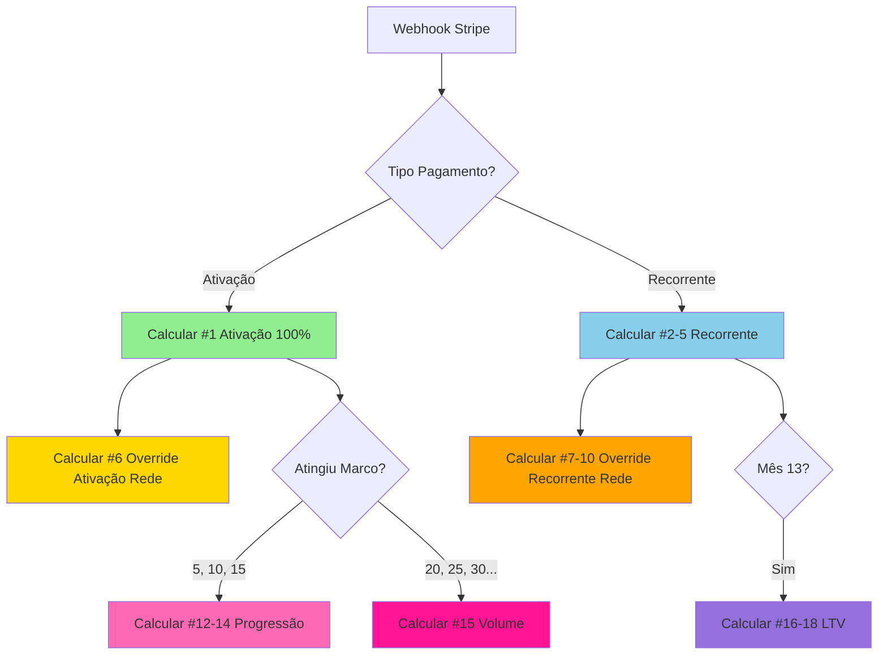

# MAPEAMENTO DAS 17 BONIFICAÇÕES

**Data:** Janeiro 2026  
**Baseado em:** `docs/ANALISE_PRD_COMPLETA.md`  
**Status:** ✅ Completo

---

## 1. VISÃO GERAL

Este documento mapeia cada uma das 17 bonificações do Programa Contadores de Elite, explicando:
- Como é calculada
- Quais tabelas são usadas
- Quais campos são necessários
- Quando é disparada
- Valor do ENUM `tipo_comissao`

---

## 2. PARTE 1: Ganhos Sobre Clientes Diretos (5 bonificações)

### Bonificação #1: Bônus de 1ª Mensalidade (100%)

**O que é:** Contador recebe 100% do 1º pagamento do cliente.

**Quando dispara:** Imediatamente após 1º pagamento do cliente (webhook Stripe).

**Cálculo:**
```typescript
valor_bonus = pagamento.valor_liquido
```

**Tabelas usadas:**
- `pagamentos` (tipo = 'ativacao')
- `clientes`
- `contadores`

**Campos necessários:**
- `pagamentos.valor_liquido`
- `pagamentos.tipo` = 'ativacao'
- `clientes.contador_id`

**ENUM:** `tipo_comissao = 'ativacao'`

**Exemplo:**
```
Cliente paga R$ 130 (1º mês)
Stripe desconta 3.79% = R$ 4,93
Valor líquido = R$ 125,07
Contador recebe: R$ 125,07
```

---

### Bonificações #2-5: Comissões Recorrentes por Nível

**O que é:** Porcentagem da mensalidade de cada cliente, todo mês, vitalício.

**Quando dispara:** A partir do 2º pagamento do cliente (webhook Stripe).

**Cálculo:**
```typescript
const percentuais = {
  'bronze': 0.15,    // 15%
  'prata': 0.175,    // 17.5%
  'ouro': 0.20,      // 20%
  'diamante': 0.20   // 20%
};

valor_comissao = pagamento.valor_liquido * percentuais[contador.nivel]
```

**Tabelas usadas:**
- `pagamentos` (tipo = 'recorrente')
- `clientes`
- `contadores` (nivel)

**Campos necessários:**
- `pagamentos.valor_liquido`
- `pagamentos.tipo` = 'recorrente'
- `contadores.nivel`
- `clientes.contador_id`

**ENUMs:**
- `tipo_comissao = 'recorrente_bronze'` (Bonificação #2)
- `tipo_comissao = 'recorrente_prata'` (Bonificação #3)
- `tipo_comissao = 'recorrente_ouro'` (Bonificação #4)
- `tipo_comissao = 'recorrente_diamante'` (Bonificação #5)

**Exemplo:**
```
Contador Prata com 7 clientes
Cada cliente paga R$ 130/mês
Valor líquido por cliente: R$ 125,07
Comissão: 7 × R$ 125,07 × 17,5% = R$ 153,21/mês
```

**Retroatividade:**
Quando contador sobe de nível, nova % se aplica a TODA carteira:
```sql
UPDATE comissoes 
SET percentual = 17.5,
    valor = base_calculo * 0.175
WHERE contador_id = ? 
AND tipo IN ('recorrente_bronze', 'recorrente_prata', 'recorrente_ouro', 'recorrente_diamante')
AND status = 'calculada';
```

---

## 3. PARTE 2: Ganhos Sobre Rede (6 bonificações)

### Bonificação #6: Override 1º Pagamento Rede (15-20%)

**O que é:** Comissão sobre 1º pagamento de clientes da rede (indicados pelos seus downlines).

**Quando dispara:** Quando contador da rede (downline) traz cliente novo.

**Cálculo:**
```typescript
// Percentual = mesmo da comissão recorrente do upline
const percentuais = {
  'bronze': 0.15,
  'prata': 0.175,
  'ouro': 0.20,
  'diamante': 0.20
};

valor_override = pagamento.valor_liquido * percentuais[upline.nivel]
```

**Tabelas usadas:**
- `pagamentos` (tipo = 'ativacao')
- `clientes` (indicado_por_id)
- `contadores` (sponsor_id)

**Campos necessários:**
- `pagamentos.valor_liquido`
- `clientes.indicado_por_id` → contador downline
- `contadores.sponsor_id` → upline que recebe override

**ENUM:** `tipo_comissao = 'override_ativacao'`

**Exemplo:**
```
Você é Prata (17,5%)
Seu indicado (João) traz cliente que paga R$ 130
Valor líquido: R$ 125,07
Você recebe: R$ 125,07 × 17,5% = R$ 21,89
```

**Query para encontrar uplines:**
```sql
SELECT c.id, c.nivel
FROM contadores c
WHERE c.id = (
  SELECT sponsor_id 
  FROM contadores 
  WHERE id = (
    SELECT indicado_por_id 
    FROM clientes 
    WHERE id = ?
  )
);
```

---

### Bonificações #7-10: Override Recorrente por Nível

**O que é:** Porcentagem sobre mensalidades de TODOS os clientes da rede.

**Quando dispara:** Mensalmente, para cada pagamento recorrente da rede.

**Cálculo:**
```typescript
const percentuais_override = {
  'bronze': 0.03,    // 3%
  'prata': 0.04,     // 4%
  'ouro': 0.05,      // 5%
  'diamante': 0.05   // 5%
};

// Para cada cliente da rede
valor_override = pagamento.valor_liquido * percentuais_override[upline.nivel]
```

**Tabelas usadas:**
- `pagamentos` (tipo = 'recorrente')
- `clientes` (indicado_por_id)
- `contadores` (sponsor_id)
- `rede_contadores` (para queries recursivas)

**Campos necessários:**
- `pagamentos.valor_liquido`
- `clientes.indicado_por_id`
- `contadores.sponsor_id`

**ENUMs:**
- `tipo_comissao = 'override_bronze'` (Bonificação #7)
- `tipo_comissao = 'override_prata'` (Bonificação #8)
- `tipo_comissao = 'override_ouro'` (Bonificação #9)
- `tipo_comissao = 'override_diamante'` (Bonificação #10)

**Exemplo:**
```
Você é Prata (4% override)
Tem 2 contadores indicados:
- João: 5 clientes × R$ 125,07 = R$ 625,35
- Maria: 3 clientes × R$ 125,07 = R$ 375,21
Total carteira rede: R$ 1.000,56
Você recebe: R$ 1.000,56 × 4% = R$ 40,02/mês
```

**Query para calcular carteira da rede:**
```sql
SELECT SUM(p.valor_liquido) as total_rede
FROM pagamentos p
JOIN clientes c ON p.cliente_id = c.id
JOIN contadores child ON c.indicado_por_id = child.id
WHERE child.sponsor_id = ? -- ID do upline
AND p.tipo = 'recorrente'
AND p.competencia = ?;
```

---

### Bonificação #11: Bônus Indicação Contador (R$ 50)

**O que é:** Bônus fixo quando contador indicado se ativa (traz 1º cliente).

**Quando dispara:** Quando downline ativa primeiro cliente.

**Cálculo:**
```typescript
valor_bonus = 50.00 // fixo
```

**Tabelas usadas:**
- `contadores` (sponsor_id)
- `clientes` (contador_id)
- `bonus_historico`

**Campos necessários:**
- `contadores.sponsor_id`
- `clientes.contador_id`
- `clientes.data_ativacao`

**ENUM:** `tipo_comissao = 'bonus_indicacao_contador'`

**Trigger:**
```sql
-- Quando cliente é ativado, verificar se é o 1º do contador
CREATE OR REPLACE FUNCTION trigger_bonus_indicacao_contador()
RETURNS TRIGGER AS $$
BEGIN
  -- Se é o 1º cliente ativo do contador
  IF (SELECT COUNT(*) FROM clientes WHERE contador_id = NEW.contador_id AND status = 'ativo') = 1 THEN
    -- Buscar sponsor
    INSERT INTO bonus_historico (
      contador_id,
      tipo_bonus,
      valor,
      competencia
    )
    SELECT 
      sponsor_id,
      'indicacao_contador',
      50.00,
      CURRENT_DATE
    FROM contadores
    WHERE id = NEW.contador_id
    AND sponsor_id IS NOT NULL;
  END IF;
  
  RETURN NEW;
END;
$$ LANGUAGE plpgsql;
```

---

## 4. PARTE 3: Bônus de Desempenho (6 bonificações)

### Bonificações #12-15: Bônus de Progressão

**O que é:** Bônus fixos ao atingir marcos de clientes.

**Quando dispara:** Quando contador atinge 5, 10, 15, 20, 25, 30... clientes.

**Cálculo:**
```typescript
const bonus_progressao = {
  5: { tipo: 'progressao_prata', valor: 100, unico: true },
  10: { tipo: 'progressao_ouro', valor: 100, unico: true },
  15: { tipo: 'progressao_diamante', valor: 100, unico: true },
  20: { tipo: 'volume', valor: 100, recorrente: true },
  25: { tipo: 'volume', valor: 100, recorrente: true },
  // ... a cada 5 após 15
};

if (contador.clientes_ativos in bonus_progressao) {
  valor_bonus = 100.00
}
```

**Tabelas usadas:**
- `contadores` (clientes_ativos)
- `bonus_historico`

**Campos necessários:**
- `contadores.clientes_ativos`
- `bonus_historico.marco_atingido`
- `bonus_historico.tipo_bonus`

**ENUMs:**
- `tipo_comissao = 'bonus_progressao_prata'` (Bonificação #12 - 5 clientes)
- `tipo_comissao = 'bonus_progressao_ouro'` (Bonificação #13 - 10 clientes)
- `tipo_comissao = 'bonus_progressao_diamante'` (Bonificação #14 - 15 clientes)
- `tipo_comissao = 'bonus_volume'` (Bonificação #15 - 20, 25, 30...)

**Regra NÃO CUMULATIVA:**
```
5 clientes = R$ 100 (Prata) ✅
10 clientes = R$ 100 (Ouro) ✅ (não soma com Prata)
15 clientes = R$ 100 (Diamante) ✅ (não soma com anteriores)
20 clientes = R$ 100 (Volume) ✅
25 clientes = R$ 100 (Volume) ✅
```

**Trigger:**
```sql
CREATE OR REPLACE FUNCTION trigger_bonus_progressao()
RETURNS TRIGGER AS $$
BEGIN
  -- Verificar marcos
  IF NEW.clientes_ativos = 5 AND NOT EXISTS (
    SELECT 1 FROM bonus_historico 
    WHERE contador_id = NEW.id AND tipo_bonus = 'progressao_prata'
  ) THEN
    INSERT INTO bonus_historico (contador_id, tipo_bonus, marco_atingido, valor, competencia)
    VALUES (NEW.id, 'progressao_prata', 5, 100, CURRENT_DATE);
  END IF;
  
  -- Repetir para 10, 15, 20, 25...
  
  RETURN NEW;
END;
$$ LANGUAGE plpgsql;
```

---

### Bonificações #16-18: Bônus LTV (Lifetime Value)

**O que é:** Bônus pela retenção de grupo de clientes captados no mesmo mês.

**Quando dispara:** No mês 13 (após 12 meses) de cada grupo.

**Cálculo:**
```typescript
// Faixas de bônus
const faixas_ltv = {
  'faixa_1': { min: 5, max: 9, percentual: 0.15 },   // 15%
  'faixa_2': { min: 10, max: 14, percentual: 0.30 }, // 30%
  'faixa_3': { min: 15, max: 999, percentual: 0.50 } // 50%
};

// No mês 13
const grupo = bonus_ltv_grupos.find(g => 
  g.data_mes_13 === CURRENT_DATE
);

const clientes_retidos = grupo.clientes_retidos;
const faixa = determinarFaixa(clientes_retidos);

const valor_mensalidades = clientes_retidos * valor_medio_mensal;
const valor_bonus = valor_mensalidades * faixas_ltv[faixa].percentual;
```

**Tabelas usadas:**
- `bonus_ltv_grupos` ⭐ NOVA TABELA
- `clientes` (mes_captacao, data_ativacao)
- `pagamentos`

**Campos necessários:**
- `clientes.mes_captacao` ⭐ CRÍTICO
- `clientes.data_ativacao`
- `bonus_ltv_grupos.cliente_ids[]`
- `bonus_ltv_grupos.clientes_retidos`
- `bonus_ltv_grupos.faixa_ltv`

**ENUMs:**
- `tipo_comissao = 'bonus_ltv_faixa_1'` (Bonificação #16 - 5-9 clientes, 15%)
- `tipo_comissao = 'bonus_ltv_faixa_2'` (Bonificação #17 - 10-14 clientes, 30%)
- `tipo_comissao = 'bonus_ltv_faixa_3'` (Bonificação #18 - 15+ clientes, 50%)

**Exemplo:**
```
Janeiro/2025: Contador capta 8 clientes
Janeiro/2026 (mês 13): 7 clientes ainda ativos
Faixa: faixa_1 (5-9 clientes)
Valor mensalidades: 7 × R$ 125,07 = R$ 875,49
Bônus: R$ 875,49 × 15% = R$ 131,32
```

**CRON Job mensal (dia 1):**
```sql
-- Identificar grupos que completaram 12 meses
UPDATE bonus_ltv_grupos
SET 
  mes_13_completado = true,
  data_mes_13 = CURRENT_DATE,
  clientes_retidos = (
    SELECT COUNT(*)
    FROM unnest(cliente_ids) AS cid
    JOIN clientes c ON c.id = cid
    WHERE c.status = 'ativo'
  )
WHERE DATE_TRUNC('month', mes_captacao) + INTERVAL '12 months' = DATE_TRUNC('month', CURRENT_DATE)
AND mes_13_completado = false;

-- Calcular e criar comissões LTV
INSERT INTO comissoes (contador_id, tipo, valor, competencia, ...)
SELECT 
  g.contador_id,
  CASE 
    WHEN g.clientes_retidos BETWEEN 5 AND 9 THEN 'bonus_ltv_faixa_1'
    WHEN g.clientes_retidos BETWEEN 10 AND 14 THEN 'bonus_ltv_faixa_2'
    WHEN g.clientes_retidos >= 15 THEN 'bonus_ltv_faixa_3'
  END,
  -- cálculo do valor...
FROM bonus_ltv_grupos g
WHERE g.data_mes_13 = CURRENT_DATE
AND g.clientes_retidos >= 5;
```

---

### Bonificação #19: Bônus Diamante Leads (1 lead/mês)

**O que é:** Empresa entrega 1 lead qualificado por mês para contadores Diamante.

**Quando dispara:** Mensalmente (dia 15), enquanto mantiver Diamante.

**Cálculo:**
```typescript
// Não é valor monetário, é entrega de lead
if (contador.nivel === 'diamante' && contador.clientes_ativos >= 15) {
  entregar_lead_qualificado(contador_id);
}
```

**Tabelas usadas:**
- `contadores` (nivel, clientes_ativos)
- `leads_diamante` (NOVA TABELA - opcional)

**Campos necessários:**
- `contadores.nivel` = 'diamante'
- `contadores.clientes_ativos` >= 15

**ENUM:** `tipo_comissao = 'bonus_diamante_leads'`

**Estrutura opcional para rastreamento:**
```sql
CREATE TABLE leads_diamante (
  id UUID PRIMARY KEY,
  contador_id UUID REFERENCES contadores(id),
  mes_referencia DATE,
  lead_info JSONB, -- {cnpj, nome_empresa, contato, etc}
  entregue_em TIMESTAMPTZ,
  status TEXT, -- entregue, convertido, substituicao_solicitada
  created_at TIMESTAMPTZ DEFAULT now()
);
```

**CRON Job mensal (dia 15):**
```sql
-- Identificar contadores Diamante elegíveis
INSERT INTO leads_diamante (contador_id, mes_referencia, status)
SELECT 
  id,
  DATE_TRUNC('month', CURRENT_DATE),
  'pendente'
FROM contadores
WHERE nivel = 'diamante'
AND clientes_ativos >= 15
AND NOT EXISTS (
  SELECT 1 FROM leads_diamante
  WHERE contador_id = contadores.id
  AND mes_referencia = DATE_TRUNC('month', CURRENT_DATE)
);
```

---

## 5. RESUMO: Tabelas por Bonificação

| Bonificação | Tipo | Tabelas Principais | Campos Críticos |
|-------------|------|-------------------|-----------------|
| #1 Ativação | ativacao | pagamentos, clientes | valor_liquido, tipo='ativacao' |
| #2-5 Recorrente | recorrente_* | pagamentos, contadores | valor_liquido, nivel |
| #6 Override Ativação | override_ativacao | pagamentos, clientes | indicado_por_id, sponsor_id |
| #7-10 Override Recorrente | override_* | pagamentos, contadores | sponsor_id, nivel |
| #11 Indicação Contador | bonus_indicacao_contador | contadores, clientes | sponsor_id, 1º cliente |
| #12-14 Progressão | bonus_progressao_* | contadores, bonus_historico | clientes_ativos, marcos |
| #15 Volume | bonus_volume | contadores, bonus_historico | clientes_ativos >= 20 |
| #16-18 LTV | bonus_ltv_faixa_* | bonus_ltv_grupos, clientes | mes_captacao, retenção |
| #19 Leads Diamante | bonus_diamante_leads | contadores, leads_diamante | nivel='diamante' |

---

## 6. FLUXO COMPLETO DE CÁLCULO

### Quando Webhook Stripe Chega



### CRON Jobs Mensais

```
DIA 1 DO MÊS:
- Verificar grupos LTV que completaram 12 meses
- Calcular bônus LTV (#16-18)
- Atualizar bonus_ltv_grupos

DIA 15 DO MÊS:
- Verificar contadores Diamante
- Gerar/entregar leads qualificados (#19)
- Registrar em leads_diamante

DIA 25 DO MÊS:
- Processar saques (comissões aprovadas)
- Agrupar por contador
- Criar Stripe Transfers
```

---

## 7. VALIDAÇÃO DE CÁLCULOS

### Query para Validar Comissões de um Contador

```sql
SELECT 
  c.tipo,
  COUNT(*) as quantidade,
  SUM(c.valor) as total_valor,
  c.competencia
FROM comissoes c
WHERE c.contador_id = ? -- UUID do contador
AND c.competencia = ? -- Mês de referência
GROUP BY c.tipo, c.competencia
ORDER BY c.tipo;
```

### Query para Validar Total Mensal

```sql
SELECT 
  DATE_TRUNC('month', c.competencia) as mes,
  SUM(CASE WHEN c.tipo LIKE 'recorrente%' THEN c.valor ELSE 0 END) as comissoes_diretas,
  SUM(CASE WHEN c.tipo LIKE 'override%' THEN c.valor ELSE 0 END) as overrides_rede,
  SUM(CASE WHEN c.tipo LIKE 'bonus%' THEN c.valor ELSE 0 END) as bonus,
  SUM(c.valor) as total_geral
FROM comissoes c
WHERE c.contador_id = ?
AND c.status IN ('aprovada', 'paga')
GROUP BY DATE_TRUNC('month', c.competencia)
ORDER BY mes DESC;
```

---

## 8. CONCLUSÃO

Todas as 17 bonificações estão mapeadas e prontas para implementação. Os campos críticos identificados são:

🔴 **CRÍTICOS (faltam):**
- `clientes.mes_captacao`
- `bonus_ltv_grupos` (tabela inteira)

🟡 **IMPORTANTES (faltam):**
- `clientes.indicado_por_id`
- ENUM `tipo_comissao` expandido

✅ **JÁ EXISTEM:**
- Todas as outras tabelas e campos necessários


