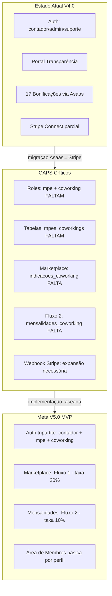

# Análise PRD V5.0 vs Código Atual — Contadores de Elite

## O que já está implementado (V4.0 sólido)

O Portal de Transparência está **substancialmente implementado**. O que funciona:

- **Auth + Roles** — Supabase Auth com `user_roles` (admin, contador, suporte)
- **Dashboard do Contador** — KPIs, gráfico de evolução, barra de progresso de nível
- **17 Bonificações** — Edge Functions `calcular-comissoes`, `verificar-bonus-ltv`, `aprovar-comissoes`, `processar-pagamento-comissoes`
- **Rede MLM** — `/rede` com visualização, até 5 níveis, tabela `rede_contadores`
- **Comissões + Saques** — `/comissoes`, `/saques`, CRON dia 25, aprovação em lote (`/admin/approvals`)
- **Simulador** — `/simulador`
- **Gamificação** — XP, níveis, `conquistas`, `contador_conquistas`
- **Onboarding de cliente** — fluxo Stripe completo em `src/onboarding/` (PaymentIntent, confirmação de cartão)
- **Stripe Connect** — Edge Functions `gerar-link-stripe-connect` e `processar-callback-stripe-connect` (contadores recebem via Stripe)
- **webhook-stripe** — Edge Function já existe (precisa expansão)
- **Educação básica** — `/educacao`, `/materiais` (estrutura básica)
- **Assistente IA** — `/assistente` com `assistente_logs`
- **Auditoria** — `audit_logs`, `/auditoria-comissoes`

---

## Gap Analysis — O que falta para V5.0

### Bloco 1 — Migração Asaas → Stripe (CRÍTICO)

| Item                          | Estado atual | O que muda                            |
| ----------------------------- | ------------ | ------------------------------------- |
| `clientes.asaas_customer_id`  | Existe       | Renomear para `stripe_customer_id`    |
| `pagamentos.asaas_payment_id` | Existe       | Renomear para `stripe_payment_id`     |
| `webhook-asaas/`              | Ativo        | Desativar; expandir `webhook-stripe/` |
| `asaas-client/`               | Existe       | Remover ou arquivar                   |

> Como os dados são de teste, essa migração pode ser feita via migration SQL sem risco.

### Bloco 2 — Multi-perfil Auth (CRÍTICO para MVP)

| Item              | Estado atual               | O que falta                    |
| ----------------- | -------------------------- | ------------------------------ |
| `user_roles` enum | `admin                     | contador                       |
| Página `/auth`    | Só para contador           | Seleção de perfil no cadastro  |
| `ProtectedRoute`  | Só verifica autenticação   | Checar role por rota           |
| `AppSidebar`      | Navegação fixa do contador | Navegação condicional por role |

### Bloco 3 — Tabelas Novas (TODAS AUSENTES)

Tabelas necessárias para o MVP do Marketplace:

- `mpes` — perfil completo com `user_id` (novo ator)
- `coworkings` — parceiros de espaço com `user_id`
- `indicacoes_coworking` — funil: pendente → convertida → paga
- `mensalidades_coworking` — Fluxo 2 (10%)
- `transacoes_plataforma` — receita da plataforma

Tabelas para Fase 4+ (Área de Membros):

- `ia_perfis`, `ia_interacoes`, `trilhas`, `progresso_trilhas`, `matriculas`, `mentorias`

### Bloco 4 — Páginas Novas (TODAS AUSENTES)

| Rota                    | Perfil                              | Prioridade |
| ----------------------- | ----------------------------------- | ---------- |
| `/indicacoes`           | Contador cria indicações            | FASE 1     |
| `/coworking/indicacoes` | Coworking confirma/recusa           | FASE 1     |
| `/mpe/pagamento`        | MPE paga mensalidade via Stripe     | FASE 2     |
| `/mpe/membros`          | Área de Membros básica da MPE       | FASE 2     |
| `/coworking/membros`    | Área de Membros básica do Coworking | FASE 2     |
| `/membros/contador`     | Área de Membros do Contador com IA  | FASE 4     |

### Bloco 5 — Edge Functions Novas (AUSENTES)

| Função                       | O que faz                                         | Prioridade |
| ---------------------------- | ------------------------------------------------- | ---------- |
| `indicacao-coworking`        | Cria indicação, valida CNPJ, notifica Coworking   | FASE 1     |
| `confirmar-conversao`        | Coworking aceita, calcula taxa 20%, cria comissão | FASE 1     |
| `processar-taxa-mensalidade` | Stripe webhook para Fluxo 2 (taxa 10%)            | FASE 2     |

---

## Diagrama do Estado Atual vs V5.0

---

## Plano de Implementação em Fases

### FASE 1 — Fundação Tripartite + Migração Stripe (Semanas 1–3)

**Objetivo**: Sem quebrar o Portal existente, criar a infraestrutura para os 3 perfis e migrar para Stripe.

- Migration: adicionar `mpe | coworking` ao enum `user_roles`
- Migration: substituir campos `asaas_`* por `stripe_`* em `clientes` e `pagamentos`
- Migration: criar tabelas `coworkings`, `mpes`
- Migration: criar `indicacoes_coworking`, `mensalidades_coworking`, `transacoes_plataforma`
- RLS policies para os novos perfis
- Atualizar `/auth` para seleção de perfil no cadastro
- Atualizar `ProtectedRoute` com guarda por role
- Atualizar `AppSidebar` com navegação condicional por role
- Expandir `webhook-stripe` para substituir `webhook-asaas`
- Desativar `webhook-asaas`

**Arquivos-chave**:

- `[src/pages/Auth.tsx](src/pages/Auth.tsx)`
- `[src/components/ProtectedRoute.tsx](src/components/ProtectedRoute.tsx)`
- `[src/components/AppSidebar.tsx](src/components/AppSidebar.tsx)`
- `[supabase/functions/webhook-stripe/index.ts](supabase/functions/webhook-stripe/index.ts)`
- Nova migration: `supabase/migrations/YYYYMMDD_v5_foundation.sql`

---

### FASE 2 — Marketplace: Fluxo 1 (Semanas 4–6)

**Objetivo**: Contador indica MPE → Coworking confirma → Comissão calculada automaticamente com taxa 20%.

- Edge Function: `indicacao-coworking` (valida CNPJ via ReceitaWS, cria indicação)
- Edge Function: `confirmar-conversao` (Coworking aceita, taxa 20%, comissão do Contador)
- Página `/indicacoes` para o Contador (criar + listar indicações)
- Área básica `/coworking/indicacoes` (receber + confirmar indicações)
- Atualizar Dashboard do Contador: KPIs de Marketplace (indicações, MPEs convertidas)

---

### FASE 3 — Marketplace: Fluxo 2 + Área Básica MPE/Coworking (Semanas 7–9)

**Objetivo**: MPE paga mensalidade → plataforma retém 10% automaticamente via Stripe.

- Edge Function: `processar-taxa-mensalidade` (webhook Stripe para Fluxo 2)
- Página `/mpe/pagamento` (MPE vê coworking, plano, histórico e paga via Stripe)
- Página `/mpe/membros` básica (MPE vê contador responsável e coworking vinculado)
- Página `/coworking/membros` básica (Coworking vê lista de MPEs e contadores)
- CRON: `verificar-indicacoes-sem-resposta` (alertas para Coworkings inativos)

---

### FASE 4 — Área de Membros com IA (Semanas 10–18)

Somente após estabilização das Fases 1–3. Inclui:

- Tabelas: `trilhas`, `progresso_trilhas`, `cursos`, `matriculas`, `mentorias`, `ia_perfis`, `ia_interacoes`
- Integração com API de IA (OpenAI/Gemini/Claude API)
- Onboarding inteligente por perfil
- Rotas `/membros/contador`, `/mpe/membros` completo, `/coworking/membros` completo

---

## Pontos de Atenção para Não Quebrar o Portal Atual

- As migrações Asaas → Stripe devem preservar o campo original como `NULL` durante a transição (não `DROP COLUMN` imediato)
- A Edge Function `calcular-comissoes` referencia `pagamentos.asaas_payment_id` — precisa ser atualizada para `stripe_payment_id` na mesma migration
- O enum `user_roles` é referenciado em RLS policies ativas — adicionar novos valores com `ALTER TYPE ... ADD VALUE` (não recria o enum)
- As views `vw_dashboard_contador` e `vw_comissoes_detalhadas` podem ser afetadas pela mudança de campos — verificar antes de migrar
- `ProtectedRoute` atual não discrimina role — a mudança deve ser retrocompatível (contadores existentes não perdem acesso)

